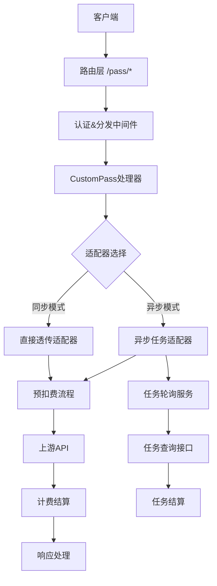
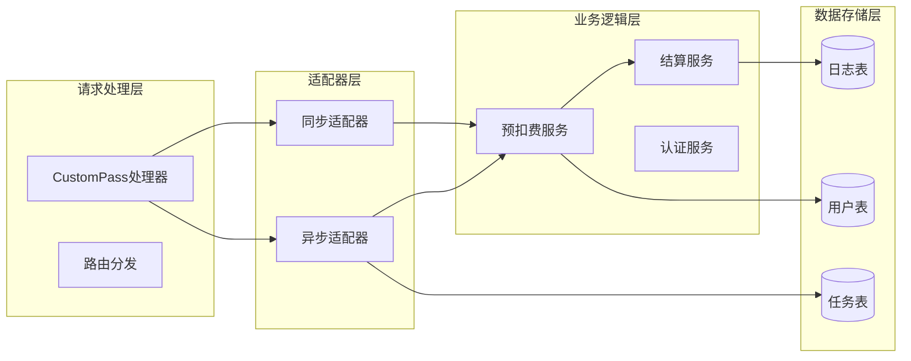

# CustomPass 自定义透传渠道设计文档

## 概述

CustomPass是New API系统中的一个特殊渠道类型，提供完全透传的API代理功能。系统采用双模式设计，支持同步直接透传和异步任务处理，具备完整的预扣费机制和多种计费策略。

## 架构

### 系统架构图



### 核心组件关系



## 组件和接口

### 1. 路由层

#### 路由配置
```go
// 路由注册
router.POST("/pass/*model", customPassHandler)

// 路由解析逻辑
func parseCustomPassRoute(path string) (model string, isAsync bool) {
    model = strings.TrimPrefix(path, "/pass/")
    isAsync = strings.HasSuffix(model, "/submit")
    if isAsync {
        model = strings.TrimSuffix(model, "/submit")
    }
    return model, isAsync
}
```

### 2. CustomPass处理器

#### 接口定义
```go
type CustomPassHandler interface {
    HandleRequest(c *gin.Context) error
    SelectAdaptor(model string, isAsync bool) (Adaptor, error)
    ValidateRequest(c *gin.Context) error
}

type CustomPassHandlerImpl struct {
    syncAdaptor  *SyncAdaptor
    asyncAdaptor *AsyncAdaptor
    authService  AuthService
}
```

#### 核心方法
```go
func (h *CustomPassHandlerImpl) HandleRequest(c *gin.Context) error {
    // 1. 解析路由和模型
    model, isAsync := parseCustomPassRoute(c.Request.URL.Path)
    
    // 2. 验证请求
    if err := h.ValidateRequest(c); err != nil {
        return err
    }
    
    // 3. 选择适配器
    adaptor, err := h.SelectAdaptor(model, isAsync)
    if err != nil {
        return err
    }
    
    // 4. 处理请求
    return adaptor.ProcessRequest(c, model)
}
```

### 3. 适配器层

#### 同步适配器接口
```go
type SyncAdaptor interface {
    ProcessRequest(c *gin.Context, model string) error
    BuildUpstreamURL(baseURL, model string) string
    HandlePrecharge(request *http.Request) (*PrechargeResponse, error)
    HandleRealRequest(request *http.Request) (*UpstreamResponse, error)
    ProcessResponse(response *UpstreamResponse) error
}
```

#### 异步适配器接口
```go
type AsyncAdaptor interface {
    SubmitTask(c *gin.Context, model string) (*TaskSubmitResponse, error)
    QueryTasks(taskIDs []string, channel *Channel) (*TaskQueryResponse, error)
    ProcessTaskSubmission(request *TaskSubmitRequest) (*Task, error)
    HandleTaskCompletion(task *Task) error
}
```

### 4. 预扣费服务

#### 服务接口
```go
type PrechargeService interface {
    ExecutePrecharge(user *User, model *Model, estimatedUsage *Usage) (*PrechargeResult, error)
    CalculatePrechargeAmount(model *Model, usage *Usage) (int64, error)
    ValidateUserBalance(userID int, amount int64) error
    ProcessRefund(userID int, prechargeAmount, actualAmount int64) error
}

type PrechargeResult struct {
    PrechargeAmount int64
    TransactionID   string
    Success         bool
    Error           error
}
```

#### 事务边界设计
```go
func (s *PrechargeService) ExecutePrecharge(user *User, model *Model, estimatedUsage *Usage) (*PrechargeResult, error) {
    tx, err := s.db.Begin()
    if err != nil {
        return nil, err
    }
    defer tx.Rollback()
    
    // 1. 锁定用户记录
    if err := s.lockUserRecord(tx, user.ID); err != nil {
        return nil, err
    }
    
    // 2. 验证余额
    if err := s.validateBalance(tx, user.ID, amount); err != nil {
        return nil, err
    }
    
    // 3. 执行预扣费
    if err := s.deductQuota(tx, user.ID, amount); err != nil {
        return nil, err
    }
    
    // 4. 记录预扣费信息
    if err := s.recordPrecharge(tx, user.ID, amount); err != nil {
        return nil, err
    }
    
    return &PrechargeResult{
        PrechargeAmount: amount,
        Success:         true,
    }, tx.Commit()
}
```

### 5. 任务轮询服务

#### 轮询服务接口
```go
type TaskPollingService interface {
    Start() error
    Stop() error
    PollTasks() error
    ProcessTaskUpdates(tasks []*Task) error
    HandleTaskCompletion(task *Task) error
    HandleTaskFailure(task *Task) error
}

type TaskPollingConfig struct {
    PollInterval     time.Duration // 轮询间隔
    BatchSize        int           // 批量查询大小
    MaxConcurrent    int           // 最大并发数
    TaskTimeout      time.Duration // 查询超时时间
    MaxLifetime      time.Duration // 任务最大生命周期
}
```

#### 轮询逻辑设计
```go
func (s *TaskPollingService) PollTasks() error {
    // 1. 获取需要轮询的任务
    tasks, err := s.getActiveTasks()
    if err != nil {
        return err
    }
    
    // 2. 按渠道分组
    taskGroups := s.groupTasksByChannel(tasks)
    
    // 3. 并发查询各渠道
    var wg sync.WaitGroup
    semaphore := make(chan struct{}, s.config.MaxConcurrent)
    
    for channelID, channelTasks := range taskGroups {
        wg.Add(1)
        go func(chID int, tasks []*Task) {
            defer wg.Done()
            semaphore <- struct{}{}
            defer func() { <-semaphore }()
            
            s.queryChannelTasks(chID, tasks)
        }(channelID, channelTasks)
    }
    
    wg.Wait()
    return nil
}
```

### 6. 认证服务

#### 认证接口
```go
type AuthService interface {
    ValidateUserToken(token string) (*User, error)
    BuildUpstreamHeaders(channelKey, userToken string) map[string]string
    ValidateChannelAccess(user *User, channel *Channel) error
}

func (s *AuthService) BuildUpstreamHeaders(channelKey, userToken string) map[string]string {
    headers := make(map[string]string)
    headers["Authorization"] = "Bearer " + channelKey
    
    customHeaderKey := os.Getenv("CUSTOM_PASS_HEADER_KEY")
    if customHeaderKey == "" {
        customHeaderKey = "X-Custom-Token"
    }
    headers[customHeaderKey] = userToken
    
    return headers
}
```

## 数据模型

### 1. 复用现有模型

CustomPass将复用系统现有的数据模型：

#### 任务模型 (复用现有Task模型)
- **文件**: `model/task.go`
- **说明**: 现有Task模型已包含所需字段，CustomPass将使用`Platform = "custompass"`来标识
- **关键字段**:
  - `Platform`: 设置为`constant.TaskPlatformCustomPass = "custompass"`
  - `Action`: 设置为模型名称，用于标识任务类型
  - `Status`: 复用现有状态枚举，需要添加状态映射逻辑
  - `FailReason`: 任务失败时设置为`TaskInfo.Error`的值
  - `Quota`: 用于存储预扣费金额
  - `Data`: 存储上游返回的完整响应数据

#### 用户模型 (复用现有User模型)
- **文件**: `model/user.go`
- **说明**: 现有User模型已包含quota管理功能，无需修改
- **关键字段**:
  - `Quota`: 用户剩余配额
  - `UsedQuota`: 用户已使用配额
  - `Group`: 用户分组，影响计费倍率

#### 渠道模型 (复用现有Channel模型)
- **文件**: `model/channel.go`
- **说明**: 现有Channel模型已支持CustomPass所需配置，需要设置`Type = constant.ChannelTypeCustomPass`

### 2. CustomPass特定常量
```go
// 在 constant/channel.go 中添加
const (
    ChannelTypeCustomPass = 999 // CustomPass渠道类型
)

// 在 constant/task.go 中添加
const (
    TaskPlatformCustomPass = "custompass"
)
```

### 3. 状态映射配置
```go
// CustomPass状态映射结构
type CustomPassStatusMapping struct {
    Success    []string // completed,success,finished
    Failed     []string // failed,error,cancelled  
    Processing []string // processing,pending,running
}

// 状态映射函数
func MapUpstreamStatus(upstreamStatus string, mapping *CustomPassStatusMapping) TaskStatus {
    // 检查成功状态
    for _, status := range mapping.Success {
        if strings.EqualFold(upstreamStatus, status) {
            return TaskStatusSuccess
        }
    }
    
    // 检查失败状态
    for _, status := range mapping.Failed {
        if strings.EqualFold(upstreamStatus, status) {
            return TaskStatusFailure
        }
    }
    
    // 检查进行中状态
    for _, status := range mapping.Processing {
        if strings.EqualFold(upstreamStatus, status) {
            return TaskStatusInProgress
        }
    }
    
    // 默认返回未知状态
    return TaskStatusUnknown
}
```

### 3. 上游API响应结构定义

#### 基础响应结构
```go
// 上游API统一响应格式
type UpstreamResponse struct {
    Code    interface{} `json:"code"`    // int 或 string，0表示成功
    Message string      `json:"message,omitempty"` // 可能存在的message字段
    Msg     string      `json:"msg,omitempty"`     // 可能存在的msg字段
    Data    interface{} `json:"data"`    // 响应数据，可以是任意类型
    Type    string      `json:"type,omitempty"` // 响应类型，预扣费时为"precharge"
    Usage   *Usage      `json:"usage,omitempty"` // token使用量信息
}

// 获取错误信息的方法 - 优先获取message，不存在时获取msg
func (r *UpstreamResponse) GetMessage() string {
    if r.Message != "" {
        return r.Message
    }
    if r.Msg != "" {
        return r.Msg
    }
    return "未知错误" // 两个字段都不存在时的默认值
}

// 判断是否成功
func (r *UpstreamResponse) IsSuccess() bool {
    switch code := r.Code.(type) {
    case int:
        return code == 0
    case string:
        return code == "0"
    default:
        return false
    }
}

// 判断是否为预扣费响应
func (r *UpstreamResponse) IsPrecharge() bool {
    return r.Type == "precharge"
}
```

#### 同步接口响应结构
```go
// 同步接口响应
type SyncResponse struct {
    UpstreamResponse
    // Data字段包含实际业务数据，格式由上游API决定
    // 可能是字符串、对象、数组或null
}
```

#### 异步任务响应结构
```go
// 任务提交响应
type TaskSubmitResponse struct {
    UpstreamResponse
    Data *TaskSubmitData `json:"data"`
}

type TaskSubmitData struct {
    TaskID   string `json:"task_id"`   // 必须：任务唯一标识
    Status   string `json:"status"`    // 必须：任务状态
    Progress string `json:"progress"`  // 可选：任务进度，如"0%"
}

// 任务查询请求
type TaskQueryRequest struct {
    TaskIDs []string `json:"task_ids"` // 必须：要查询的任务ID列表
}

// 任务查询响应
type TaskQueryResponse struct {
    UpstreamResponse
    Data []*TaskInfo `json:"data"` // 必须：任务信息数组
}

type TaskInfo struct {
    TaskID   string      `json:"task_id"`   // 必须：任务唯一标识
    Status   string      `json:"status"`    // 必须：任务状态
    Progress string      `json:"progress"`  // 可选：任务进度百分比
    Error    string      `json:"error"`     // 可选：错误信息（失败时）
    Result   interface{} `json:"result"`    // 可选：任务结果（完成时）
    Usage    *Usage      `json:"usage"`     // 可选：实际使用量（完成时）
}
```

#### Usage数据结构
```go
type Usage struct {
    // 必需字段 - 用于基础计费
    PromptTokens     int `json:"prompt_tokens"`     // 必须：输入token数量
    CompletionTokens int `json:"completion_tokens"` // 必须：输出token数量  
    TotalTokens      int `json:"total_tokens"`      // 必须：总token数量
    
    // 可选字段 - 用于高级计费策略
    PromptCacheHitTokens    int                     `json:"prompt_cache_hit_tokens,omitempty"`
    PromptTokensDetails     *PromptTokensDetails    `json:"prompt_tokens_details,omitempty"`
    CompletionTokensDetails *CompletionTokensDetails `json:"completion_tokens_details,omitempty"`
    
    // 兼容性字段 - 支持其他格式
    InputTokens  int     `json:"input_tokens,omitempty"`  // 兼容input_tokens格式
    OutputTokens int     `json:"output_tokens,omitempty"` // 兼容output_tokens格式
    Cost         float64 `json:"cost,omitempty"`          // 第三方平台成本信息
}

type PromptTokensDetails struct {
    CachedTokens int `json:"cached_tokens"` // 缓存命中token数量
    TextTokens   int `json:"text_tokens"`   // 文本token数量
    AudioTokens  int `json:"audio_tokens"`  // 音频token数量
    ImageTokens  int `json:"image_tokens"`  // 图像token数量
}

type CompletionTokensDetails struct {
    TextTokens      int `json:"text_tokens"`      // 文本输出token数量
    AudioTokens     int `json:"audio_tokens"`     // 音频输出token数量
    ReasoningTokens int `json:"reasoning_tokens"` // 推理token数量
}

// Usage验证方法
func (u *Usage) Validate() error {
    if u.PromptTokens < 0 || u.CompletionTokens < 0 || u.TotalTokens < 0 {
        return errors.New("token数量不能为负数")
    }
    
    if u.TotalTokens != u.PromptTokens + u.CompletionTokens {
        return errors.New("总token数量与输入输出token数量之和不匹配")
    }
    
    return nil
}

// 获取兼容的输入token数量
func (u *Usage) GetInputTokens() int {
    if u.InputTokens > 0 {
        return u.InputTokens
    }
    return u.PromptTokens
}

// 获取兼容的输出token数量
func (u *Usage) GetOutputTokens() int {
    if u.OutputTokens > 0 {
        return u.OutputTokens
    }
    return u.CompletionTokens
}
```

#### 字段说明和验证规则

**响应码字段 (code)**:
- **类型**: int 或 string
- **规则**: 0表示成功，非0表示失败
- **验证**: 必须存在，支持整数和字符串格式

**消息字段 (message/msg)**:
- **类型**: string
- **规则**: 优先获取message字段，不存在时获取msg字段
- **验证**: 至少一个字段应该存在，用于错误描述

**数据字段 (data)**:
- **类型**: 任意类型 (dict/list/string/null)
- **规则**: 包含实际业务数据
- **验证**: 必须存在，可以为null

**类型字段 (type)**:
- **类型**: string
- **规则**: 预扣费响应时必须为"precharge"
- **验证**: 可选字段，仅预扣费时需要

**使用量字段 (usage)**:
- **类型**: Usage对象
- **规则**: 按量计费模型必须提供
- **验证**: 必须包含prompt_tokens、completion_tokens、total_tokens

**任务状态字段 (status)**:
- **类型**: string
- **规则**: 根据环境变量配置进行状态映射
- **验证**: 必须存在，支持自定义状态映射

**任务进度字段 (progress)**:
- **类型**: string
- **规则**: 百分比格式，如"50%"
- **验证**: 可选字段，用于显示任务进度

**错误信息字段 (error)**:
- **类型**: string
- **规则**: 任务失败时提供错误详情
- **验证**: 失败状态时建议提供

**任务结果字段 (result)**:
- **类型**: 任意类型
- **规则**: 任务完成时的输出结果
- **验证**: 完成状态时建议提供

## 错误处理

### 1. 错误类型定义
```go
type CustomPassError struct {
    Code    string `json:"code"`
    Message string `json:"message"`
    Details string `json:"details,omitempty"`
}

const (
    ErrCodeInvalidRequest     = "INVALID_REQUEST"
    ErrCodeInsufficientQuota  = "INSUFFICIENT_QUOTA"
    ErrCodeUpstreamError      = "UPSTREAM_ERROR"
    ErrCodeConfigError        = "CONFIG_ERROR"
    ErrCodeTimeout            = "TIMEOUT"
    ErrCodeSystemError        = "SYSTEM_ERROR"
)
```

### 2. 错误处理策略
```go
func (h *CustomPassHandler) HandleError(err error, c *gin.Context) {
    var customErr *CustomPassError
    
    switch {
    case errors.Is(err, ErrInsufficientQuota):
        customErr = &CustomPassError{
            Code:    ErrCodeInsufficientQuota,
            Message: "用户余额不足",
            Details: err.Error(),
        }
        c.JSON(http.StatusPaymentRequired, customErr)
        
    case errors.Is(err, ErrUpstreamTimeout):
        customErr = &CustomPassError{
            Code:    ErrCodeTimeout,
            Message: "上游API请求超时",
            Details: err.Error(),
        }
        c.JSON(http.StatusGatewayTimeout, customErr)
        
    default:
        customErr = &CustomPassError{
            Code:    ErrCodeSystemError,
            Message: "系统内部错误",
            Details: "请联系管理员",
        }
        c.JSON(http.StatusInternalServerError, customErr)
    }
    
    // 记录错误日志
    logger.Error("CustomPass error", 
        zap.String("code", customErr.Code),
        zap.String("message", customErr.Message),
        zap.Error(err))
}
```

## 测试策略

### 1. 单元测试
- **适配器测试**: 测试同步和异步适配器的核心逻辑
- **预扣费服务测试**: 测试预扣费计算和事务处理
- **计费服务测试**: 测试各种计费策略的计算准确性
- **认证服务测试**: 测试token验证和header构建

### 2. 集成测试
- **端到端流程测试**: 测试完整的请求处理流程
- **数据库事务测试**: 测试预扣费和结算的事务一致性
- **轮询服务测试**: 测试任务状态轮询和更新机制
- **错误处理测试**: 测试各种异常情况的处理

### 3. 性能测试
- **并发请求测试**: 测试高并发下的系统稳定性
- **轮询性能测试**: 测试大量任务轮询的性能表现
- **数据库压力测试**: 测试预扣费操作的数据库性能

### 4. 测试数据设计
```go
type TestScenario struct {
    Name        string
    ModelConfig *ModelConfig
    UserQuota   int64
    RequestData interface{}
    Expected    *ExpectedResult
}

type ExpectedResult struct {
    StatusCode      int
    PrechargeAmount int64
    FinalAmount     int64
    ErrorCode       string
}
```

## 配置管理

### 1. 环境变量配置
```go
type CustomPassConfig struct {
    // 轮询配置
    PollInterval     time.Duration `env:"CUSTOM_PASS_POLL_INTERVAL" envDefault:"30s"`
    TaskTimeout      time.Duration `env:"CUSTOM_PASS_TASK_TIMEOUT" envDefault:"15s"`
    MaxConcurrent    int           `env:"CUSTOM_PASS_MAX_CONCURRENT" envDefault:"100"`
    TaskMaxLifetime  time.Duration `env:"CUSTOM_PASS_TASK_MAX_LIFETIME" envDefault:"1h"`
    BatchSize        int           `env:"CUSTOM_PASS_BATCH_SIZE" envDefault:"50"`
    
    // 认证配置
    HeaderKey        string        `env:"CUSTOM_PASS_HEADER_KEY" envDefault:"X-Custom-Token"`
    
    // 状态映射配置
    StatusSuccess    []string      `env:"CUSTOM_PASS_STATUS_SUCCESS" envDefault:"completed,success,finished"`
    StatusFailed     []string      `env:"CUSTOM_PASS_STATUS_FAILED" envDefault:"failed,error,cancelled"`
    StatusProcessing []string      `env:"CUSTOM_PASS_STATUS_PROCESSING" envDefault:"processing,pending,running"`
}
```

### 2. 配置验证
```go
func (c *CustomPassConfig) Validate() error {
    if c.PollInterval < time.Second {
        return errors.New("轮询间隔不能小于1秒")
    }
    
    if c.BatchSize <= 0 || c.BatchSize > 1000 {
        return errors.New("批量大小必须在1-1000之间")
    }
    
    if c.MaxConcurrent <= 0 || c.MaxConcurrent > 1000 {
        return errors.New("最大并发数必须在1-1000之间")
    }
    
    return nil
}
```

## 前端界面设计

### 1. 渠道管理页面

#### 渠道类型选择
在渠道创建/编辑页面的渠道类型下拉框中添加：
```javascript
// 在 web/src/constants/channel.constants.js 中添加
export const CHANNEL_OPTIONS = [
    // ... 现有渠道类型
    { key: 999, text: '自定义透传渠道', value: 999, color: 'purple' }
];
```

#### CustomPass渠道配置表单
```javascript
// CustomPass渠道特有配置项
const CustomPassChannelForm = {
    // 基础配置
    name: '渠道名称',
    baseUrl: '上游API地址', // 必填
    key: 'API密钥',        // 必填
    models: '支持的模型',   // 必填，支持同步和异步模型
    
    // 高级配置
    group: '用户分组',
    priority: '优先级',
    weight: '权重',
    
    // CustomPass特有配置
    customTokenHeader: '自定义Token头名称', // 可选，默认X-Custom-Token
    
    // 状态映射配置（可选）
    statusMapping: {
        success: 'completed,success,finished',
        failed: 'failed,error,cancelled', 
        processing: 'processing,pending,running'
    }
};
```

#### 模型配置说明
在模型配置区域添加说明文本：
```
模型配置说明：
- 同步模型：直接透传，立即返回结果
- 异步模型：模型名称需以 /submit 结尾，如 custom-image-gen/submit
- 支持混合配置：可同时配置同步和异步模型
```

### 2. 任务管理页面

#### 任务列表增强
在现有任务管理页面中：
- **平台筛选**: 添加"CustomPass"选项
- **状态显示**: 支持CustomPass的状态映射显示
- **详情查看**: 显示上游返回的完整数据

#### 任务详情页面
```javascript
// CustomPass任务详情组件
const CustomPassTaskDetail = {
    // 基础信息
    taskId: '任务ID',
    model: '模型名称', 
    status: '任务状态',
    progress: '任务进度',
    
    // 计费信息
    prechargeQuota: '预扣费配额',
    actualQuota: '实际消费配额',
    refundQuota: '退还配额',
    
    // 上游数据
    upstreamData: '上游返回数据', // JSON格式显示
    errorMessage: '错误信息'      // 失败时显示
};
```

### 3. 配置优先级说明

#### CustomPass配置优先级
当渠道配置和环境变量都存在时，优先级如下：

**自定义Token头名称**:
1. **最高优先级**: 渠道配置中的`customTokenHeader`字段
2. **次优先级**: 环境变量`CUSTOM_PASS_HEADER_KEY`
3. **默认值**: `X-Custom-Token`

**状态映射配置**:
1. **最高优先级**: 渠道配置中的`statusMapping`字段
2. **次优先级**: 环境变量`CUSTOM_PASS_STATUS_*`系列
3. **默认值**: 系统内置映射（success: completed,success,finished; failed: failed,error,cancelled; processing: processing,pending,running）

```go
// 配置优先级处理逻辑
func getCustomTokenHeader(channel *Channel) string {
    // 1. 优先使用渠道配置
    if setting := channel.GetSetting(); setting.CustomTokenHeader != "" {
        return setting.CustomTokenHeader
    }
    
    // 2. 使用环境变量
    if envHeader := os.Getenv("CUSTOM_PASS_HEADER_KEY"); envHeader != "" {
        return envHeader
    }
    
    // 3. 使用默认值
    return "X-Custom-Token"
}

func getStatusMapping(channel *Channel) *CustomPassStatusMapping {
    // 1. 优先使用渠道配置
    if setting := channel.GetSetting(); setting.StatusMapping != nil {
        return setting.StatusMapping
    }
    
    // 2. 使用环境变量
    if envMapping := getEnvStatusMapping(); envMapping != nil {
        return envMapping
    }
    
    // 3. 使用默认值
    return getDefaultStatusMapping()
}
```

## 监控和日志

### 1. 关键指标监控
- **请求量指标**: 同步/异步请求的QPS和成功率
- **计费指标**: 预扣费金额、实际消费金额、退款金额
- **任务指标**: 任务提交量、完成率、平均处理时间
- **错误指标**: 各类错误的发生频率和分布

### 2. 日志设计
```go
type CustomPassLog struct {
    RequestID    string        `json:"request_id"`
    UserID       int           `json:"user_id"`
    ChannelID    int           `json:"channel_id"`
    Model        string        `json:"model"`
    Mode         string        `json:"mode"` // sync/async
    PrechargeAmount int64      `json:"precharge_amount"`
    ActualAmount    int64      `json:"actual_amount"`
    ProcessTime     int64      `json:"process_time"`
    Status          string     `json:"status"`
    Error           string     `json:"error,omitempty"`
}
```

