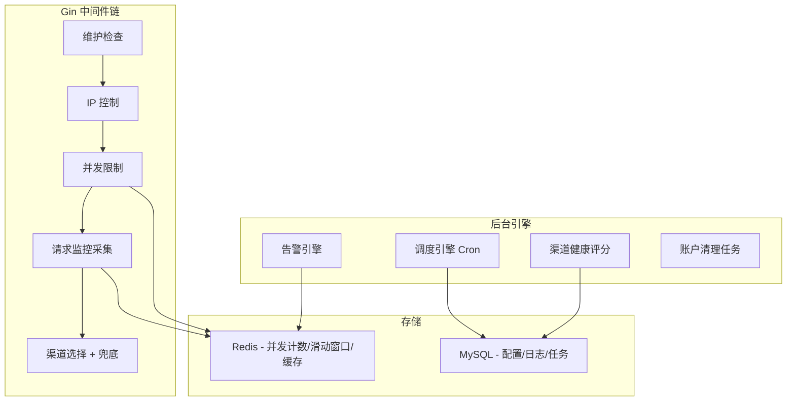

# New-API 二次开发实施方案（v2）

## 背景

基于 new-api（Go/Gin + React 前端）进行二次开发，新增 6 大功能模块 + 补充增强功能。

---

## 需求清单（含用户反馈更新）

### 原始需求（6 项）

| # | 需求 | 核心要点 |
|---|------|----------|
| 1 | 慢请求监控告警 | ✅ **更新**：整合进调度管理模块，提供可配置选项给管理员 |
| 2 | 调度功能 | 定时任务引擎，管理员可自定义配置 |
| 3 | 停机维护提示 | 503 + 预告 + 白名单 |
| 4 | 用户并发限制 | ✅ **更新**：充值用户默认 10 并发，可单独为某个用户调整并发数 |
| 5 | 渠道兜底策略 | 链式 Failover a→b→c |
| 6 | 一键导入 Codex / Claude Code | 生成配置文件 |

### 新增需求（用户反馈）

| # | 需求 | 说明 |
|---|------|------|
| 7 | 不活跃账户额度清理 | 一周内未使用且从未充值的用户，自动清理额度 |

### 我补充的建议功能（8-14）

| # | 补充需求 | 说明 | 理由 |
|---|----------|------|------|
| 8 | 渠道健康度自动评分 | 基于成功率/延迟/错误率对渠道打分 | 与兜底策略联动，低分渠道自动降权 |
| 9 | Token 用量日报推送 | 每日推送用户/渠道用量摘要 | 运营必需，及时发现异常用量 |
| 10 | IP 白名单 / 黑名单 | 支持 IP 级别的访问控制 | 安全加固，防滥用 |
| 11 | 请求重放 / 调试 | 记录完整请求，支持回放调试 | 排查问题必备 |
| 12 | 渠道自动禁用与恢复 | 连续失败 N 次自动禁用，定期探活恢复 | 避免人工干预 |
| 13 | 用户公告系统 | 在用户面板展示系统公告 | 通知 API 变更、模型下线等 |
| 14 | 操作审计日志 | 管理员操作可追溯 | 多管理员场景安全审计 |

---

## 架构总览

---

## 各模块详细设计（分文件）

> [!NOTE]
> 每个模块的详细技术设计在单独文件中，便于逐个评审和实施。

| 模块文件 | 内容 |
|----------|------|
| [module_1_monitor.md](./modules/module_1_monitor.md) | 慢请求监控（整合调度模块） |
| [module_2_scheduler.md](./modules/module_2_scheduler.md) | 调度管理引擎 |
| [module_3_maintenance.md](./modules/module_3_maintenance.md) | 停机维护提示 |
| [module_4_concurrency.md](./modules/module_4_concurrency.md) | 用户并发限制（含用户级配置） |
| [module_5_fallback.md](./modules/module_5_fallback.md) | 渠道兜底策略 |
| [module_6_import.md](./modules/module_6_import.md) | 一键导入 Codex / Claude Code |
| [module_7_cleanup.md](./modules/module_7_cleanup.md) | 不活跃账户清理 |
| [module_8_extras.md](./modules/module_8_extras.md) | 补充建议功能（8-14） |

---

## 并发限制策略（更新版）

| 用户类型 | 默认并发数 | 可调整 |
|----------|-----------|--------|
| 免费用户（未充值） | 3 | 管理员可在用户组配置中调整 |
| 充值用户（已充值） | 10 | 管理员可单独为某用户设置 |
| VIP 用户 | 50 | 可配置 |
| 管理员 | 不限制 | - |
| 单用户自定义 | 自定义值 | 管理员在用户详情页单独设置 |

---

## 开发优先级与里程碑

### Sprint 1（基础设施 + 核心）— 5 天

| 天数 | 任务 |
|------|------|
| D1 | Redis 集成 + 数据库迁移框架 + 所有新表 DDL |
| D2 | 模块五：渠道兜底引擎（核心 relay 改动） |
| D3 | 模块四：并发限制中间件 + 用户级并发配置 |
| D4 | 模块二：调度引擎框架 + 内置任务注册 |
| D5 | 模块一：慢请求监控（作为调度任务 + 可配置选项） |

### Sprint 2（运维功能）— 4 天

| 天数 | 任务 |
|------|------|
| D6 | 模块三：停机维护提示 + 模块七：不活跃账户清理任务 |
| D7 | 告警引擎（钉钉/企微/Telegram）+ 渠道自动禁用恢复 |
| D8 | 模块六：一键导入 Codex / Claude Code |
| D9 | 渠道健康评分 + Token 用量日报 |

### Sprint 3（前端 + 测试）— 4 天

| 天数 | 任务 |
|------|------|
| D10-11 | 前端页面（调度管理、监控面板、兜底配置、并发配置） |
| D12 | 前端页面（维护管理、一键导入、公告系统） |
| D13 | 集成测试 + 压力测试 + 部署文档 |

**总计约 13 个工作日（约 2.5 周）**

---

## Open Questions

> [!IMPORTANT]
> 1. **你用的是哪个版本的 new-api？** 请提供 GitHub 仓库链接或本地路径
> 2. **是否已有 Redis？** 当前部署中是否包含 Redis
> 3. **告警通道偏好？** 钉钉/企微/Telegram/邮件，你主要用哪个
> 4. **补充功能（8-14）** 你觉得哪些需要，哪些先不做
> 5. **是否需要克隆 new-api 到 workspace 直接改代码？**

---

## Verification Plan

### 自动化测试
- 并发限制：goroutine 并发压测
- 兜底引擎：mock 渠道故障，验证链式切换
- 账户清理：mock 不活跃数据，验证清理逻辑

### 集成测试
- 各 API 端点 curl 验证
- 慢请求告警触发验证
- 一键导入配置在 Codex / Claude Code 中验证连通性
