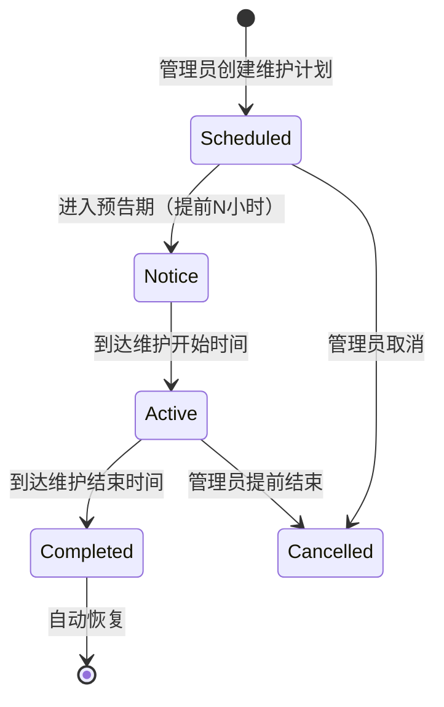

# 模块三：停机维护提示

## 核心逻辑

三阶段维护模式：**预告 → 维护中 → 自动恢复**



---

## 中间件实现

```go
// middleware/maintenance.go
func MaintenanceMiddleware() gin.HandlerFunc {
    return func(c *gin.Context) {
        // 从 Redis 缓存读取维护状态（避免每次查库）
        maintenance := GetCachedMaintenanceStatus()
        
        if maintenance == nil || !maintenance.Enabled {
            c.Next()
            return
        }
        
        now := time.Now()
        
        // ---- 预告期 ----
        noticeStart := maintenance.StartTime.Add(
            -time.Duration(maintenance.NoticeHours) * time.Hour)
        if now.After(noticeStart) && now.Before(maintenance.StartTime) {
            // 正常处理，但在响应头加预告
            c.Header("X-Maintenance-Scheduled", maintenance.StartTime.Format(time.RFC3339))
            c.Header("X-Maintenance-Message", maintenance.Title)
            c.Next()
            return
        }
        
        // ---- 维护中 ----
        if now.After(maintenance.StartTime) && now.Before(maintenance.EndTime) {
            // 白名单用户放行
            userID := c.GetInt("user_id")
            if isMaintenanceWhitelisted(userID, maintenance) {
                c.Next()
                return
            }
            
            // 管理端 API 放行
            if strings.HasPrefix(c.Request.URL.Path, "/api/admin") {
                c.Next()
                return
            }
            
            c.JSON(http.StatusServiceUnavailable, gin.H{
                "error": gin.H{
                    "message":       maintenance.Message,
                    "type":          "system_maintenance",
                    "title":         maintenance.Title,
                    "start_time":    maintenance.StartTime,
                    "end_time":      maintenance.EndTime,
                    "estimated_end": maintenance.EndTime.Format("15:04"),
                },
            })
            c.Abort()
            return
        }
        
        c.Next()
    }
}
```

---

## 数据库

```sql
CREATE TABLE maintenance_schedules (
    id              INT PRIMARY KEY AUTO_INCREMENT,
    title           VARCHAR(200) NOT NULL,
    message         TEXT NOT NULL,              -- 用户看到的提示信息
    start_time      DATETIME NOT NULL,
    end_time        DATETIME NOT NULL,
    notice_hours    INT DEFAULT 24,             -- 提前通知小时数
    whitelist_users JSON DEFAULT '[]',          -- 白名单用户 ID
    status          VARCHAR(20) DEFAULT 'scheduled',
    created_by      INT,
    created_at      DATETIME DEFAULT CURRENT_TIMESTAMP
);
```

## API 端点

```
POST   /api/admin/maintenance           -- 创建维护计划
GET    /api/admin/maintenance           -- 列表
PUT    /api/admin/maintenance/:id       -- 更新
DELETE /api/admin/maintenance/:id       -- 删除
POST   /api/admin/maintenance/instant   -- 即时开启/关闭维护
GET    /api/maintenance/status          -- 公开接口：查询当前维护状态
```

## 前端

- **管理端**：维护计划 CRUD + 即时开关按钮
- **用户端**：顶部 Banner 展示维护预告（黄色）或维护中（红色）
