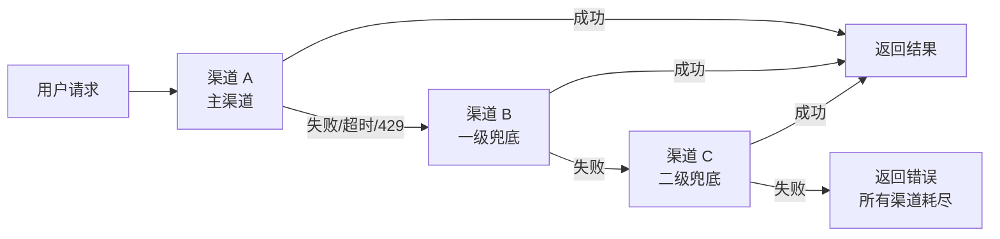

# 模块五：渠道兜底策略

## 核心机制

每个渠道可独立配置兜底链：`主渠道A → 兜底B → 兜底C`，当主渠道请求失败且满足触发条件时，自动切换到下一个兜底渠道。



---

## 兜底触发条件（每个渠道可独立配置）

| 条件 | 默认值 | 说明 |
|------|--------|------|
| HTTP 状态码 | `[500, 502, 503, 429]` | 上游返回这些状态码触发兜底 |
| 超时 | `true`，30s | 请求超时触发 |
| 错误关键词 | `["rate_limit", "overloaded", "insufficient_quota"]` | 响应体包含关键词触发 |
| 渠道被禁用 | `true` | 渠道被自动禁用时直接跳过 |

---

## 后端实现

```go
// relay/fallback.go
func RelayWithFallback(c *gin.Context, primaryChannelID int, modelName string) error {
    fallbackConfig := GetChannelFallback(primaryChannelID)
    
    // 构建执行链
    var chain []int
    if fallbackConfig != nil && fallbackConfig.Enabled {
        chain = append([]int{primaryChannelID}, fallbackConfig.FallbackChain...)
    } else {
        chain = []int{primaryChannelID}
    }
    
    var lastErr error
    for level, channelID := range chain {
        channel, err := model.GetChannelByID(channelID)
        if err != nil || channel.Status == model.ChannelStatusDisabled {
            continue // 渠道不存在或已禁用，跳过
        }
        
        // 检查渠道是否支持该模型
        if !channel.SupportsModel(modelName) {
            continue
        }
        
        if level > 0 {
            log.Warnf("[兜底] 渠道 %d(%s) 失败 → 切换到渠道 %d(%s) (第%d级兜底)", 
                chain[level-1], getChannelName(chain[level-1]),
                channelID, channel.Name, level)
        }
        
        // 执行 relay
        err = doRelay(c, channel)
        if err == nil {
            // 成功
            if level > 0 {
                recordFallbackLog(primaryChannelID, channelID, level, true, "")
            }
            return nil
        }
        
        lastErr = err
        
        // 判断是否应该兜底
        if !shouldTriggerFallback(err, fallbackConfig) {
            // 不满足兜底条件（如 400 参数错误），直接返回
            return err
        }
        
        recordFallbackLog(primaryChannelID, channelID, level, false, err.Error())
    }
    
    return fmt.Errorf("所有渠道(%d级)已耗尽: %v", len(chain), lastErr)
}

func shouldTriggerFallback(err error, config *ChannelFallback) bool {
    if config == nil {
        return false
    }
    
    relayErr, ok := err.(*RelayError)
    if !ok {
        return config.TriggerOnTimeout // 非 relay 错误按超时处理
    }
    
    // 检查状态码
    for _, code := range config.TriggerStatusCodes {
        if relayErr.StatusCode == code {
            return true
        }
    }
    
    // 检查错误关键词
    for _, keyword := range config.TriggerKeywords {
        if strings.Contains(relayErr.Message, keyword) {
            return true
        }
    }
    
    return false
}
```

---

## 管理员配置界面

```
┌─ 渠道兜底配置：OpenAI 官方 (渠道 #1) ─────────┐
│                                                  │
│  [✓] 启用兜底策略                                │
│                                                  │
│  ── 兜底链 ──（拖拽排序）                        │
│  1️⃣ Azure OpenAI (渠道 #3)         [✕ 移除]     │
│  2️⃣ 中转站 A (渠道 #5)             [✕ 移除]     │
│  3️⃣ 中转站 B (渠道 #7)             [✕ 移除]     │
│                     [+ 添加兜底渠道]              │
│                                                  │
│  ── 触发条件 ──                                  │
│  状态码：[✓]500 [✓]502 [✓]503 [✓]429 [ ]400     │
│  超时触发：[✓]  超时阈值：[30] 秒                │
│  关键词：rate_limit, overloaded, insufficient     │
│                                                  │
│            [取消]  [保存]                         │
└──────────────────────────────────────────────────┘
```

---

## 数据库

```sql
CREATE TABLE channel_fallbacks (
    id                   INT PRIMARY KEY AUTO_INCREMENT,
    channel_id           INT NOT NULL UNIQUE,
    fallback_chain       JSON NOT NULL DEFAULT '[]',
    trigger_status_codes JSON DEFAULT '[500,502,503,429]',
    trigger_on_timeout   TINYINT(1) DEFAULT 1,
    timeout_seconds      INT DEFAULT 30,
    trigger_keywords     JSON DEFAULT '["rate_limit","overloaded","insufficient_quota"]',
    enabled              TINYINT(1) DEFAULT 1,
    created_at           DATETIME DEFAULT CURRENT_TIMESTAMP,
    updated_at           DATETIME DEFAULT CURRENT_TIMESTAMP ON UPDATE CURRENT_TIMESTAMP
);

CREATE TABLE fallback_logs (
    id                INT PRIMARY KEY AUTO_INCREMENT,
    primary_channel   INT NOT NULL,
    fallback_channel  INT NOT NULL,
    fallback_level    INT NOT NULL,
    model             VARCHAR(100),
    success           TINYINT(1),
    error_message     TEXT,
    created_at        DATETIME DEFAULT CURRENT_TIMESTAMP,
    INDEX idx_primary_time (primary_channel, created_at)
);
```

## API 端点

```
GET    /api/admin/channels/:id/fallback     -- 获取渠道兜底配置
PUT    /api/admin/channels/:id/fallback     -- 更新兜底配置
GET    /api/admin/fallback/logs             -- 兜底日志查询
GET    /api/admin/fallback/stats            -- 兜底统计（各渠道触发次数/成功率）
```
