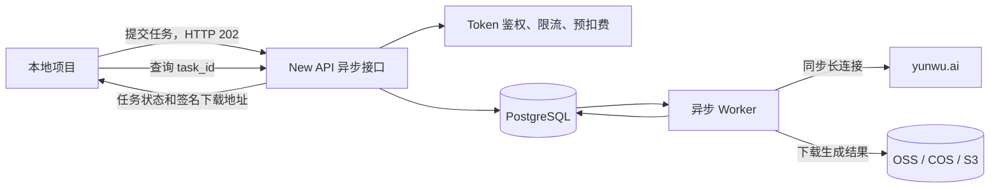
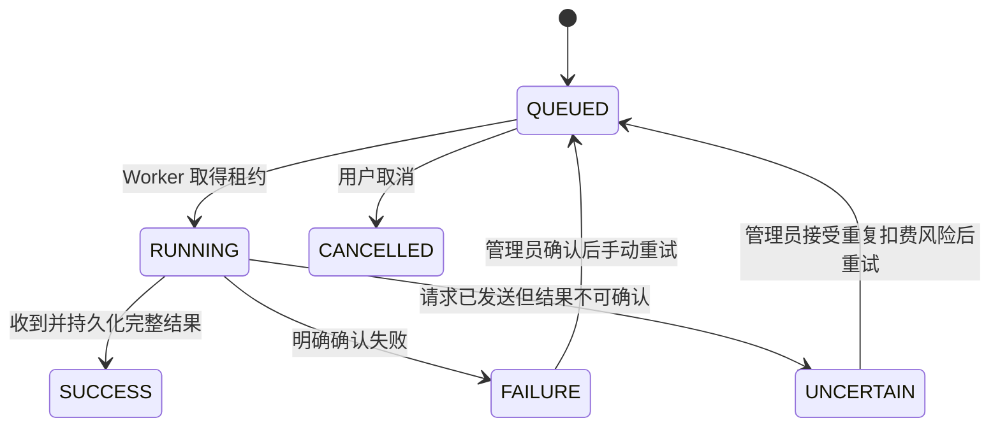

# New API 异步任务中转站开发文档

## 1. 文档信息

- 项目名称：New API 异步任务中转站
- 上游项目：[QuantumNous/new-api](https://github.com/QuantumNous/new-api)
- 计划基线：`v1.0.0-rc.21`
- 首版上游：`https://yunwu.ai`
- 首版使用对象：仅项目所有者自己的多个项目
- 首版范围：同步图片生成接口异步化
- 文档状态：开发基线

## 2. 项目目标

在保留 New API 面板、用户、令牌、渠道、额度、日志和任务管理能力的基础上，增加一套持久化异步执行系统，将云雾的同步图片生成接口包装为异步任务。

客户端提交请求后立即取得本地 `task_id`，无需继续保持网络连接。云端 Worker 负责等待云雾返回最终结果，并将响应和媒体文件持久化。客户端之后可通过任务查询接口或回调取得结果。

### 2.1 成功标准

- 本地客户端提交任务后可以立即断开连接。
- 客户端断线不会影响云端任务继续执行。
- API 服务重启不会丢失尚未执行的排队任务。
- 同一幂等键不会产生重复任务或重复扣费。
- 云雾返回的临时媒体地址会被归档到自有对象存储。
- 任务状态、结果、失败原因和计费信息可在 New API 面板查看。
- 原有 `/v1/images/generations` 同步接口保持兼容。

### 2.2 首版不包含

- 不开放公众注册、在线充值和对外销售。
- 不改造聊天流式、语音和文件接口。
- 不承诺上游同步请求已经被接收后的严格一次执行。
- 不对没有取消能力的上游任务伪造“已取消”。
- 不同时维护 New API classic 前端的新增功能。

## 3. 总体架构



### 3.1 服务角色

同一个代码仓库和 Docker 镜像支持两种运行角色：

```env
APP_ROLE=api
```

```env
APP_ROLE=worker
ASYNC_WORKER_CONCURRENCY=50
ASYNC_JOB_TIMEOUT_SECONDS=1800
```

- API 服务负责鉴权、校验、预扣费、任务入库和查询。
- Worker 负责领取任务、调用上游、归档文件和完成结算。
- API 请求处理器中禁止通过普通 goroutine 执行长任务。

## 4. 代码基线与升级策略

1. Fork 官方 `QuantumNous/new-api` 仓库。
2. 从发布标签 `v1.0.0-rc.21` 建立开发分支，不直接以持续变化的 `main` 作为生产基线。
3. 保留官方仓库为 `upstream` remote。
4. 新功能尽量放入独立目录、独立数据表和独立路由，减少与上游核心转发代码的冲突。
5. 定期合并上游安全修复，合并后必须运行完整测试矩阵。
6. 生产镜像固定 commit SHA 和镜像 digest，禁止直接使用未固定的 `latest`。

建议新增模块：

```text
model/async_job.go
controller/async_job.go
service/async_queue.go
service/async_worker.go
router/async-router.go
relay/asyncwrap/yunwu.go
storage/artifact_store.go
```

## 5. 对外 API

### 5.1 提交异步图片任务

```http
POST /v1/async/images/generations
Authorization: Bearer <new-api-token>
Idempotency-Key: <project-unique-key>
Content-Type: application/json
```

请求体继续使用云雾/OpenAI 图片生成格式：

```json
{
  "model": "doubao-seedream-4-0-250828",
  "prompt": "一座未来城市",
  "size": "1728x2304",
  "response_format": "url"
}
```

成功响应为 HTTP `202 Accepted`：

```json
{
  "id": "task_xxx",
  "status": "queued",
  "status_url": "/v1/async/tasks/task_xxx",
  "result_url": "/v1/async/tasks/task_xxx/result"
}
```

规则：

- `Idempotency-Key` 为必填请求头。
- 唯一约束为 `token_id + idempotency_key`。
- 重复提交返回原任务，不重复预扣费。
- 请求模型必须存在于当前 Token 和渠道允许列表中。
- 首版只允许配置过异步包装能力的云雾渠道。

### 5.2 查询任务

```http
GET /v1/async/tasks/{task_id}
Authorization: Bearer <new-api-token>
```

响应示例：

```json
{
  "id": "task_xxx",
  "status": "running",
  "progress": 50,
  "created_at": 1784300000,
  "started_at": 1784300003,
  "finished_at": null,
  "error": null
}
```

Token 只能查询自己创建的任务，管理员可以通过面板查询全部任务。

### 5.3 获取结果

```http
GET /v1/async/tasks/{task_id}/result
Authorization: Bearer <new-api-token>
```

- `SUCCESS`：返回归一化响应、原始上游响应和自有存储的签名下载地址。
- 非终态：返回 HTTP `409` 和当前任务状态。
- `FAILURE`：返回稳定错误码和失败阶段。
- `UNCERTAIN`：明确提示任务可能已在上游执行，禁止客户端自动重试。

### 5.4 取消任务

```http
POST /v1/async/tasks/{task_id}/cancel
Authorization: Bearer <new-api-token>
```

- `QUEUED` 任务可以取消并退款。
- `RUNNING` 任务若上游没有取消接口，不中断连接；接口返回 HTTP `409` 并说明无法确认上游取消。
- 已进入终态的任务保持原状态。

### 5.5 保留原同步接口

```http
POST /v1/images/generations
```

该接口维持 New API 原有同步语义，避免破坏现有 OpenAI SDK 和第三方客户端。

### 5.6 已接入的三个云雾模型

预发布环境已经启用并实测以下模型：

| 模型 | 客户端请求格式 | Worker 上游协议 | 已验收产物 |
| --- | --- | --- | --- |
| `gemini-3.1-flash-image-preview` | 本站统一图片请求 | Gemini `generateContent` | JPEG |
| `gemini-3-pro-image-preview` | 本站统一图片请求 | Gemini `generateContent` | JPEG |
| `gpt-image-2` | OpenAI 图片请求 | `/v1/images/generations` | PNG |

New API 渠道需要同时满足以下配置：

- 类型选择 `OpenAI`，API 地址填写 `https://yunwu.ai`，不要手动附加 `/v1`。
- 渠道模型列表加入上述三个模型。
- 在渠道高级设置中启用“异步图片包装”，异步模型允许列表也加入上述三个模型。
- 启用自动归档；预发布环境渠道并发暂设为 `1`，完成稳定性测试后再逐级提高。
- 给用户 Token 开启相同的模型权限，否则请求会在入队前返回 `403`。
- Worker 设置 `ASYNC_YUNWU_ROUTE_SUFFIX=stable`，由适配器对每次上游请求追加稳定路由，不修改渠道密钥。

Gemini 请求示例：

```json
{
  "model": "gemini-3.1-flash-image-preview",
  "prompt": "一只站在窗边的橘猫",
  "n": 1,
  "size": "1:1",
  "quality": "1K"
}
```

Gemini 模型当前限制 `n=1`；`size` 使用宽高比，`quality` 使用 `1K`、`2K` 或 `4K`。适配器会转换为云雾的 Gemini 原生请求，并把 `inlineData` 图片归档到对象存储。

`gpt-image-2` 请求示例：

```json
{
  "model": "gpt-image-2",
  "prompt": "一只站在窗边的橘猫",
  "n": 1,
  "size": "1024x1024",
  "quality": "low"
}
```

两类上游响应最终都由本站归一化为 `response.data[].url`，URL 指向本站对象存储的短期签名地址。

## 6. 任务状态机



状态定义：

- `QUEUED`：任务已持久化，尚未向上游发送。
- `RUNNING`：Worker 已领取任务并开始执行。
- `SUCCESS`：上游响应和产物均已成功持久化。
- `FAILURE`：可以明确确认任务失败或未被上游接受。
- `UNCERTAIN`：请求可能已被上游接受，但最终结果无法确认。
- `CANCELLED`：仅适用于尚未发送上游的排队任务。

## 7. 数据模型

继续复用 New API 的 `Task` 表记录用户可见状态、渠道、额度和结果摘要；新增一对一的 `async_jobs` 表记录后台执行细节。

### 7.1 async_jobs

| 字段 | 用途 |
| --- | --- |
| `id` | 数据库主键 |
| `task_id` | 关联 New API Task，唯一 |
| `token_id` | 创建任务的 Token |
| `channel_id` | 入队时选定的上游渠道 |
| `endpoint_type` | 首版固定为图片生成 |
| `request_payload` | 加密或受控保存的请求内容 |
| `request_hash` | 请求一致性验证 |
| `idempotency_key` | 客户端幂等键 |
| `execution_status` | 后台执行状态 |
| `worker_id` | 当前执行节点 |
| `lease_until` | Worker 租约到期时间 |
| `attempt` | 尝试次数 |
| `request_sent_at` | 请求体开始向上游发送的时间 |
| `result_payload` | 原始上游响应或其对象存储引用 |
| `error_phase` | 失败发生阶段 |
| `error_code` | 稳定内部错误码 |
| `created_at` | 创建时间 |
| `updated_at` | 更新时间 |

### 7.2 artifacts

用于记录一项任务产生的一个或多个文件：

```text
id
task_id
object_key
content_type
size_bytes
sha256
source_url_hash
created_at
expires_at
```

### 7.3 task_events

记录任务状态变化、Worker、错误阶段和管理员操作，禁止写入上游密钥和完整 Token。

## 8. Worker 与队列设计

### 8.1 领取任务

- 使用项目统一的 `lockForUpdate(tx)` 领取任务，兼容 SQLite、MySQL 5.7 和 PostgreSQL 9.6。
- 领取后写入 `worker_id`、`lease_until` 和 `RUNNING`。
- Worker 定期续租。
- 单 Worker 内使用渠道并发信号量；预发布阶段固定一个 Worker 副本，避免横向扩容绕过进程内渠道上限。
- 全局并发和渠道并发均可配置；增加多 Worker 副本前必须先实现数据库或 Redis 级分布式并发配额。

### 8.2 崩溃恢复

- `request_sent_at` 为空且租约过期：可以安全重新入队。
- `request_sent_at` 非空且租约过期：标记 `UNCERTAIN`。
- 原生异步上游若已经取得上游任务 ID，可以重新进入查询流程，不标记 `UNCERTAIN`。
- Worker 发布时先停止领取新任务，再等待运行中任务完成。

### 8.3 上游调用

- 使用独立 HTTP Client 和连接池。
- 设置连接、TLS、响应头和整体任务超时。
- 禁止将客户端请求 Context 传给后台 Worker。
- 只允许访问配置的云雾基地址和白名单路径。
- 请求和响应日志默认脱敏。

## 9. 计费与重试

### 9.1 计费

- 入队成功后预扣额度。
- 重复幂等请求不重复扣费。
- 成功时按 New API 现有计费上下文完成结算。
- 明确确认未被上游接受的失败任务退款。
- 排队取消任务退款。
- `UNCERTAIN` 默认不退款，由管理员人工核查。
- 所有退款和结算必须具备幂等保护。

### 9.2 自动重试

可以自动重试：

- DNS 解析失败。
- TCP/TLS 连接建立失败。
- 请求体尚未发送时的本地错误。
- 明确收到可重试的 429，并遵守退避时间。

禁止自动重试：

- 请求体已经发送后的读取超时。
- Worker 在已发送请求后崩溃。
- 上游返回的错误无法证明任务未执行。

管理员手动重试 `UNCERTAIN` 任务时，面板必须显示可能重复生成和重复扣费的确认提示。

## 10. 文件归档

新增统一对象存储接口：

```go
type ArtifactStore interface {
    Put(ctx context.Context, key string, body io.Reader, contentType string) error
    SignedURL(ctx context.Context, key string, ttl time.Duration) (string, error)
    Delete(ctx context.Context, key string) error
}
```

首版要求兼容 S3 协议，可对接阿里云 OSS、腾讯云 COS、AWS S3 或 MinIO。

归档流程：

1. 解析上游响应中的全部媒体 URL。
2. 校验协议、主机、DNS 解析结果和重定向目标。
3. 阻止环回、内网、链路本地地址和云元数据地址，防止 SSRF。
4. 限制文件数量、单文件大小、总大小、超时和 MIME 类型。
5. 流式下载并计算 SHA-256，避免一次性加载到内存。
6. 上传对象存储并写入 artifacts。
7. 只有全部必需产物持久化成功后，任务才进入 `SUCCESS`。

默认结果保留 30 天，由清理任务删除过期对象和对应记录。

## 11. 面板改造

仅维护 New API 默认新版前端。

任务列表增加：

- 异步包装任务类型。
- 状态、进度、排队时长和执行时长。
- Worker 节点和尝试次数。
- 错误阶段和稳定错误码。
- `UNCERTAIN` 高风险标识。
- 原始响应查看和产物下载。
- 排队任务取消。
- 管理员手动重试。

渠道设置增加：

- 是否启用同步接口异步包装。
- 允许的图片模型。
- 最大并发数。
- 单任务超时时间。
- 结果保留天数。
- 是否自动归档文件。

## 12. 安全要求

- New API Token 只保存系统原有安全表示，不在日志输出明文。
- 云雾密钥保存在服务端 Secret 中，不返回给客户端。
- 任务查询必须校验 Token 所有权。
- 管理后台不直接暴露数据库和 Redis。
- PostgreSQL、Redis 只监听 Docker 内部网络。
- 对象存储 Bucket 默认私有，结果使用短期签名地址。
- Caddy 负责 HTTPS，HTTP 自动跳转 HTTPS。
- 限制请求体大小、提示词长度、图片数量和输入 URL 数量。
- 管理员操作写入审计事件。
- 对外提供服务前必须另行确认 New API AGPLv3 义务和云雾转售授权；首版不对外销售。

## 13. 部署方案

### 13.1 服务器

- Ubuntu 24.04 LTS，x86_64。
- 推荐 4 核 8GB、80GB SSD。
- 独立公网 IP。
- 开放 22、80、443 端口。
- 服务器能够稳定访问 `yunwu.ai` 和对象存储。

### 13.2 Docker Compose 服务

```text
caddy
new-api-api
new-api-worker
postgres
redis
```

- 数据库和 Redis 使用强随机密码。
- 设置 `SESSION_SECRET`、`CRYPTO_SECRET` 和各类存储 Secret。
- 数据目录使用持久卷。
- 每日备份 PostgreSQL，备份文件上传到独立存储位置。
- 生产环境不直接暴露 3000、5432 和 6379 端口。

## 14. 测试计划

### 14.1 单元测试

- 状态迁移合法性。
- 幂等键唯一性。
- 任务租约领取和续租。
- 计费预扣、结算和退款幂等性。
- 可重试和不可重试错误分类。
- URL、DNS、重定向和 MIME 安全校验。

### 14.2 集成测试

- 模拟云雾延迟成功、明确失败、429、5xx 和读取超时。
- 客户端提交后立即断开连接，任务仍然成功。
- API 容器重启不影响 Worker 任务。
- Worker 在请求发送前崩溃，任务重新领取。
- Worker 在请求发送后崩溃，任务进入 `UNCERTAIN`。
- 同一幂等键并发提交只创建一个任务。
- 超出渠道并发上限的任务保持排队。
- 多图片响应全部归档并生成签名 URL。
- 不同 Token 无法读取对方任务。

### 14.3 部署验收

- HTTPS、健康检查和自动重启正常。
- 数据库和 Redis 不可从公网访问。
- 备份和恢复演练成功。
- 服务器重启后排队任务仍存在。
- 日志中不存在完整 Token、云雾密钥和敏感请求体。
- 原同步接口行为与改造前一致。

## 15. 实施顺序

1. 建立 Fork、固定基线和开发分支。
2. 准备 PostgreSQL 开发环境并加入数据迁移。
3. 实现 AsyncJob、Artifact 和 TaskEvent 数据模型。
4. 实现提交、查询、结果和取消接口。
5. 实现数据库租约队列和独立 Worker 角色。
6. 实现云雾同步图片适配器。
7. 接入 New API 预扣、结算和退款流程。
8. 实现 S3 兼容对象存储和安全下载。
9. 改造默认新版面板。
10. 完成单元、集成、故障注入和并发测试。
11. 在全新云服务器部署预发布环境。
12. 完成备份恢复、断线和重启验收后切换正式使用。

## 16. 第一版完成定义

满足以下条件后，第一版才视为完成：

- 四个异步公开接口可用并有稳定响应格式。
- 云雾同步图片任务可以在客户端断线后继续完成。
- 排队任务、运行任务和不确定任务均有正确状态处理。
- 额度不会因重复提交或重复结算产生异常。
- 所有成功产物已进入自有对象存储。
- 面板可以查询、筛选和诊断任务。
- 故障注入测试和部署验收全部通过。
- 已生成部署、备份、恢复和升级操作说明。

## 17. 2026-07-18 服务器实测记录

隔离预发布环境目录为 `/opt/new-api-async-staging`，Compose 项目名为 `new-api-async-staging`。PostgreSQL、Redis、MinIO、API 和单 Worker 均只使用该 Compose 项目的网络、容器和数据卷。

三个模型通过本站异步 API 同时入队后，由单 Worker 依次执行，结果如下：

| 模型 | 任务状态 | 结算状态 | 归档 | 下载验证 |
| --- | --- | --- | --- | --- |
| `gemini-3.1-flash-image-preview` | `SUCCESS` | `SETTLED` | 1 个 JPEG，326987 字节 | HTTP 200，SHA-256 已记录 |
| `gemini-3-pro-image-preview` | `SUCCESS` | `SETTLED` | 1 个 JPEG，573119 字节 | HTTP 200，SHA-256 已记录 |
| `gpt-image-2` | `SUCCESS` | `SETTLED` | 1 个 PNG，98649 字节 | HTTP 200，SHA-256 已记录 |

真实服务器测试同时发现并修复了 PostgreSQL `TEXT` 字段返回 `string` 时无法扫描到 `json.RawMessage` 的问题。异步结果和事件详情现使用项目已有的跨驱动 `JSONValue`，可读取 `string` 与 `[]byte` 两种数据库驱动返回值。
