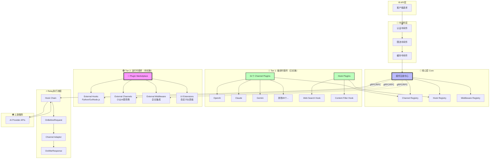
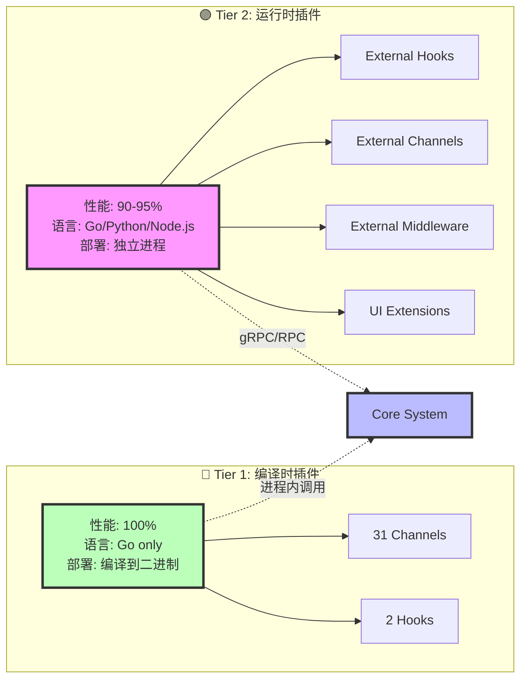

# New-API 插件化架构说明

## 完整目录结构

```
new-api-2/
├── core/                              # 核心层（高性能，不可插件化）
│   ├── interfaces/                    # 插件接口定义
│   │   ├── channel.go                # Channel插件接口
│   │   ├── hook.go                   # Hook插件接口
│   │   └── middleware.go             # Middleware插件接口
│   └── registry/                      # 插件注册中心
│       ├── channel_registry.go       # Channel注册器（线程安全）
│       ├── hook_registry.go          # Hook注册器（优先级排序）
│       └── middleware_registry.go    # Middleware注册器
│
├── plugins/                           # 🔵 Tier 1: 编译时插件（已实施）
│   ├── channels/                      # Channel插件
│   │   ├── base_plugin.go            # 基础插件包装器
│   │   └── registry.go               # 自动注册31个AI Provider
│   └── hooks/                         # Hook插件
│       ├── web_search/               # 联网搜索Hook
│       │   ├── web_search_hook.go
│       │   └── init.go
│       └── content_filter/           # 内容过滤Hook
│           ├── content_filter_hook.go
│           └── init.go
│
├── marketplace/                       # 🟣 Tier 2: 运行时插件（待实施，Phase 2）
│   ├── loader/                        # go-plugin加载器
│   │   ├── plugin_client.go          # 插件客户端
│   │   ├── plugin_server.go          # 插件服务器
│   │   └── lifecycle.go              # 生命周期管理
│   ├── manager/                       # 插件管理器
│   │   ├── installer.go              # 安装/卸载
│   │   ├── updater.go                # 版本更新
│   │   └── registry.go               # 插件注册表
│   ├── security/                      # 安全模块
│   │   ├── signature.go              # Ed25519签名验证
│   │   ├── checksum.go               # SHA256校验
│   │   └── sandbox.go                # 沙箱配置
│   ├── store/                         # 插件商店客户端
│   │   ├── client.go                 # 商店API客户端
│   │   ├── search.go                 # 搜索功能
│   │   └── download.go               # 下载管理
│   └── proto/                         # gRPC协议定义
│       ├── hook.proto                # Hook插件协议
│       ├── channel.proto             # Channel插件协议
│       └── common.proto              # 通用消息
│
├── plugins_external/                  # 第三方插件安装目录
│   ├── installed/                    # 已安装插件
│   │   ├── awesome-hook-v1.0.0/
│   │   ├── custom-llm-v2.1.0/
│   │   └── slack-notify-v1.5.0/
│   ├── cache/                        # 下载缓存
│   └── temp/                         # 临时文件
│
├── relay/                            # Relay层
│   ├── hooks/                        # Hook执行链
│   │   ├── chain.go                 # Hook链管理器
│   │   ├── context.go               # Hook上下文
│   │   └── context_builder.go       # 上下文构建器
│   └── relay_adaptor.go             # Channel适配器（优先从Registry获取）
│
├── config/                           # 配置系统
│   ├── plugins.yaml                 # 插件配置（Tier 1 + Tier 2）
│   └── plugin_config.go             # 配置加载器（支持环境变量）
│
└── (其他现有目录保持不变)
```

---

## 完整架构图

### 系统架构总览



### 双层插件系统架构



---

## 核心要点说明

### 1. 双层插件架构

| 层级 | 技术方案 | 性能 | 适用场景 | 开发语言 |
|------|---------|------|---------|---------|
| **Tier 1<br/>编译时插件** | 编译时链接 | 100%<br/>零损失 | • 核心Channel（OpenAI等）<br/>• 内置Hook<br/>• 高频调用路径 | Go only |
| **Tier 2<br/>运行时插件** | go-plugin<br/>gRPC | 90-95%<br/>5-10%开销 | • 第三方扩展<br/>• 企业定制<br/>• 多语言集成 | Go/Python/<br/>Node.js/Rust |

### 2. 核心组件

#### Core层（核心引擎）
- **interfaces/**: 定义ChannelPlugin、RelayHook、MiddlewarePlugin接口
- **registry/**: 线程安全的插件注册中心，支持O(1)查找、优先级排序

#### Relay Hook链
- **执行流程**: OnBeforeRequest → Channel.DoRequest → OnAfterResponse
- **特性**: 优先级排序、短路机制、数据共享（HookContext.Data）
- **应用场景**: 联网搜索、内容过滤、日志增强、缓存策略

### 3. Tier 1: 编译时插件（已实施 ✅）

**特点**:
- 零性能损失，编译后与硬编码无差异
- init()函数自动注册到Registry
- YAML配置启用/禁用

**已实现**:
- ✅ 31个Channel插件（OpenAI、Claude、Gemini等）
- ✅ 2个Hook插件（web_search、content_filter）
- ✅ Hook执行链
- ✅ 配置系统（支持环境变量展开）

### 4. Tier 2: 运行时插件（待实施 🚧）

**基于**: [hashicorp/go-plugin](https://github.com/hashicorp/go-plugin)（Vault/Terraform使用）

**优势**:
- ✅ 进程隔离（第三方代码崩溃不影响主程序）
- ✅ 多语言支持（gRPC协议）
- ✅ 热插拔（无需重启）
- ✅ 安全验证（Ed25519签名 + SHA256校验 + TLS加密）
- ✅ 独立分发（插件商店）

**适用场景**:
- 第三方开发者扩展
- 企业定制业务逻辑
- Python ML模型集成
- 第三方服务集成（Slack/钉钉/企业微信）
- UI扩展

### 5. 安全机制

**Tier 1（编译时）**:
- 内部代码审查
- 编译期类型安全

**Tier 2（运行时）**:
- Ed25519签名验证
- SHA256校验和
- gRPC TLS加密
- 进程资源限制（内存/CPU）
- 插件商店审核机制
- 可信发布者白名单

### 6. 配置系统

**单一配置文件**: `config/plugins.yaml`

```yaml
# Tier 1: 编译时插件
plugins:
  hooks:
    - name: web_search
      enabled: false
      priority: 50
      config:
        api_key: ${WEB_SEARCH_API_KEY}

# Tier 2: 运行时插件（待实施）
external_plugins:
  enabled: true
  hooks:
    - name: awesome_hook
      binary: awesome-hook-v1.0.0/awesome-hook
      checksum: sha256:abc123...

# 插件商店
marketplace:
  enabled: true
  api_url: https://plugins.new-api.com
```

### 7. 性能对比

| 场景 | Tier 1 | Tier 2 | RPC开销 |
|------|--------|--------|--------|
| 核心Channel | 100% | N/A | 0% |
| 内置Hook | 100% | N/A | 0% |
| 第三方Hook | N/A | 92-95% | 5-8% |
| Python插件 | N/A | 88-92% | 8-12% |

### 8. 实施路线图

#### Phase 1: 编译时插件系统 ✅ 已完成
- Core Registry + Hook Chain
- 31个Channel插件 + 2个Hook示例
- YAML配置系统

#### Phase 2: go-plugin基础
- protobuf协议定义
- PluginLoader实现
- 签名验证系统
- Python/Go SDK

#### Phase 3: 插件商店
- 商店后端API
- Web UI（搜索、安装、管理）
- CLI工具
- 多语言SDK

### 9. 扩展示例

**新增Tier 1插件（编译时）**:
```go
// 1. 实现接口
type MyHook struct{}
func (h *MyHook) OnBeforeRequest(ctx *HookContext) error { /*...*/ }

// 2. 注册
func init() { registry.RegisterHook(&MyHook{}) }

// 3. 导入到main.go
import _ "github.com/xxx/plugins/hooks/my_hook"
```

**新增Tier 2插件（运行时）**:
```python
# external-plugin/my_hook.py
from new_api_plugin_sdk import HookPlugin, serve

class MyHook(HookPlugin):
    def on_before_request(self, ctx):
        return {"modified_body": ctx.request_body}

serve(MyHook())
```