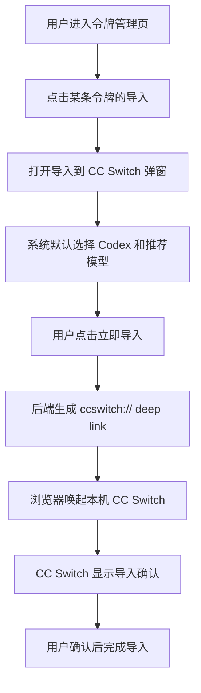
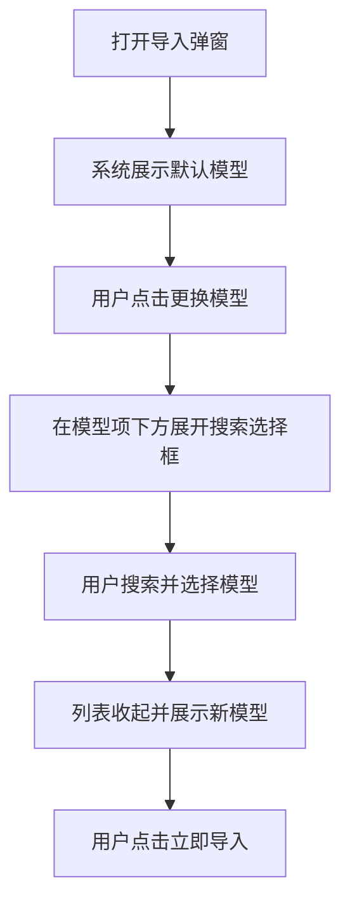
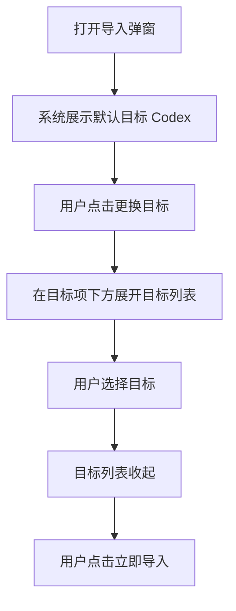

# 中转站「一键导入 CC Switch」需求文档

> 适用范围：中转站 Web 控制台 / 令牌管理页面  
> 目标客户端：MVP 阶段仅支持 Codex；后续扩展 Claude Code、Hermes、OpenClaw、OpenCode、Gemini 等。  
> 目标平台：Windows / macOS。平台能力不作为弹窗内容展示，只在唤起失败或安装引导时处理。

---

## 1. 背景与设计判断

中转站已有 API 令牌管理能力，用户需要把某个令牌的 `API Key`、`BaseURL`、`默认模型` 快速配置到本地 CC Switch，再由 CC Switch 管理 Codex 等客户端的模型调用配置。

需要辩证看待这个功能：

- 不能把它设计成复杂的「配置导出工具」，否则用户会面对目标、模型、链接、平台等过多概念。
- 也不能完全没有修改入口，因为默认模型或目标客户端可能不符合用户当前需求。
- 最优方案是：系统先给用户选好默认值，用户只负责确认；只有默认值不满意时，才展开更换模型或更换目标。

因此，本功能的核心不是「让用户配置」，而是「让用户确认」。

---

## 2. 功能命名

### 2.1 页面按钮文案

推荐文案：

```text
导入
```

鼠标悬停提示：

```text
导入到 CC Switch
```

### 2.2 不推荐文案

不建议使用：

```text
导出
导出配置
导出到 CC Switch
复制到 CC Switch
```

原因：从用户视角看，目标动作是「把当前令牌导入到 CC Switch」，而不是导出文件或复制配置。若叫「导出」，容易让用户误以为会下载配置文件、导出 Excel 或生成明文配置。

---

## 3. 页面入口位置

### 3.1 入口位置

在「令牌管理」页面的每条令牌记录右侧操作区新增「导入」按钮。

推荐位置：

```text
聊天 / 导入 / 禁用 / 编辑 / 删除
```

即放在「聊天」之后、「禁用」之前。

### 3.2 原因

- 「导入」是针对某一个令牌的操作，不适合放在页面顶部全局按钮区。
- 用户需要明确知道当前导入的是哪一个令牌。
- 放在行操作区，符合「编辑」「禁用」「删除」这类单条记录操作习惯。

### 3.3 当操作区拥挤时的备选方案

如果后续右侧操作区按钮过多，可以改为：

```text
聊天 / 导入 / 更多
```

「更多」中包含：

```text
禁用
编辑
删除
```

MVP 阶段建议先直接展示「导入」，提升功能可见性。

---

## 4. 用户流程

### 4.1 默认流程



### 4.2 修改模型流程



### 4.3 修改目标流程



---

## 5. 弹窗 UI 设计

### 5.1 弹窗默认状态

```text
┌──────────────────────────────────────────────┐
│ 导入到 CC Switch                              │
│ 将当前令牌导入到本机 CC Switch，用于 Codex。   │
│                                              │
│ 当前令牌                                      │
│ 名称：codex                                   │
│ 密钥：sk-HYYi********M15                      │
│ BaseURL：https://api.example.com/v1            │
│                                              │
│ 导入目标                                      │
│ Codex                                  更换   │
│                                              │
│ 默认模型                                      │
│ gpt-5.1-codex                          更换   │
│                                              │
│                         取消    立即导入       │
└──────────────────────────────────────────────┘
```

### 5.2 更换目标展开状态

目标选择内容必须出现在「导入目标」下面，不要放在弹窗底部。

```text
导入目标
Codex                                      收起

请选择导入目标
● Codex
○ Claude Code       即将支持
○ Hermes            即将支持
○ OpenClaw          即将支持
○ OpenCode          即将支持
```

MVP 阶段仅 Codex 可选，其他目标显示为灰色「即将支持」。

### 5.3 更换模型展开状态

模型搜索内容必须出现在「默认模型」下面，不要放在弹窗底部。

```text
默认模型
                 收起

搜索模型
[ 输入模型名称，例如 codex / sonnet / qwen ]

推荐 / 最近添加
● gpt-5.1-codex           推荐
○ gpt-5-codex
○ claude-sonnet-4
○ qwen-max
```

用户选择模型后：

```text
默认模型
qwen-max                                  更换
```

下拉列表自动收起。

---

## 6. 不展示内容

弹窗中不要展示以下内容：

```text
Windows / macOS 通用
导入预览
复制链接
ccswitch:// 链接明文
Provider / App / Model 三列表格预览
```

原因：

1. 用户不关心 deep link 技术细节。
2. API Key 可能存在于 deep link 中，不适合明文展示。
3. 本功能目标是「一键导入」，不是「配置生成器」。
4. 弹窗越复杂，越容易让用户犹豫，不符合「少做选择」原则。

---

## 7. 默认值策略

### 7.1 默认目标

默认目标选择优先级：

1. 当前用户上次导入 CC Switch 时使用的目标。
2. 如果令牌名称包含 `codex`，默认 Codex。
3. 其他情况默认 Codex。

MVP 阶段：固定默认 Codex。

### 7.2 默认模型

默认模型选择优先级：

1. 当前用户上次导入 CC Switch 时使用的模型。
2. 当前令牌绑定的默认模型。
3. 系统推荐模型。
4. 最近添加的启用模型。

### 7.3 模型通用原则

中转站中的模型对 Codex、Claude Code、Hermes、OpenClaw 等目标通用。

因此：

- 模型列表不按目标客户端过滤。
- 目标选择只影响 deep link 中的 `app` 参数。
- 模型选择只影响 deep link 中的 `model` 参数。

---

## 8. 模型搜索选择框

### 8.1 设计目标

模型数量可能很多，因此不应一次性展示全部模型。应使用「可搜索单选框」。

用户体验上表现为：

```text
打开更换模型
→ 默认展示推荐 / 最近添加模型
→ 用户输入关键词
→ 列表按模型名匹配
→ 用户点击模型
→ 列表收起，只展示已选模型
```

### 8.2 默认展示

点击「更换模型」后，默认展示：

```text
推荐模型
最近添加模型
```

默认最多显示 20～30 个。

### 8.3 搜索规则

支持包含匹配。

示例：

```text
输入 codex
匹配：
- gpt-5.1-codex
- gpt-5-codex
- codex-mini
```

```text
输入 sonnet
匹配：
- claude-sonnet-4
- claude-3.7-sonnet
- claude-3.5-sonnet
```

可选增强：支持多关键词匹配。

```text
输入 gpt codex
匹配：
- gpt-5.1-codex
- gpt-5-codex
```

### 8.4 无结果状态

```text
没有找到匹配模型
请检查模型名称，或清空关键词重新搜索。
```

### 8.5 清空逻辑

MVP 阶段可以不单独展示清空按钮，因为用户点击「更换」后即可重新选择。

如果后续需要，可在已选模型右侧增加小型清空图标，但不要打断默认确认流程。

---

## 9. 目标客户端扩展设计

### 9.1 目标注册表

前端和后端都应使用目标注册表，不要在多处硬编码目标。

```json
[
  {
    "key": "codex",
    "label": "Codex",
    "ccswitchApp": "codex",
    "enabled": true
  },
  {
    "key": "claude",
    "label": "Claude Code",
    "ccswitchApp": "claude",
    "enabled": false
  },
  {
    "key": "hermes",
    "label": "Hermes",
    "ccswitchApp": "hermes",
    "enabled": false
  },
  {
    "key": "openclaw",
    "label": "OpenClaw",
    "ccswitchApp": "openclaw",
    "enabled": false
  },
  {
    "key": "opencode",
    "label": "OpenCode",
    "ccswitchApp": "opencode",
    "enabled": false
  }
]
```

### 9.2 MVP 范围

MVP 仅启用：

```text
Codex
```

后续启用某个目标时，只需要：

1. 确认 CC Switch 是否支持该目标的 app 参数。
2. 在目标注册表中打开 `enabled`。
3. 补充目标相关测试用例。

---

## 10. 后端接口设计

### 10.1 查询导入弹窗初始化信息

```http
GET /api/tokens/{tokenId}/ccswitch/import-options
```

返回示例：

```json
{
  "token": {
    "id": "tok_001",
    "name": "codex",
    "masked_key": "sk-HYYi********M15",
    "base_url": "https://api.example.com/v1"
  },
  "default_target": "codex",
  "default_model": "gpt-5.1-codex",
  "targets": [
    {
      "key": "codex",
      "label": "Codex",
      "enabled": true
    },
    {
      "key": "claude",
      "label": "Claude Code",
      "enabled": false,
      "disabled_reason": "即将支持"
    }
  ]
}
```

注意：该接口不要返回完整 API Key。

### 10.2 查询模型列表

```http
GET /api/models?keyword=&page=1&pageSize=30&sort=created_at_desc
```

返回示例：

```json
{
  "list": [
    {
      "name": "gpt-5.1-codex",
      "created_at": "2026-06-10 09:20:00",
      "enabled": true,
      "is_recommended": true
    },
    {
      "name": "gpt-5-codex",
      "created_at": "2026-06-09 18:30:00",
      "enabled": true,
      "is_recommended": false
    }
  ],
  "total": 128,
  "has_more": true
}
```

### 10.3 生成导入链接

```http
POST /api/tokens/{tokenId}/ccswitch/import-link
```

请求示例：

```json
{
  "target": "codex",
  "model": "gpt-5.1-codex"
}
```

返回示例：

```json
{
  "url": "ccswitch://v1/import?resource=provider&app=codex&name=codex&endpoint=https%3A%2F%2Fapi.example.com%2Fv1&apiKey=sk-xxx&model=gpt-5.1-codex"
}
```

该接口需要设置：

```http
Cache-Control: no-store
```

---

## 11. Deep Link 生成规则

### 11.1 Codex

```js
const params = new URLSearchParams({
  resource: "provider",
  app: "codex",
  name: tokenName,
  endpoint: baseURL,
  apiKey,
  model: selectedModel,
  enabled: "true"
});

const url = `ccswitch://v1/import?${params.toString()}`;
```

### 11.2 Claude Code

```js
const params = new URLSearchParams({
  resource: "provider",
  app: "claude",
  name: tokenName,
  endpoint: baseURL,
  apiKey,
  model: selectedModel,
  enabled: "true"
});
```

### 11.3 参数编码要求

所有参数必须通过 `URLSearchParams` 或等价方法编码，不能手工拼接未编码字符串。

需要正确处理：

```text
中文名称
空格
斜杠 /
冒号 :
问号 ?
等号 =
与号 &
```

---

## 12. 前端交互实现要求

### 12.1 打开弹窗

点击「导入」时：

1. 读取当前行 tokenId。
2. 请求初始化接口。
3. 弹出「导入到 CC Switch」弹窗。
4. 默认展示目标和模型。

### 12.2 立即导入

点击「立即导入」时：

1. 校验目标和模型是否存在。
2. 请求后端生成 deep link。
3. 使用 `window.location.href = url` 唤起 CC Switch。
4. 展示简短提示：`正在打开 CC Switch...`

### 12.3 唤起失败处理

浏览器无法直接判断 deep link 是否一定成功。可以在点击后展示辅助提示：

```text
如果没有打开 CC Switch，请确认已安装并完成协议注册。
```

该提示可以延迟 1.5 秒后出现，不要默认占用主要界面。

---

## 13. 安全要求

1. 弹窗仅展示脱敏 API Key。
2. 完整 API Key 只在「立即导入」时由后端读取并生成 deep link。
3. 不在页面中展示 deep link 明文。
4. 不提供复制链接按钮。
5. 前端日志不得输出 deep link。
6. 后端日志不得记录完整 deep link、完整 API Key。
7. 导入链接接口必须鉴权，用户只能导入自己有权限的令牌。
8. 响应头设置 `Cache-Control: no-store`。
9. 建议记录导入行为，但只记录 tokenId、target、model、时间、操作者，不记录完整 API Key。

---

## 14. 数据库建议

### 14.1 导入记录表

```sql
CREATE TABLE ccswitch_import_logs (
  id BIGINT PRIMARY KEY AUTO_INCREMENT,
  user_id BIGINT NOT NULL,
  token_id BIGINT NOT NULL,
  target VARCHAR(64) NOT NULL,
  model VARCHAR(255) NOT NULL,
  created_at DATETIME NOT NULL,
  ip VARCHAR(64),
  user_agent VARCHAR(512)
);
```

### 14.2 用户偏好表

```sql
CREATE TABLE user_ccswitch_preferences (
  id BIGINT PRIMARY KEY AUTO_INCREMENT,
  user_id BIGINT NOT NULL,
  last_target VARCHAR(64),
  last_model VARCHAR(255),
  updated_at DATETIME NOT NULL,
  UNIQUE KEY uk_user_id (user_id)
);
```

---

## 15. MVP 开发范围

### 15.1 必须实现

- 令牌列表每行新增「导入」按钮。
- 点击后打开导入确认弹窗。
- 展示当前令牌名称、脱敏密钥、BaseURL。
- 默认目标为 Codex。
- 默认模型按规则自动选择。
- 支持更换模型，包含模型搜索。
- 支持立即导入并唤起 CC Switch。
- 不展示 deep link，不提供复制链接。

### 15.2 暂不实现

- 批量导入。
- 同时导入多个目标。
- 用户自定义 Provider 高级配置。
- 导入预览。
- 复制链接。
- Windows / macOS 平台展示。

---

## 16. 验收标准

### 16.1 UI 验收

- 「导入」按钮出现在每条令牌行的操作区。
- 弹窗默认状态简洁，只展示当前令牌、导入目标、默认模型和底部按钮。
- 「更换目标」展开内容出现在导入目标项下方。
- 「更换模型」展开内容出现在默认模型项下方。
- 弹窗中不出现「Windows / macOS 通用」。
- 弹窗中不出现「导入预览」。
- 弹窗中不出现「复制链接」。
- 弹窗中不展示 `ccswitch://` 明文。

### 16.2 功能验收

- 默认 Codex + 默认模型时可直接点击「立即导入」。
- 模型搜索输入 `codex` 能匹配包含 codex 的模型。
- 选择模型后，模型列表自动收起。
- 点击「立即导入」后能够生成 deep link 并尝试唤起 CC Switch。
- 未选择模型时，「立即导入」不可用或提示选择模型。

### 16.3 安全验收

- 前端不展示完整 API Key。
- 前端不打印 deep link。
- 后端不记录完整 API Key。
- 无权限令牌无法生成导入链接。
- 导入链接接口响应头包含 `Cache-Control: no-store`。

---

## 17. 给 Codex 桌面端执行的 Spike 文档

### 17.1 目标

在中转站的令牌管理页面新增「导入」功能，用户可以将当前令牌一键导入到 CC Switch，用于 Codex。MVP 只支持 Codex，但代码结构需要预留 Claude Code、Hermes、OpenClaw、OpenCode 等目标扩展能力。

### 17.2 变更范围

需要修改：

- 令牌管理列表 UI。
- 导入弹窗组件。
- 模型搜索选择组件。
- CC Switch deep link 生成接口。
- 导入日志记录。
- 用户上次导入偏好记录。

不得修改：

- 现有令牌创建逻辑。
- 现有令牌编辑逻辑。
- 现有聊天功能。
- 现有禁用 / 删除逻辑。

### 17.3 完成标准

1. 令牌列表每条记录右侧新增「导入」按钮。
2. 点击「导入」打开弹窗。
3. 弹窗默认展示：当前令牌、导入目标 Codex、默认模型。
4. 用户可直接点击「立即导入」。
5. 点击「更换模型」后，在默认模型项下方展开搜索选择框。
6. 输入关键词可搜索模型。
7. 选择模型后列表自动收起。
8. 点击「更换目标」后，在导入目标项下方展开目标列表。
9. MVP 阶段仅 Codex 可选，其他目标显示「即将支持」。
10. 弹窗中不得展示 deep link、复制链接、导入预览、Windows / macOS 通用。
11. 点击「立即导入」时由后端生成 deep link 并尝试唤起 CC Switch。
12. API Key 仅脱敏展示，完整 Key 不进入前端日志。
13. 补充必要测试用例或手动测试说明。

### 17.4 建议执行顺序

1. 先完成静态 UI。
2. 再接入初始化接口。
3. 再接入模型搜索接口。
4. 再接入 deep link 生成接口。
5. 最后做权限、安全、异常提示和测试。

---

## 18. 设计原则总结

本功能最终遵循一句话：

```text
系统先帮用户选好，用户只负责确认；用户不满意时，才让用户更换目标或模型。
```

这比「导入 → 选择模型 → 选择目标 → 生成链接」更符合真实用户使用习惯。
