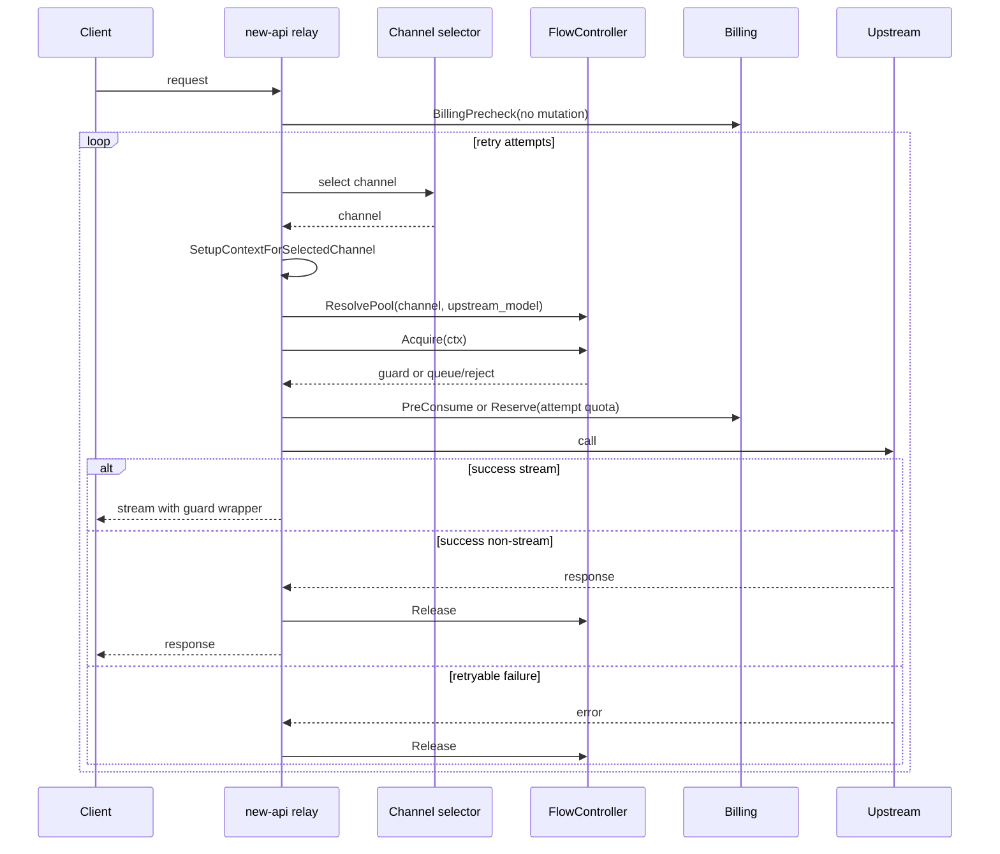

# Channel Flow Control and Queue Design Report v3

Date: 2026-06-13

Status: v3 design draft for external AI review

Review target:

- `docs/channel-flow-control-queue-design-v2.md`
- `docs/flow-control-v2-review.md` (internal audit document)

Local reference code:

- `controller/relay.go`
- `middleware/distributor.go`
- `service/billing.go`
- `service/billing_session.go`
- `middleware/rate-limit.go`
- `middleware/model-rate-limit.go`
- `../boom-gateway/boom-flowcontrol/src/lib.rs` (gateway reference)
- `../boom-gateway/boom-routing/src/policy/load_helpers.rs` (gateway reference)

Official product references used for the market survey:

- LiteLLM Proxy: https://docs.litellm.ai/docs/proxy/users
- Kong AI Rate Limiting Advanced: https://docs.konghq.com/hub/kong-inc/ai-rate-limiting-advanced/
- Apache APISIX AI Rate Limiting: https://apisix.apache.org/docs/apisix/plugins/ai-rate-limiting/
- Envoy AI Gateway usage-based rate limiting: https://aigateway.envoyproxy.io/docs/capabilities/traffic/usage-based-ratelimiting/
- Portkey AI Gateway rate limits: https://portkey.ai/docs/product/ai-gateway/virtual-keys/rate-limits
- Cloudflare AI Gateway rate limiting: https://developers.cloudflare.com/ai-gateway/configuration/rate-limiting/

## 1. Executive Summary

The target requirement is upstream resource-pool admission control, not ordinary user rate limiting.

Example production scenario:

```text
One upstream model pool has 96 GPUs.
The upstream can safely process 60 concurrent requests.
The 61st request must not enter the upstream.
The gateway should hold excess requests in a bounded queue, release them when capacity is available, and expose real-time plus historical in-flight/queued trends.
```

v2 had the right product direction, but the v2 review found several implementation risks. v3 changes the design in these important ways:

1. Flow control still happens after channel selection and `SetupContextForSelectedChannel`, because only then do we know the actual channel, key, base URL, model mapping, and group context.
2. Billing is changed from "preconsume once before retry" to "precheck before queue, preconsume/reserve after acquire per selected attempt". This avoids charging while queued and reduces mismatch when retry selects a different channel/group.
3. Queue length must be hard bounded. Recommended initial config for the 60-concurrency pool is `max_inflight=60`, `max_queue_size=240`, `queue_timeout_ms=120000`.
4. `pool_id` is not user input. Admins create/select a Flow Pool by name; backend generates immutable `pool_key`. Bindings are explicit by `channel_id` and, later, optional upstream model.
5. Phase 1 should support only channel-level binding. `channel + upstream_model` binding is kept in the schema but enabled in Phase 2 to reduce the first test matrix.
6. Redis Lua is not mandatory. v3 uses a Redis `WATCH/MULTI` design first, but only after a Phase 0 spike proves conflict rate is acceptable. Lua remains the fallback if the spike fails.
7. Redis transactions must not watch config, and release must not promote a batch of waiters. Release only removes the running request and optionally publishes a wakeup signal. Waiting requests self-promote.
8. Waiting poll is adaptive by queue position. Only near-head requests run full promotion logic; tail requests poll slowly and do cheap checks.
9. Client disconnect, queue timeout, graceful shutdown, and stream completion must all release queue/running state idempotently.
10. Trend charts are part of the product requirement, not optional polish. Phase 1 includes realtime status and minimum minute-level trend data for running and queued counts; percentiles can be approximate in a later iteration.

My recommendation:

```text
Approve v3 as the implementation direction, but require Phase 0 Redis spike before coding the Redis backend.
Start with Memory backend plus channel-level Flow Pool binding and full lifecycle correctness.
Add Redis after the transaction conflict behavior is measured.
```

## 2. What Changed from v2 After Review

| v2 review issue | v3 decision |
|---|---|
| Preconsume happens once, but retry may select a different channel/group | Precheck before queue only. After each selected attempt acquires a guard, recompute price context and create or extend the billing session with `Reserve`. |
| Polling estimate undercounted Redis ops | Adaptive poll by queue position. Only near-head waiters run `TryPromoteSelf`. Tail waiters avoid transactions. |
| Lease expiry can cause actual concurrency overrun | Explicitly documented as a bounded failure mode. Track `lease_expired_running_total` and accept temporary overrun rather than killing user requests. |
| Memory backend lazy cleanup can accumulate cancelled entries | Add compaction threshold: compact if cancelled/stale entries exceed 30 percent or 64 entries. |
| Event daily cap undefined | Use write-time per-pool daily counter and sampling after cap, not cleanup after uncontrolled writes. |
| `WATCH/MULTI` conflict can be high | Do Phase 0 spike. Minimize conflict by not watching config and by removing promotion from release. |
| Stale queue head can block later waiters | `TryPromoteSelf` scans a head window and removes stale/missing/timed-out candidates before deciding. |
| Billing TOCTOU during queue wait | Accept for MVP. If balance is consumed while waiting, release guard and return a clear insufficient quota message. Soft reservation is future work. |
| Config watched inside transaction | Config is read from cache/Redis outside transaction. It is never in `WATCH`. |
| Release promotes many waiters | Release performs only `ZREM running` plus optional wakeup publish. Waiters self-promote. |
| Graceful shutdown and LB timeout unclear | Acquire uses request context. Queue timeout should be less than upstream load balancer idle timeout. Client disconnect removes waiting entry. |
| `fail_open` can cause storm | Track bypass count and use recovery cooldown. Optionally use local memory safety valve during Redis outage. |
| `FlowGuard` not stream-aware | Add idempotent guard and stream/read-closer binding. Guard releases on non-stream return, stream end, stream drop, timeout, or cancel. |
| `AcquireDecision` lacks fields | Define complete decision shape for errors, metrics, logs, and UI. |
| Multi-tenant queue fairness missing | Add `max_queue_per_user` field, default off for compatibility, recommended on shared pools. |
| Roadmap too optimistic | Add Phase 0 spike, Phase 1 channel-only binding, Phase 3 split into Redis 3a/3b. |

## 3. Existing new-api Limit Controls

new-api already has several limit mechanisms, but none protects a shared upstream GPU pool with global in-flight capacity and queueing.

| Existing mechanism | Scope | Implementation | What it protects | Gap for this feature |
|---|---|---|---|---|
| Global web API rate limit | IP | `middleware/rate-limit.go` with Redis list or memory limiter | Web/dashboard abuse | Not channel/pool aware |
| Global relay API rate limit | IP | `GlobalAPIRateLimit` | API abuse by client IP | Does not count in-flight upstream requests |
| Critical endpoint limit | IP | `CriticalRateLimit` | Login, reset, payment, token key endpoints | Not relay capacity |
| Search/email verification limits | User/IP | `SearchRateLimit`, `EmailVerificationRateLimit` | Expensive dashboard actions | Not upstream capacity |
| Model request rate limit | User/group | `middleware/model-rate-limit.go` with success count and Redis token bucket Lua | Request frequency per user/group | No queue, no channel pool, no total upstream concurrency |
| Billing quota | User/token/subscription | `service/billing.go`, `service/billing_session.go`, `service/quota.go` | Whether user can pay | Not an admission control semaphore |
| Channel retry/distribution | Channel/model/group | `middleware/distributor.go`, `controller/relay.go`, service selector | Selects a usable channel | Does not know pool capacity |

Important separation:

```text
User rate limit: who may send how many requests in a time window.
Billing: whether the request can be paid for.
Flow control: whether the selected upstream resource pool has capacity now.
```

The proposed feature should be a new service, not an extension of `ModelRequestRateLimit`.

## 4. Market Survey Summary

Mainstream AI gateways usually support one or more of these:

- RPM/RPS request-window limits.
- TPM or token-aware limits.
- Budgets and spend caps.
- Per-key, per-user, team, model, or provider limits.
- Provider fallback and load-aware routing.
- Sometimes max parallel requests or scheduler queueing.

The specific requirement here is narrower and stricter:

```text
Protect a physical/logical upstream pool shared by multiple new-api channels.
Bound total in-flight requests.
Queue overflow requests.
Keep queue length finite.
Make in-flight and queued trends auditable.
```

| Gateway/product | Similar capability | Difference from new-api requirement |
|---|---|---|
| LiteLLM Proxy | User/team/key/model budgets and rate limits; max parallel style controls in proxy settings | Strong tenant-facing control, but new-api still needs explicit Flow Pool binding to its channel model |
| Kong AI Rate Limiting Advanced | AI-aware/token-aware rate limiting with gateway plugin model | Primarily request/token limiting, not necessarily a shared GPU-pool queue in the new-api channel selector |
| APISIX AI Rate Limiting | LLM token dimensions for prompt/completion/total tokens | Useful for token quota, not enough for GPU occupancy |
| Envoy AI Gateway | Provider traffic policies, fallback, usage-based rate limiting | Kubernetes/Gateway API architecture differs; concepts useful for future capacity-aware routing |
| Portkey AI Gateway | Virtual key rate limits and gateway policy controls | More tenant/key policy oriented |
| Cloudflare AI Gateway | Gateway-level rate limiting with fixed/sliding windows | Good edge policy, but not enough for per-upstream in-flight queueing |

Conclusion:

```text
This feature is justified as a first-class new-api capability.
It complements, rather than duplicates, existing user and token rate limits.
```

## 5. Gateway Project Reference

The local `gateway` project is a useful reference, but it is not directly the same solution new-api needs.

Observed design in `boom-flowcontrol`:

- It models flow control per `deployment_id`.
- It keeps `vip_queue` and `normal_queue`.
- The queue itself is the source of truth; dispatched entries are in-flight.
- There is no separate counter that can leak.
- `FlowControlGuard` releases in `Drop`.
- `FlowControlledStream` holds the guard until stream end or stream drop.
- It exposes user request status such as waiting position and processing time.
- Routing can use in-flight plus queued load when choosing a deployment.

What new-api should borrow:

1. Queue-as-source-of-truth for memory backend.
2. Idempotent guard lifecycle.
3. Stream wrapper/guard binding.
4. Realtime waiting and processing status.
5. Load-aware routing as a later phase.

What new-api cannot copy as-is:

1. The gateway implementation is memory-local; new-api production deployments can be multi-instance.
2. new-api needs Redis backend for global capacity.
3. new-api has existing billing and retry semantics that must be integrated.
4. new-api channels are configured in DB and can share one physical upstream pool.
5. new-api needs a web admin CRUD model for Flow Pools and bindings.
6. v3 requires a hard `max_queue_size`; the gateway reference mainly uses timeout/context and in-flight limits.

Therefore:

```text
gateway is the right lifecycle model, not the final distributed backend.
```

## 6. Product Model

### 6.1 Flow Pool

A Flow Pool represents one upstream capacity domain.

Examples:

```text
96-card DeepSeek-R1 production pool
Azure East US GPT-4.1 shared deployment
Internal Qwen 72B cluster
```

Admins should not manually type raw `pool_id`.

User-facing flow:

```text
Admin opens channel edit drawer.
Admin enables Flow Control.
Admin selects an existing Flow Pool by name or creates a new pool.
Backend generates pool_key.
Backend stores explicit binding between channel and pool.
Runtime Redis keys, logs, and metrics use pool_key.
```

Identifiers:

| Field | Purpose |
|---|---|
| `id` | DB primary key, internal only |
| `pool_key` | Backend-generated stable runtime key, unique, immutable |
| `name` | Admin-visible name |
| `description` | Admin-readable explanation |

Example:

```text
name: "DeepSeek R1 96-card pool"
pool_key: "flow_pool_8f3a2c7e"
```

### 6.2 Binding to Channel and Upstream URL

Binding must be explicit.

v3 resolution source of truth:

```text
channel_flow_pool_bindings.channel_id -> channel_flow_pools.id
```

Phase 1:

```text
match_mode = "channel"
All upstream models on this channel share the same pool.
```

Phase 2:

```text
match_mode = "channel_model"
Binding key = channel_id + resolved upstream_model.
```

Base URL is not the binding source of truth. It is only used for UI suggestions and warnings.

Reasons:

- One base URL may serve multiple physical pools by key, tenant, or deployment name.
- One physical pool may have multiple base URLs.
- A channel may map public model names to different upstream model names.
- Base URL edits should not silently merge or split resource pools.

UI may show:

```text
This channel has the same base URL as channels #12 and #18.
Suggested existing Flow Pools: "DeepSeek R1 96-card pool".
No binding is changed until the admin explicitly selects one.
```

### 6.3 Queue Must Have a Hard Upper Bound

Yes, queue length needs an upper bound.

Without a hard cap:

- Client HTTP connections can pile up.
- Gateway memory can grow without bound.
- Upstream recovery can be followed by a long stale backlog.
- User experience becomes unpredictable.
- One user can occupy all waiting capacity.

Recommended first production config:

```text
max_inflight: 60
max_queue_size: 240
queue_timeout_ms: 120000
queue_policy: fifo
on_limit: queue
max_queue_per_user: 0 by default, recommended 20 for shared public pools
```

Default formula when admin creates a new pool:

```text
max_queue_size = max_inflight * 4
queue_timeout_ms = 120000
```

UI should warn when:

```text
max_queue_size > max_inflight * 10
queue_timeout_ms > known/provided load balancer idle timeout
memory backend is used in multi-instance deployment
```

## 7. Web Admin Design

### 7.1 Channel Drawer

Add a section in the channel create/update drawer:

```text
Advanced Settings
  Flow Control & Queue
```

Controls:

```text
[Switch] Enable flow control

Flow Pool
  [Select] Existing pool
  [Button] Create new pool

Binding scope
  [Segmented] Entire channel
  [Segmented disabled in Phase 1] Specific upstream models

Capacity
  Max in-flight requests
  Max queue size
  Queue timeout
  Max queue per user (optional)

Behavior
  On limit: queue | reject | fallback
  Redis failure: fail_open | fail_closed | local_memory

Preview
  Current channel ID
  Base URL
  Model mapping summary
  Resolved binding
  Similar channels by base URL
```

Phase 1 should disable or hide upstream-model binding. The schema can support it, but the UI should make it clear that the first release binds the entire channel.

### 7.2 Flow Pools Page

Add a management tab:

```text
Channels | Flow Pools
```

List columns:

```text
Name
Bound channels
Running / max_inflight
Queued / max_queue_size
Oldest wait
Wait avg/max
Rejected / timeout
Backend
Health
Updated
```

Detail page sections:

```text
Overview
  realtime running and queued status
  pool config
  backend health

Bindings
  bound channels
  channel base URL
  channel type
  model mapping

Trends
  in-flight trend
  queued trend
  wait time trend
  process time trend
  reject/timeout/cancel trend

Events
  queue full
  timeout
  cancelled
  lease expired
  backend unavailable
```

### 7.3 Trend Chart Requirement

The user explicitly needs in-flight and queued trend charts for traceability.

Minimum v3 release must provide:

```text
running_avg
running_max
queued_avg
queued_max
acquired_count
queued_count
released_count
rejected_count
timeout_count
cancelled_count
wait_ms_avg
wait_ms_max
process_ms_avg
process_ms_max
```

Chart views:

```text
Last 15 minutes, bucket 10 seconds or 1 minute
Last 1 hour, bucket 1 minute
Last 24 hours, bucket 5 minutes or 1 hour
Custom time range, bucket selected by backend
```

Percentiles:

```text
Phase 1: avg/max only.
Phase 2: approximate histogram for p50/p95/p99.
```

## 8. Runtime Placement in new-api

Flow control should not be generic Gin middleware.

It must run after:

```text
channel selection
SetupContextForSelectedChannel
channel key selection
channel model mapping
upstream model resolution
```

Reason:

- The selected channel can change during retry.
- The same client model may map to a different upstream model per channel.
- The selected channel key and group context can affect billing/logging.
- Pool binding is based on channel and later upstream model.

Current relevant flow in `controller/relay.go`:

```text
token estimate
ModelPriceHelper
PreConsumeBilling
retry loop:
  getChannel
  SetupContextForSelectedChannel
  relayHandler
```

v3 target flow:

```text
parse and validate request
estimate prompt tokens
billing precheck only, no deduction
retry loop:
  getChannel
  SetupContextForSelectedChannel
  resolve upstream model
  resolve Flow Pool binding
  acquire Flow Guard with request context
  recompute attempt price context if needed
  preconsume or reserve billing for this selected attempt
  call upstream
  release guard on attempt failure, non-stream finish, stream finish/drop, timeout, or cancellation
settle/refund billing as today
```

Mermaid sequence:



## 9. Billing Lifecycle v3

### 9.1 Problem in Current Code

`controller/relay.go` currently calculates price and calls `PreConsumeBilling` before the retry loop. But `getChannel` and `SetupContextForSelectedChannel` happen inside the retry loop.

This means:

- Flow control inserted after channel selection would happen after billing has already deducted quota.
- A queued request could hold user quota while waiting.
- Retry may switch channel/group context after the first billing estimate.
- v2's "preconsume once after first acquire" still leaves ambiguity if later retry uses a different selected channel/group.

### 9.2 v3 Billing Rule

Billing must not preconsume while queued.

v3 splits billing into:

```text
BillingPrecheck:
  read-only, before queue
  rejects obvious insufficient quota/subscription/token cases
  does not mutate user quota, token quota, or subscription amount

AttemptPreConsumeOrReserve:
  after Flow Guard is acquired
  uses the selected attempt's current RelayInfo and price context
  creates BillingSession if this is the first billable attempt
  calls BillingSession.Reserve(targetQuota) if a later attempt needs more quota
```

If the later attempt needs less quota:

```text
Do not refund immediately.
Final SettleBilling handles actual quota and refund.
```

If billing fails after acquire:

```text
release guard immediately
return insufficient quota
record queue_wait_then_billing_failed event
```

User-facing message:

```text
排队期间余额或订阅额度已被其他请求消耗，请充值或稍后重试。
```

This TOCTOU is acceptable for MVP because a soft reservation system would add significant complexity. It should be revisited after the first release.

### 9.3 Pseudocode

```go
priceEstimate, err := helper.ModelPriceHelper(c, relayInfo, tokens, meta)
if err != nil { return err }

if !priceEstimate.FreeModel {
    if err := billing.Precheck(c, priceEstimate.QuotaToPreConsume, relayInfo); err != nil {
        return err
    }
}

var billingStarted bool

for retry := 0; retry <= common.RetryTimes; retry++ {
    channel, err := getChannel(c, relayInfo, retryParam)
    if err != nil { break }

    pool, ok := flow.ResolvePool(c, channel.Id, resolvedUpstreamModel(c, relayInfo))
    guard, decision, err := flow.Acquire(c.Request.Context(), acquireReq)
    if err != nil {
        return flow.ToAPIError(decision, err)
    }

    attemptPrice, err := helper.ModelPriceHelper(c, relayInfo, tokens, meta)
    if err != nil {
        guard.Release(context.Background())
        return err
    }

    if !attemptPrice.FreeModel {
        if !billingStarted {
            err = service.PreConsumeBilling(c, attemptPrice.QuotaToPreConsume, relayInfo)
            if err != nil {
                guard.Release(context.Background())
                return err
            }
            billingStarted = true
        } else if relayInfo.Billing != nil {
            if err := relayInfo.Billing.Reserve(attemptPrice.QuotaToPreConsume); err != nil {
                guard.Release(context.Background())
                return billingReserveError(err)
            }
        }
    }

    err = callUpstreamWithGuard(c, relayInfo, guard)
    if streamSuccess {
        bindGuardToStream(guard)
        return nil
    }

    guard.Release(context.Background())
    if err == nil { return nil }
    if !shouldRetry(c, err, remaining) { break }
}
```

### 9.4 What This Does Not Solve

This does not solve provider-side duplicate billing when a retry happens after an upstream already consumed tokens but returned an error. That is an existing retry risk and should remain handled by current high-risk retry settings and logging.

The flow-control feature should not expand scope into provider billing reconciliation.

## 10. Backend Interface

Controller code should depend on a service-level `FlowController`, not directly on Redis or memory structures.

```go
type FlowBackend interface {
    Acquire(ctx context.Context, req AcquireRequest) (FlowGuard, *AcquireDecision, error)
    Status(ctx context.Context, poolKey string) (PoolStatus, error)
    Close(ctx context.Context) error
}
```

`AcquireRequest`:

```go
type AcquireRequest struct {
    RequestID       string
    PoolKey         string
    ChannelID       int
    UpstreamModel   string
    UserID          int
    TokenID         int
    QueueTimeoutMs  int64
    ContextTokens   int
    ContextChars    int
    CreatedAtMs     int64
}
```

`AcquireDecision`:

```go
type AcquireDecision struct {
    Admitted       bool
    Queued         bool
    QueuePos       int
    WaitedMs       int64
    Temporary      bool
    RejectCode     string
    RunningNow     int
    QueuedNow      int
    RetryAfterS    int
    Backend        string
    PoolKey        string
    ConfigVersion  int64
}
```

`FlowGuard`:

```go
type FlowGuard interface {
    Release(ctx context.Context) error
    RenewLease(ctx context.Context) error
    PoolKey() string
    RequestID() string
    IsReleased() bool

    // For non-stream handlers, defer Release.
    // For stream handlers, bind release to stream/read closer completion or drop.
    BindRelease(release func())
    WrapReadCloser(rc io.ReadCloser) io.ReadCloser
}
```

Implementation notes:

- `Release` must be idempotent.
- `Release` should be safe after queue timeout, client disconnect, or lease expiry.
- Stream wrapper is required for SSE, chunked streaming, WebSocket-like flows, and any handler that returns before upstream processing ends.

## 11. Data Model

Use DB tables, not per-channel JSON blobs. Shared pool config cannot be safely represented in multiple channel settings.

All migrations must support SQLite, MySQL, and PostgreSQL. Prefer GORM models and avoid DB-specific JSONB or partial indexes in the initial implementation.

### 11.1 `channel_flow_pools`

```text
id                         int primary key
pool_key                   varchar unique, generated by backend
name                       varchar
description                text
enabled                    bool/int
backend                    varchar, "memory" | "redis"
max_inflight               int
max_queue_size             int
max_queue_per_user         int, 0 means disabled
queue_timeout_ms           int
queue_policy               varchar, default "fifo"
on_limit                   varchar, "queue" | "reject" | "fallback"
redis_failure_policy       varchar, "fail_open" | "fail_closed" | "local_memory"
max_context_tokens         int, optional
max_context_chars          int, optional
max_processing_ms          int, optional
lease_ms                   int, default 60000
renew_interval_ms          int, default 20000
config_version             bigint
created_time               bigint
updated_time               bigint
```

### 11.2 `channel_flow_pool_bindings`

```text
id              int primary key
pool_id         int
channel_id      int
upstream_model  varchar, optional, Phase 2
match_mode      varchar, "channel" | "channel_model"
enabled         bool/int
created_time    bigint
updated_time    bigint
```

Phase 1 runtime only uses:

```text
channel_id + match_mode="channel"
```

### 11.3 `channel_flow_metrics_minute`

```text
id                  int primary key
bucket_ts           bigint
pool_key            varchar
channel_id          int
model               varchar
running_avg         double
running_max         int
queued_avg          double
queued_max          int
acquired_count      int
queued_count        int
released_count      int
rejected_count      int
timeout_count       int
cancelled_count     int
billing_failed_count int
lease_renew_fail    int
lease_expired_count int
wait_ms_avg         int
wait_ms_max         int
process_ms_avg      int
process_ms_max      int
created_time        bigint
updated_time        bigint
```

Phase 2 optional:

```text
wait_ms_p50
wait_ms_p95
wait_ms_p99
process_ms_p50
process_ms_p95
process_ms_p99
```

### 11.4 `channel_flow_events`

```text
id
request_id
pool_key
channel_id
model
user_id
token_id
event_type
reason
running
queued
queue_pos
wait_ms
process_ms
backend
created_time
```

Event types:

```text
queue_full
queue_timeout
client_cancelled
service_draining
context_exceeded
billing_failed_after_wait
lease_renew_failed
lease_expired_running
backend_unavailable
forced_release
config_invalid
```

Retention:

```text
FlowEventRetentionDays = 7 by default
Per-pool daily write cap = 10000 by default
After cap, sample writes at 1/N while keeping aggregate counters
```

## 12. Memory Backend

Memory backend is for dev and single-instance deployments.

Data structure:

```text
map[poolKey]*slot

slot:
  mutex
  config
  queue []request
  next sequence

request:
  request_id
  state: waiting | running
  user_id
  context_tokens
  context_chars
  enqueue_time
  dispatch_time
  notify channel
  cancelled flag
```

Rules:

- Queue is the source of truth.
- Running entries are queue entries with `state=running`.
- No independent running counter unless derived under lock.
- `max_queue_size` counts waiting entries only.
- `max_queue_per_user` counts waiting entries by user when enabled.
- On cancellation, mark cancelled and notify dispatcher.
- Compact when stale/cancelled entries exceed 30 percent or 64 entries.
- Background scanner force-releases entries that exceed `max_processing_ms`.

Admin warning:

```text
Current Flow Control backend is local memory. Multi-instance deployments cannot guarantee global upstream concurrency limits. Use Redis for production pool-level capacity.
```

## 13. Redis Backend v3 Without Mandatory Lua

### 13.1 Is Lua Required?

No. Lua is not required as the first implementation.

However, Redis concurrency must be validated before coding the production backend. The v3 position is:

```text
Do a Phase 0 WATCH/MULTI spike.
If conflict rate and p99 acquire latency are acceptable, implement WATCH/MULTI.
If not, implement small Lua scripts for acquire/enqueue and self-promotion.
```

Lua should be treated as an optimization/atomicity packaging choice, not as a product requirement.

### 13.2 Redis Keys

Use Redis hash tags so keys for one pool share a slot in Redis Cluster:

```text
flow:{pool_key}:config
flow:{pool_key}:running
flow:{pool_key}:waiting
flow:{pool_key}:waiting_deadline
flow:{pool_key}:seq
flow:{pool_key}:req:{request_id}
flow:{pool_key}:user_waiting
flow:{pool_key}:events:{yyyymmdd}:count
flow:{pool_key}:wakeup
```

Meaning:

| Key | Type | Meaning |
|---|---|---|
| `config` | Hash | Runtime config snapshot |
| `running` | ZSET | request_id scored by lease expiration ms |
| `waiting` | ZSET | request_id scored by FIFO sequence |
| `waiting_deadline` | ZSET | request_id scored by queue deadline ms |
| `seq` | String counter | FIFO sequence |
| `req:{request_id}` | Hash | request metadata |
| `user_waiting` | Hash | user_id to waiting count for optional per-user cap |
| `events:*:count` | Counter | write-time event cap |
| `wakeup` | Pub/Sub channel | optional latency optimization |

### 13.3 Config Is Not Watched

Do not `WATCH` config.

Reason:

- Admin config changes are rare.
- Slightly stale config for one poll cycle is acceptable.
- Watching config causes all transactions to conflict on every config update.

Runtime rule:

```text
Read config from local cache or Redis before transaction.
WATCH only keys that must be protected for state transition.
```

If config changes:

```text
DB config_version increments.
Redis config hash updates.
Local cache invalidates or refreshes.
Running requests are not killed.
New acquire/promotion sees new config after refresh.
```

### 13.4 Immediate Acquire or Enqueue

High-level algorithm:

```text
1. Read config outside transaction.
2. Validate context limits.
3. Cleanup a small batch of expired running leases and expired waiting entries.
4. If valid waiting queue exists, enqueue to preserve FIFO.
5. If no valid waiting and running < max_inflight, try immediate running admission.
6. Else enqueue if waiting < max_queue_size and per-user cap allows.
7. Else reject queue_full.
```

Transaction for immediate acquire:

```text
WATCH running, waiting
read running count and waiting count
if running < max_inflight and waiting == 0:
  MULTI
    ZADD running lease_expire_ms request_id
    HSET req metadata state=running dispatch_time=now
    EXPIRE req
  EXEC
else:
  UNWATCH
  enqueue or wait
```

Transaction for enqueue:

```text
seq = INCR flow:{pool_key}:seq
deadline = now + queue_timeout_ms

WATCH waiting, user_waiting
read waiting count and user waiting count
if waiting < max_queue_size and user cap ok:
  MULTI
    ZADD waiting seq request_id
    ZADD waiting_deadline deadline request_id
    HINCRBY user_waiting user_id 1
    HSET req metadata state=waiting enqueue_time=now deadline=deadline
    EXPIRE req
  EXEC
else:
  UNWATCH
  reject
```

Notes:

- Cleanup is bounded per operation, for example 16 running and 64 waiting entries.
- If cleanup cannot remove enough stale entries before queue-full decision, a false queue-full can happen under extreme stale buildup. This is acceptable only if metrics make it visible; the cleanup budget can be increased.

### 13.5 Waiting Loop

Correctness does not rely on Pub/Sub.

Every waiter uses request context and deadline:

```text
until queue deadline or request context done:
  check if request_id is already in running
  check whether request_id still exists in waiting
  calculate approximate queue position
  if near head:
    TryPromoteSelf
  sleep adaptive interval with jitter or wake early on Pub/Sub
```

Adaptive poll:

| Position | Behavior |
|---|---|
| already running | return guard |
| position <= 3 | poll 100-250 ms; run full `TryPromoteSelf` |
| position <= max_inflight | poll 300-700 ms; run promotion every few polls or on wakeup |
| tail | poll 1000-2000 ms; cheap state checks only |

This reduces Redis ops. A queue of 240 waiters should not produce 240 concurrent `WATCH/MULTI` attempts every 500 ms.

### 13.6 TryPromoteSelf

`TryPromoteSelf` must handle stale head entries.

Algorithm:

```text
1. Read config outside transaction.
2. Cleanup small batch of expired running leases.
3. Fetch head window from waiting: ZRANGE waiting 0 9 WITHSCORES.
4. For each candidate before self:
   - if metadata missing, ZREM waiting and waiting_deadline
   - if deadline expired, remove candidate and decrement user_waiting
   - if candidate is valid and not self, exit: not my turn
5. If self is first valid candidate and running < max_inflight:
   WATCH running, waiting
   re-check running count and that self is still in waiting head window
   MULTI
     ZREM waiting self
     ZREM waiting_deadline self
     HINCRBY user_waiting user_id -1
     ZADD running lease_expire_ms self
     HSET req state=running dispatch_time=now
   EXEC
6. On conflict, retry with small jitter and bounded attempts.
```

Bounded transaction retry:

```text
max_tx_retries = 8
retry jitter = 5-30 ms
```

If retries fail:

```text
return temporary busy to the wait loop, not to the user immediately
```

### 13.7 Release

Release must be simple.

v3 release:

```text
ZREM running request_id
HSET req state=released release_time=now
PUBLISH wakeup optional
```

Do not:

```text
WATCH config
promote a batch of waiters
loop over available capacity
```

Why:

- Release storms are common when many upstream requests finish together.
- Batch promotion in release causes large transactions and conflicts.
- Self-promotion by waiters keeps release cheap and predictable.
- Latency cost is at most one adaptive poll interval, usually below 250 ms for head waiters.

### 13.8 Lease and Renewal

Defaults:

```text
lease_ms = 60000
renew_interval_ms = 20000
renew_max_failures = 3
```

Renewal:

```text
ZADD running new_lease_expire_ms request_id
HSET req last_renew_time=now
```

Known boundary behavior:

```text
If lease expires while the upstream request is still running, another waiter may be promoted.
Actual upstream concurrency can temporarily exceed max_inflight by the number of expired-but-still-live requests.
This is accepted because killing an in-progress user request is worse than a temporary overrun during Redis/network instability.
```

Metrics:

```text
flow_lease_renew_fail_total
flow_lease_expired_running_total
flow_actual_overrun_observed_total
```

### 13.9 Redis Failure Policy

Configurable:

| Policy | Behavior | Use case |
|---|---|---|
| `fail_open` | bypass flow control | public availability first |
| `fail_closed` | reject affected pool | strict private upstream protection |
| `local_memory` | local per-instance fallback | partial protection when Redis is unstable |

v3 additions:

```text
During fail_open, maintain local bypass counter per pool.
When Redis recovers and bypass_count > max_inflight * 2, enter 10s recovery cooldown.
During cooldown, new requests use normal flow control and are not bypassed.
```

For strict 96-GPU/60-concurrency private pools, recommended policy:

```text
fail_closed
```

For public gateway availability:

```text
fail_open with admin warning and recovery cooldown
```

### 13.10 When to Use Lua

Use Lua if Phase 0 spike shows:

```text
transaction conflict rate > 30 percent under target load
or p99 acquire/promotion latency is unacceptable
or Redis round trips become a bottleneck
```

If Lua is introduced, keep scripts small:

```text
try_acquire_or_enqueue.lua
try_promote_self.lua
release.lua may stay plain Redis command
```

Do not implement a large scheduler script that scans unbounded queues.

## 14. Client Disconnect, Timeout, and Shutdown

Acquire must use:

```go
c.Request.Context()
```

Rules:

- If client disconnects while waiting, remove request from waiting and decrement per-user waiting count.
- If queue timeout fires, remove request from waiting and return queue timeout.
- If shutdown starts, reject new acquire with `service_draining`.
- Waiting local handlers should return 503 when the process is draining.
- Running requests should be allowed to finish until server shutdown timeout.
- If process dies abruptly, Redis leases recover running state.

Load balancer guidance:

```text
queue_timeout_ms should be lower than LB/proxy idle timeout.
If admin configures queue_timeout_ms higher than a known LB timeout, UI should warn.
```

## 15. Retry and Channel Failure Semantics

Pool full is not a channel failure.

Do not:

```text
auto-ban channel
disable channel
record as permanent channel error
```

Do:

```text
mark channel/pool temporarily unavailable for this request attempt
allow retry/fallback if policy says so
record flow-control-specific metrics
```

MVP policies:

```text
queue
reject
fallback
```

Defer:

```text
fallback_then_queue
```

Reason:

Current channel selection is iterative. A clean `fallback_then_queue` needs candidate-set routing so the gateway can inspect all possible channels/pools before deciding whether to queue.

## 16. Metrics, Trends, and Events

### 16.1 Realtime Status

Endpoint:

```text
GET /api/channel_flow/pools/:id/status
```

Response:

```json
{
  "pool_key": "flow_pool_8f3a2c7e",
  "name": "DeepSeek R1 96-card pool",
  "backend": "redis",
  "health": "congested",
  "running": 60,
  "max_inflight": 60,
  "queued": 137,
  "max_queue_size": 240,
  "oldest_wait_ms": 42100,
  "lease_renew_failures": 0,
  "config_version": 12
}
```

Health states:

```text
healthy: running < 70 percent and queued = 0
busy: running >= 70 percent and queued = 0
congested: queued > 0
critical: queued / max_queue_size >= 80 percent
overloaded: queue_full or queue_timeout happening
degraded: Redis unavailable or lease renewal failures high
```

### 16.2 Trend APIs

```text
GET /api/channel_flow/pools/:id/metrics?from=&to=&bucket=
GET /api/channel_flow/pools/:id/events?from=&to=&event_type=
```

Minimum charts:

1. In-flight trend: `running_avg`, `running_max`.
2. Queue trend: `queued_avg`, `queued_max`.
3. Wait time trend: `wait_ms_avg`, `wait_ms_max`.
4. Process time trend: `process_ms_avg`, `process_ms_max`.
5. Outcome trend: acquired, released, rejected, timeout, cancelled, billing failed.

### 16.3 Event Write Cap

Do not write unlimited event rows.

Write-time cap:

```text
INCR event counter for pool/day
if counter <= daily cap:
  write event
else:
  sample at configured rate, e.g. 1/10 or 1/100
always increment aggregate counters
```

This prevents uncontrolled table growth and avoids depending on delayed cleanup.

### 16.4 Prometheus Naming Reserved

Not required in MVP, but reserve names:

```text
newapi_channel_flow_running
newapi_channel_flow_queued
newapi_channel_flow_acquired_total
newapi_channel_flow_rejected_total
newapi_channel_flow_timeout_total
newapi_channel_flow_cancelled_total
newapi_channel_flow_wait_ms
newapi_channel_flow_process_ms
newapi_channel_flow_lease_renew_fail_total
```

## 17. Error Codes and i18n

Backend error codes:

```text
channel_flow_queue_full
channel_flow_queue_timeout
channel_flow_context_exceeded
channel_flow_draining
channel_flow_backend_unavailable
channel_flow_config_invalid
channel_flow_billing_failed_after_wait
channel_flow_per_user_queue_full
```

Frontend/backend i18n keys:

```text
channel_flow.queue_full
channel_flow.queue_timeout
channel_flow.context_exceeded
channel_flow.service_draining
channel_flow.backend_unavailable
channel_flow.config_invalid
channel_flow.billing_failed_after_wait
channel_flow.per_user_queue_full
channel_flow.memory_backend_warning
channel_flow.redis_degraded_warning
```

Queue full response:

```json
{
  "error": {
    "message": "The upstream resource pool is busy and the waiting queue is full. Please retry later.",
    "type": "rate_limit_error",
    "code": "channel_flow_queue_full",
    "metadata": {
      "pool_running": 60,
      "pool_max_inflight": 60,
      "pool_queued": 240,
      "pool_max_queue_size": 240,
      "retry_after_seconds": 30
    }
  }
}
```

Set:

```text
Retry-After: 30
```

Normal users should not see sensitive pool names unless admin explicitly enables it.

## 18. Config Hot Update

On pool config update:

```text
1. DB transaction updates channel_flow_pools and increments config_version.
2. Redis config hash updates.
3. Local cache invalidates or refreshes.
4. Status endpoint returns new config_version.
```

Runtime behavior:

- Reducing `max_inflight` does not cancel running requests.
- New dispatch pauses until running drops below the new max.
- Reducing `max_queue_size` does not kill already queued requests by default.
- New enqueue rejects if valid queue length is already above the new max.
- Disabling a pool stops new acquire according to policy; running requests drain.
- Changing Redis failure policy takes effect on next acquire.

## 19. API Surface

Pool CRUD:

```text
GET    /api/channel_flow/pools
POST   /api/channel_flow/pools
GET    /api/channel_flow/pools/:id
PUT    /api/channel_flow/pools/:id
DELETE /api/channel_flow/pools/:id
```

Bindings:

```text
GET    /api/channel_flow/pools/:id/bindings
POST   /api/channel_flow/pools/:id/bindings
DELETE /api/channel_flow/bindings/:id
```

Status, metrics, events:

```text
GET /api/channel_flow/pools/:id/status
GET /api/channel_flow/pools/:id/metrics?from=&to=&bucket=
GET /api/channel_flow/pools/:id/events?from=&to=&event_type=
```

Suggestions:

```text
GET /api/channel_flow/suggestions?channel_id=123
```

Suggestions are advisory only. They never create or modify bindings automatically.

## 20. Roadmap v3

### Phase 0: Redis Transaction Spike

Must happen before Redis backend implementation.

Scope:

```text
Redis keys with hash tags
immediate acquire
enqueue
adaptive wait loop
TryPromoteSelf
release as simple ZREM
queue timeout
client cancellation cleanup
conflict metrics
```

Load test:

```text
1000 concurrent acquire attempts
max_inflight = 60
max_queue_size = 240
multiple gateway-like goroutines
release storm simulation
stale head simulation
```

Pass conditions:

```text
running never exceeds 60 except documented lease-expiry boundary
queue full and timeout deterministic
transaction conflict rate measured and acceptable
p99 acquire/promotion latency acceptable
Redis ops/s acceptable for target deployment
```

If fail:

```text
design small Lua scripts for acquire/enqueue and self-promotion
```

### Phase 1: Correct Single-instance Product Release

Required:

- Flow Pool DB tables.
- Binding table.
- Channel-level binding only.
- Memory backend.
- Backend interface and FlowController.
- Channel drawer Flow Control section.
- Flow Pools list/detail page.
- Realtime status.
- Minimum trend charts for running and queued.
- Bounded queue.
- Queue timeout.
- Optional `max_queue_per_user` field, default off.
- Per-attempt acquire/release in normal relay.
- Client disconnect detection.
- Idempotent guard.
- Stream release wrapper.
- Billing precheck before queue.
- Billing preconsume/reserve after acquire.
- Admin warning for memory backend.

Not included:

- Redis production backend.
- Upstream-model binding.
- `fallback_then_queue`.
- Exact percentile charts.
- `on_task_finish` async task holding.

### Phase 2: Operational Visibility and Model Binding

- Upstream model binding in UI and runtime.
- Event retention config.
- Event sampling after daily cap.
- Wait/process percentile approximation.
- Per-user queue cap UI defaults for shared pools.
- More detailed event filtering.
- Admin notifications for degraded backend.

### Phase 3a: Redis Basic Backend

- Redis acquire/enqueue.
- Redis waiting loop.
- Simple release.
- Queue timeout/cancel cleanup.
- Redis status endpoint.
- Multi-instance tests.

### Phase 3b: Redis Lease and Recovery

- Lease renewal.
- Expired lease cleanup.
- Recovery cooldown after fail_open.
- Optional Pub/Sub wakeup.
- Degraded backend metrics.

### Phase 4: Capacity-aware Routing

- Candidate-set channel selection.
- Pool load-aware routing.
- `fallback` without marking channel failed.
- `fallback_then_queue`.

### Phase 5: Advanced Controls

- VIP priority.
- Weighted fair queueing if needed.
- Context/token in-flight budget.
- `on_task_finish` for async tasks.
- Lua optimization if WATCH/MULTI metrics require it.
- Prometheus/OpenTelemetry exporter.

## 21. Acceptance Criteria

Functional:

```text
With max_inflight=60, no more than 60 non-expired running requests are admitted.
With max_queue_size=240, the 301st simultaneous request gets queue_full or fallback behavior.
Queued requests are dispatched when running slots release.
Queue timeout removes waiting request.
Client disconnect removes waiting request.
Stream requests hold guard until stream ends or is dropped.
Retry attempt releases old guard before acquiring a new one.
Pool full is not recorded as channel failure or auto-ban.
Billing is not preconsumed while request is waiting.
Billing session is created/reserved only after guard acquire.
```

Observability:

```text
Realtime status shows running and queued.
Trend chart shows in-flight and queued history.
Events show queue_full, timeout, cancellation, and backend failures.
Event volume is capped or sampled.
```

Multi-instance Redis:

```text
Two or more gateway instances share the same pool capacity.
Release storm does not create high transaction conflict loops.
Stale queue head does not block valid later waiters forever.
Redis config changes do not invalidate all transactions.
```

Compatibility:

```text
Migrations work on SQLite, MySQL, and PostgreSQL.
Memory backend remains usable for dev/single instance.
Existing user rate limit and billing behavior remain separate.
```

## 22. Open Decisions for Reviewer

These should be explicitly approved or rejected before implementation:

1. Phase 1 only supports channel-level binding; upstream-model binding moves to Phase 2.
2. Queue length is mandatory and defaults to `max_inflight * 4`.
3. `pool_key` is backend-generated and never typed manually by admin.
4. Base URL only provides suggestions; explicit binding is the source of truth.
5. Billing precheck is read-only and not a quota hold.
6. If quota is consumed while waiting, post-acquire billing failure is accepted for MVP with clear error.
7. Redis config is not watched in transactions.
8. Redis release does not promote waiters.
9. Waiters self-promote with adaptive polling.
10. Redis Lua is optional and depends on Phase 0 spike results.
11. Memory backend can ship first but must show a multi-instance warning.
12. Trend charts are included in the first usable product release.

## 23. Final Recommendation

v3 is implementable and cleaner than v2.

The most important design simplification is:

```text
Release only releases.
Waiters promote themselves.
Config is not part of Redis optimistic locking.
Billing starts only after capacity is actually acquired.
```

This keeps the first implementation understandable while preserving a clear upgrade path to Lua, capacity-aware routing, and advanced fairness.

For the user's 96-GPU/60-concurrency upstream, the recommended initial production policy is:

```text
Flow Pool: one explicit pool bound to all channels that share that physical upstream.
max_inflight: 60
max_queue_size: 240
queue_timeout_ms: 120000
backend: redis
redis_failure_policy: fail_closed if the upstream must never exceed capacity, otherwise fail_open with cooldown
trend charts: running and queued avg/max from minute aggregates
```

## 24. Final Review Resolutions for Implementation

The v3 final review approved implementation and raised several implementation-level details. These are the decisions to carry into code:

1. `BillingSession.Reserve(targetQuota)` means "ensure total pre-reserved quota reaches targetQuota", not "add targetQuota again". This matches the existing `BillingSession.Reserve` implementation.
2. Phase 1 client disconnect handling uses `c.Request.Context()` plus `queue_timeout_ms` as the fallback. Active response flushing/probing is deferred.
3. Redis backend should avoid the `waiting` + `waiting_deadline` dual-ZSET design. Phase 0/Phase 3 should use a single `waiting` ZSET scored by enqueue timestamp/sequence-compatible ordering, with timeout derived from enqueue time.
4. Redis request metadata TTL must be `max(queue_timeout_ms, max_processing_ms) + 300s` so cleanup can still read user/channel metadata.
5. Redis per-user queue accounting must be updated in the same atomic transition as waiting enqueue/remove/promote. If metadata cannot be guaranteed, encode enough user identity into the waiting member format.
6. Memory backend event caps can be implemented with a per-pool/day in-memory counter when event persistence lands.
7. `fail_open` should use a local memory safety valve by default once Redis backend is implemented. Phase 1 does not ship Redis backend.
8. Strict FIFO may leave capacity idle for one poll interval in Redis mode. This is accepted for v3 because request processing time is much larger than the expected poll delay.

Phase 1 implementation scope is therefore:

```text
DB tables
Pool CRUD and channel-level binding APIs
Memory backend with bounded queue
Relay per-attempt acquire/release
Billing precheck before queue and preconsume/reserve after acquire
Docker build/start validation
```
