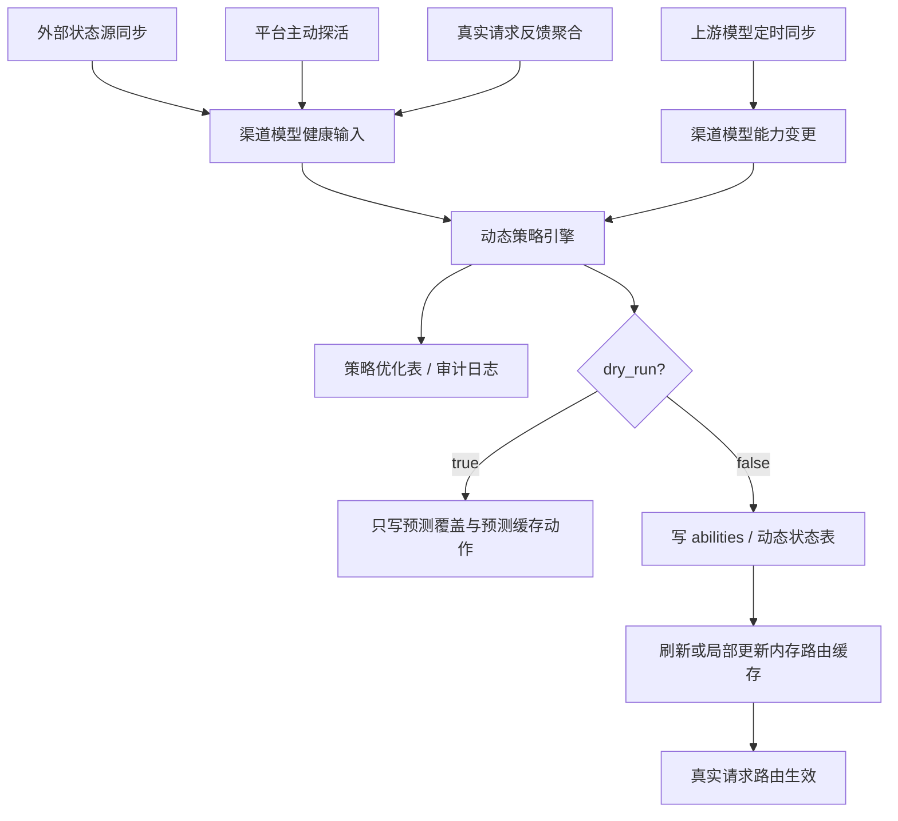

# 动态调权、真实请求反馈与上游模型同步稳定性方案

## 背景

aiapi114 作为中转平台，稳定性问题不是单一链路导致的。结合现有代码、动态调权方案和近期生产日志，当前主要风险集中在四类：

- 渠道或模型不可用后，请求仍然路由到异常渠道，形成 `503`、`502`、`500`、`channel_error`、`relay_error`。
- 上游已移除或暂不可用的模型没有及时同步，本地 `abilities` 仍然保留，用户请求会被分发到不再支持该模型的渠道。
- 流式请求出现读取超时、客户端中断或 scanner error 后，缺少对渠道模型健康度的反馈沉淀。
- 会话连续性 failover 只能解决切换渠道后的上下文延续，不能减少“选中坏渠道”的发生概率。

因此，本方案把四个能力合并为一套稳定性闭环：

- 动态调权：根据健康信号调整渠道模型的 `enabled`、`priority`、`weight`。
- 真实请求反馈：从线上真实请求中聚合错误、超时、流式异常和延迟信号。
- 上游模型同步：定时同步上游模型列表，及时移除或恢复本地模型能力。
- 路由缓存落地：非试运行模式下，动态策略必须真实影响内存路由缓存。

## 目标

- 默认保留 `dry_run=true`，降低自动干预风险。
- 在系统管理 -> 运维 -> 动态调权中保留“试运行模式”开关。
- 试运行模式只输出检测结果、策略动作和预测缓存调整，不影响真实路由。
- 非试运行模式在输出策略的同时，真实修改 `abilities` 和路由缓存。
- 接入真实请求反馈，定时聚合到数据库，作为动态策略输入。
- 定时同步上游模型列表，避免本地路由到上游已移除模型。
- 上游恢复模型服务后，自动恢复本地动态移除或禁用的模型能力。
- 所有自动动作必须可审计、可回滚、可解释。

## 非目标

- 不替代管理员手工禁用渠道或手工配置权重。
- 不保证上游容量足够；动态调权只能把流量从坏渠道迁走，不能凭空增加可用渠道。
- 不把单次请求失败直接升级为禁用动作。
- 不保存用户 prompt、response、API Key 或敏感请求正文。
- 不负责会话状态重建；该能力由 `conversation-continuity-failover.md` 覆盖。

## 总体架构

## 数据模型

### 渠道模型数据表

建议新增或演进为 `channel_model_dynamic_states`。

用途：保存每个 `(channel_id, group, model)` 当前动态状态和基准值。

核心字段：

- `channel_id`
- `group`
- `model`
- `source`：`external_status`、`platform_probe`、`request_feedback`、`model_sync`
- `state`：`healthy`、`degraded`、`unhealthy`、`removed`、`unknown`
- `base_enabled`
- `base_priority`
- `base_weight`
- `applied_enabled`
- `applied_priority`
- `applied_weight`
- `dry_run`
- `active`
- `protected`
- `last_reason`
- `last_applied_at`
- `created_at`
- `updated_at`

现有 `channel_dynamic_overrides` 已覆盖一部分字段，可作为首期落点；如果继续扩展，需要补齐模型同步来源、预测缓存动作和真实请求反馈来源。

### 真实请求反馈表

建议新增 `channel_model_request_feedbacks`。

用途：保存真实请求的聚合结果，不保存请求正文。

聚合粒度：`time_bucket + channel_id + group + model + request_path + is_stream`。

核心字段：

- `time_bucket`
- `channel_id`
- `group`
- `model`
- `request_path`
- `is_stream`
- `total_requests`
- `success_count`
- `error_count`
- `http_4xx_count`
- `http_5xx_count`
- `rate_limit_count`
- `timeout_count`
- `transport_error_count`
- `stream_error_count`
- `client_gone_count`
- `no_available_channel_count`
- `avg_latency_ms`
- `p95_latency_ms`
- `avg_first_response_ms`
- `max_retry_chain_len`
- `created_at`
- `updated_at`

写入方式：

- relay 完成时记录结果事件。
- `processChannelError` 记录渠道错误事件。
- stream scanner 结束时记录 `stream_end_reason`。
- 定时任务按 1 到 5 分钟窗口聚合事件表或直接累加聚合表。

### 策略优化表

建议新增或扩展为 `channel_model_strategy_logs`。

用途：记录每次策略判断的输入、输出和执行结果。

核心字段：

- `channel_id`
- `group`
- `model`
- `source`
- `state`
- `action`
- `dry_run`
- `protected`
- `reason`
- `input_summary`
- `before_enabled`
- `before_priority`
- `before_weight`
- `after_enabled`
- `after_priority`
- `after_weight`
- `cache_action`
- `cache_applied`
- `error`
- `created_at`

现有 `channel_dynamic_adjustment_logs` 可承载大部分审计字段；首期可以扩展字段，避免重复建两套日志。

### 上游模型同步记录表

建议新增 `channel_upstream_model_syncs`。

用途：保存渠道上游模型同步快照、差异和恢复信息。

核心字段：

- `channel_id`
- `upstream_model`
- `local_model`
- `sync_status`：`present`、`removed`、`restored`、`unknown`
- `last_seen_at`
- `last_missing_at`
- `removed_by_sync`
- `restored_by_sync`
- `reason`
- `created_at`
- `updated_at`

## dry-run 与真实执行

### 试运行模式

`dry_run=true` 时：

- 拉取外部状态源。
- 执行平台探活。
- 聚合真实请求反馈。
- 执行上游模型同步差异分析。
- 生成动态策略动作。
- 写入动态覆盖表和策略日志。
- 输出预测缓存调整动作。
- 不修改 `abilities`。
- 不修改 `channels.status`。
- 不刷新真实路由缓存。

试运行模式用于观察策略质量，适合上线初期、策略调整期和故障复盘期。

### 非试运行模式

`dry_run=false` 时：

- 保留试运行模式下所有检测、策略和审计输出。
- 写入 `abilities.enabled`、`abilities.priority`、`abilities.weight`。
- 必要时写入 `channels.status`，但必须遵守最后可用渠道保护。
- 对上游已移除模型，禁用对应 `(channel_id, group, model)` 的能力。
- 对上游恢复模型，恢复由动态任务或模型同步任务修改过的能力。
- 刷新或局部更新内存路由缓存。

非试运行模式必须真实影响请求选路，否则无法解决当前稳定性问题。

## 路由缓存改造

当前代码中，动态调权更新的是 `abilities`，但内存缓存选路主要基于 `channels` 的 `models`、`priority`、`weight` 和 `status`。在启用 Redis 时，`MemoryCacheEnabled` 会被打开，因此必须修正缓存层。

目标缓存结构应以 `abilities` 为真实调度源：

- `group`
- `model`
- `channel_id`
- `ability.enabled`
- `ability.priority`
- `ability.weight`
- `channel.status`
- `channel` 基础信息

选择逻辑：

- 只纳入 `channel.status=enabled` 且 `ability.enabled=true` 的能力。
- 同一 `(group, model)` 下按 `ability.priority` 选择最高优先级。
- 同优先级内按 `ability.weight` 加权选择。
- retry 时按下一档 `ability.priority` 选择。

缓存更新策略：

- 简单方案：动态任务应用后调用 `InitChannelCache()` 全量刷新。
- 优化方案：新增 `CacheUpdateAbility(channelID, group, model)` 局部更新。

首期推荐先全量刷新，确保非试运行模式真实生效；后续在高渠道量场景下再做局部更新。

## 真实请求反馈策略

真实请求反馈优先解决外部状态源和平台探活覆盖不到的问题，尤其是：

- 长流式请求超时。
- 上游中途断流。
- 模型虽然探活成功但真实请求高失败率。
- 同一渠道在某个模型上异常，而其他模型正常。
- retry 链路频繁跨渠道，说明当前优先级策略不稳定。

健康状态建议：

`healthy`：

- 最近窗口请求数达到最小样本数。
- 成功率高于阈值。
- `p95_latency_ms` 未超过慢请求阈值。
- 流式错误率低。

`degraded`：

- 成功率下降但未低于不可用阈值。
- `p95_latency_ms` 明显升高。
- timeout 或 stream error 连续出现。
- retry 链长度增加。

`unhealthy`：

- 最近多个窗口连续 5xx、timeout 或 transport error。
- 模型返回明确不可用。
- 上游模型同步显示模型已移除。

`unknown`：

- 样本数不足。
- 数据过期。
- 同步失败且没有可靠反馈。

建议阈值首期保守：

- 最小样本数：20 个请求或 3 个连续窗口。
- degraded 成功率阈值：70% 到 95%。
- unhealthy 成功率阈值：低于 70%。
- 连续不可用窗口：至少 2 个。
- 恢复窗口：至少 3 个连续健康窗口。

## 上游模型定时同步

上游模型同步是动态调权的重要补充。动态调权解决“渠道健康度”，模型同步解决“本地能力是否仍然存在”。

### 同步来源

- 优先使用渠道已有上游模型巡检能力。
- 对支持 `/v1/models` 或等价接口的渠道，定时拉取模型列表。
- 对不支持模型列表接口的渠道，保留 `unknown`，不做自动移除。
- 对管理员配置了固定模型映射的渠道，以映射后的上游模型为判断对象。

### 移除策略

当上游模型列表中缺失某个本地 `ability.model` 对应的上游模型时：

- 第一次缺失只记录 `suspected_removed`，不立即禁用。
- 连续缺失达到阈值后标记 `removed`。
- 非试运行模式下禁用对应 `ability`。
- 如果这是当前分组该模型最后一个可用渠道，则触发最后可用保护，只降权并告警，不直接禁用。

建议阈值：

- 连续 2 到 3 次同步缺失后确认移除。
- 同步失败不视为模型移除，只记 `unknown`。
- 上游返回 401/403 时优先标记渠道凭据异常，不做模型移除判断。

### 恢复策略

当上游模型重新出现在模型列表中：

- 如果该能力是由模型同步任务禁用，允许自动恢复。
- 如果该能力是管理员手动禁用，不自动恢复。
- 恢复时写回基准 `enabled`、`priority`、`weight`。
- 写入策略日志和同步记录。
- 非试运行模式下刷新内存路由缓存。

### 与动态调权的优先级

模型同步状态参与策略引擎：

- `removed` 优先级高于健康状态，默认动作是禁用能力。
- `restored` 只恢复动态任务或模型同步任务曾经修改过的能力。
- `unknown` 不产生破坏性动作。
- 外部状态源显示健康但模型同步显示已移除时，以模型同步为准。

## 策略合并优先级

多个信号同时存在时，按以下顺序合并：

1. 管理员手工禁用。
2. 上游模型同步 `removed`。
3. 真实请求反馈 `unhealthy`。
4. 平台探活 `unhealthy`。
5. 外部状态源 `unhealthy`。
6. 真实请求反馈 `degraded`。
7. 平台探活 `degraded`。
8. 外部状态源 `degraded`。
9. 恢复信号。
10. `unknown`。

原因：

- 手工配置必须最高优先级。
- 模型已不存在时，即使渠道健康也不能继续路由。
- 真实请求反馈最贴近用户实际体验。
- 平台探活能覆盖没有真实流量的渠道。
- 外部状态源适合做前置信号，但不能完全替代本地观测。

## 安全保护

- 默认 `dry_run=true`。
- 最后可用渠道保护始终生效。
- 手工禁用不自动恢复。
- 自动任务只恢复自己修改过的能力。
- 同步失败不触发移除。
- 样本不足不触发强干预。
- 连续异常才进入 `unhealthy`。
- 所有动作写策略日志。
- 支持按 channel、group、model 回滚到基准值。

## 稳定性收益评估

### 能直接改善的问题

`No available channel`：

- 模型同步可以减少“本地仍认为可用，但上游已移除模型”的假可用能力。
- 最后可用保护可以避免自动禁用把可用池清空。
- 但如果真实容量不足，仍需要补渠道。

`503 / 502 / 500`：

- 真实请求反馈和探活可以把高失败率渠道模型降权或禁用。
- 动态路由缓存真实生效后，请求会更少打到坏渠道。

流式超时和 scanner error：

- 真实请求反馈可以把长流式中途断开的渠道模型识别为 degraded 或 unhealthy。
- 能减少后续请求继续打到同类异常渠道。

上游模型移除：

- 定时同步能及时禁用被上游移除的模型能力。
- 上游恢复后能自动恢复路由，减少人工维护延迟。

### 只能部分改善的问题

高峰期容量不足：

- 动态调权只能迁移流量，不能增加总容量。
- 仍需要扩容、限流、排队或分组策略。

客户端主动断开：

- 可以作为反馈记录，但不能简单归咎于渠道。
- 需要和 `client_gone`、响应时长、已输出 token 数结合判断。

状态型会话切换：

- 动态调权能降低坏渠道命中率。
- 切换后的上下文延续仍需要会话连续性 failover 方案。

### 不能解决的问题

- API Key 额度耗尽但未被上游准确暴露。
- 用户请求参数错误导致的 400。
- 用户侧无限重试造成的流量放大。
- 上游整体区域性不可用且没有备用渠道。
- 已经输出部分流式内容后的透明跨渠道续写。

## 预期收益

在完成路由缓存改造并关闭 dry-run 后，预期收益如下：

- 对模型已移除导致的路由失败：可降低 70% 到 90%，取决于上游模型列表接口覆盖率。
- 对单渠道高失败率导致的 5xx：可降低 30% 到 60%，取决于备用渠道容量。
- 对长流式异常渠道重复命中：可降低 20% 到 50%，取决于真实请求反馈窗口配置。
- 对 `No available channel`：如果问题来自假可用能力，可明显改善；如果来自容量不足，只能减少误伤，不能根治。
- 对上下文丢失：只能间接减少触发 failover 的概率，不能替代会话连续性方案。

## 优化空间

### 路由缓存局部更新

首期可全量刷新缓存，后续应支持局部更新：

- 单个 `ability` 更新只影响对应 `(group, model)`。
- 避免大规模渠道下频繁 `InitChannelCache()`。
- 支持策略批量应用后一次性刷新。

### 策略仿真视图

试运行模式应展示：

- 当前真实路由结果。
- 策略建议路由结果。
- 预计被降权或禁用的渠道模型。
- 预计受最后可用保护拦截的动作。

### 反馈信号去噪

需要区分：

- 上游错误。
- 用户参数错误。
- 客户端中断。
- 平台超时。
- Nginx 或网络层问题。

错误分类越清晰，策略误伤越少。

### 成本与利润信号合并

已有成本利润调度方案可以作为低优先级策略输入：

- 健康策略优先保证可用性。
- 成本策略只在健康渠道之间优化利润。
- 当健康策略和成本策略冲突时，取更保守的结果。

### 自动回滚

建议增加：

- 策略异常时一键回滚全部动态覆盖。
- 单 channel/group/model 回滚。
- dry-run 与非 dry-run 切换时的状态清理策略。

## 分阶段落地

### P0：路由缓存真实生效

- 改造内存缓存以 `abilities` 为调度源。
- 非试运行模式下动态策略应用后刷新缓存。
- 增加测试覆盖 `ability.weight/priority/enabled` 对选路的影响。

### P1：真实请求反馈闭环

- 增加真实请求反馈聚合表。
- 在 relay、channel error、stream scanner 结束点记录反馈事件。
- 定时聚合为渠道模型健康输入。
- dry-run 输出策略建议。

### P2：上游模型同步闭环

- 定时拉取支持模型列表的上游渠道。
- 记录模型缺失、确认移除和恢复。
- 非试运行模式下禁用或恢复对应 `ability`。
- 接入最后可用渠道保护。

### P3：策略可视化与运维体验

- 系统管理 -> 运维 -> 动态调权保留试运行开关。
- 展示动态覆盖、策略日志、真实请求反馈、上游模型同步差异。
- 支持按渠道、分组、模型筛选。

## 结论

这份方案可以补齐稳定性提升中最关键的“前置避障”拼图。

会话连续性 failover 解决的是“切换渠道之后如何继续”；动态调权、真实请求反馈和上游模型同步解决的是“尽量不要把请求打到坏渠道或无模型渠道”。两者组合后，稳定性治理才形成闭环：

- 上游模型同步减少假可用能力。
- 真实请求反馈发现线上真实故障。
- 动态调权调整调度策略。
- 路由缓存改造保证策略真实生效。
- 会话连续性方案兜底不可避免的渠道切换。

方案仍有优化空间，核心在于策略去噪、缓存局部更新、自动回滚和可视化仿真。首期必须优先保证非试运行模式真实影响路由，否则动态调权无法对生产稳定性产生实质收益。
