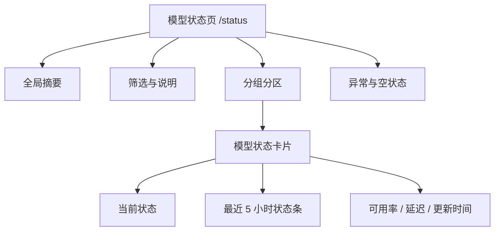

# aiapi114 模型状态页设计方案

## 结论

截至 2026-05-23，New API 官方帮助文档没有面向用户的“模型状态查看页面”说明。官方文档中与本需求相关的能力主要有三类：

- “个人设置 / 可用模型查看”：只说明用户可查看当前账户可用模型，并点击模型名复制，不提供可用性、延迟、历史状态等健康信息。
- “模型管理”：面向管理员管理模型元数据和定价，支持同步上游模型列表，不是用户侧状态页面。
- “获取 Uptime Kuma 状态”：提供无需鉴权的 `GET /api/uptime/status` 接口，但文档没有给出专门前端页面。

因此，aiapi114 需要新增一个独立的用户可访问模型状态页，基于现有 `/api/uptime/status` 聚合数据展示模型健康状态。页面设计参考 `https://status.rjj.cc/status/foxcode` 的状态页结构，但不直接照搬 Uptime Kuma 的通用服务监控表达，而是调整为“分组 + 模型”的模型可用性视角。

重要约束：状态监控页面不展示具体渠道、上游供应商或供应商状态接口名称。供应商只作为后端同步和内部诊断字段使用，用户界面、筛选项、说明文案、DOM 可访问名称和公开页面 URL 都不得暴露 Ikun、Foxcode 等上游名称。

## 参考页面观察

Foxcode 状态页的核心结构：

- 顶部标题：`FoxCode状态检查`
- 全局状态摘要：例如“部分服务出现故障”
- 分组标题：例如 `Claude Code 分组`
- 每个监控项展示：
  - 24 小时可用率
  - 线路 / 模型名称
  - 横向状态条，按时间点展示 Up / Down / Pending 等状态
  - 时间范围标识：左侧历史窗口，右侧最近更新时间

适合复用的设计模式：

- 用一条紧凑的状态条表达时间序列，比表格更适合用户快速判断波动。
- 按分组组织监控项，适合 aiapi114 的“分组 / 模型”展示结构。
- 顶部全局状态一句话总结，降低普通用户理解成本。

需要针对 aiapi114 调整的部分：

- Foxcode 页面偏“服务线路监控”，aiapi114 应偏“模型调用可用性”。
- 状态窗口按当前后端设计展示最近 5 小时，而不是 24 小时。
- 可用性指标应同时呈现 `可用率`、`当前状态`、`延迟`、`最近更新时间`。
- 公共接口有 Redis 缓存，页面应避免高频轮询；默认 60 秒刷新一次即可。

## 页面定位

### 页面名称

模型状态

### 推荐路由

- 用户侧公开页面：`/status`
- 控制台内入口：`/console/model-status`
- API 数据源：`GET /api/uptime/status`

如果只做一个入口，优先做 `/status`，无需登录即可查看，便于用户在调用异常时快速判断平台状态。

### 目标用户

- 普通用户：判断当前模型是否可用、是否存在波动。
- 管理员：观察模型分组的健康趋势，为后续动态调度策略提供人工判断依据。

### 页面目标

让用户在 10 秒内判断：

- 平台整体是否稳定。
- 自己关注的模型当前是否可用。
- 最近 5 小时是否有明显波动。
- 波动来自哪个分组或模型。

## 信息架构



## 页面布局

### 1. 顶部摘要区

内容：

- 标题：`模型状态`
- 副标题：`展示已接入状态同步的模型可用性，数据每 60 秒缓存更新。`
- 全局状态：
  - 全部正常：`全部模型运行正常`
  - 部分异常：`部分模型出现波动`
  - 大面积异常：`多个分组出现异常`
  - 无数据：`暂无状态数据`
- 统计指标：
  - 当前正常模型数
  - 异常 / 波动模型数
  - 已接入分组数
  - 最近更新时间

视觉建议：

- 顶部使用横向信息带，不用夸张大卡片。
- 全局状态用明确语义色：绿色正常、黄色波动、红色故障、灰色无数据。

### 2. 筛选区

筛选项：

- 分组：由接口中的 `group` 聚合生成
- 状态：全部、正常、波动、不可用
- 搜索：模型名模糊搜索

默认行为：

- 默认展示全部分组。
- 如果存在异常模型，自动将异常模型所在分组排序靠前。

### 3. 分组分区

每个分组作为一级区块，不展示供应商、渠道或上游名称：

```text
Codex
已接入 3 个模型 · 最近更新 1 分钟前 · 当前 2 正常 / 1 波动

  gpt-5.4             正常   可用率 96.7%   延迟 3049ms   状态条
  gpt-5.5             波动   可用率 90.0%   延迟 1292ms   状态条

Claude Code-稳定
已接入 1 个模型 · 最近更新 2 分钟前 · 当前 1 正常

  claude-sonnet-4-6   正常   可用率 88.9%   延迟 3270ms   状态条
```

排序规则：

1. 有异常 / 波动的分组靠前。
2. 同一分组内，有异常 / 波动的模型靠前。
3. 其余按模型名排序。

### 4. 模型状态卡片 / 行

推荐桌面端使用“紧凑行”，移动端折叠为卡片。

字段：

- 模型名：`model`
- 分组：`group`
- 当前状态：由 `status` 映射
- 最近 5 小时可用率：由 `history` 计算或直接用后端 `uptime`
- 当前延迟：`latency`
- 最近更新时间：`updated_at`
- 状态条：`history[]`

状态映射：

| 后端状态 | 页面文案 | 颜色 | 含义 |
|---|---|---|---|
| `1` | 正常 | 绿色 | 当前采样可用 |
| `2` | 波动 | 黄色 | 当前可用但延迟或成功率异常 |
| `0` | 不可用 | 红色 | 当前采样失败 |
| 其他 / 缺失 | 未知 | 灰色 | 数据缺失或未接入 |

状态条规则：

- 每个采样点渲染为一个窄条。
- 鼠标悬停展示：时间、状态、延迟、可用性。
- 最近点靠右，左侧为更早时间。
- 状态条下方显示：`5h` 到 `现在`。

## 视觉方向

### 情绪目标

稳定、清晰、可诊断。用户打开页面时应先获得“是否可用”的答案，而不是看到复杂图表。

### 记忆点

“模型心跳条”：每个模型都有一条最近 5 小时的状态脉冲条，用户能直观看到波动密度。

### 设计 token 建议

```css
:root {
  --status-bg: #f8fafc;
  --status-surface: #ffffff;
  --status-text: #0f172a;
  --status-muted: #64748b;
  --status-border: #e2e8f0;
  --status-up: #16a34a;
  --status-degraded: #f59e0b;
  --status-down: #dc2626;
  --status-unknown: #94a3b8;
}
```

深色模式：

```css
.dark {
  --status-bg: #020617;
  --status-surface: #0f172a;
  --status-text: #e5e7eb;
  --status-muted: #94a3b8;
  --status-border: #1e293b;
  --status-up: #22c55e;
  --status-degraded: #fbbf24;
  --status-down: #f87171;
  --status-unknown: #64748b;
}
```

## 数据契约

当前 `/api/uptime/status` 可支撑页面展示，推荐前端使用以下结构：

```ts
type ModelStatusPayload = {
  success: boolean
  message: string
  data: Array<{
    // 后端内部来源名称；状态页不得直接展示。
    categoryName: string
    monitors: Array<{
      name: string
      model: string
      group?: string
      uptime: number
      availability: number
      status: number
      latency: number
      updated_at: number
      history: Array<{
        timestamp: number
        status: number
        availability: number
        latency: number
      }>
    }>
  }>
}
```

前端展示前需要做一次轻量包装：

- 忽略展示来源：`categoryName` 只用于内部诊断和去重，不渲染到页面。
- 分组：`monitor.group`
- 模型：`monitor.model || monitor.name`
- 当前状态：`monitor.status`
- 最近 5 小时状态条：`monitor.history`
- 可用率：优先展示 `monitor.uptime * 100`，保留 2 位小数
- 延迟：`monitor.latency`，大于 1000ms 仍保留毫秒，便于诊断

如果不同来源返回了相同 `group + model`，页面仍只展示一行：

- 当前状态取最差状态：不可用 > 波动 > 未知 > 正常。
- 延迟取最近时间点对应延迟；如果同一时间有多个来源，取较差状态对应延迟。
- 历史状态按时间桶聚合，同一时间桶内取最差状态。
- 不通过模型名后缀、tooltip、aria-label 或调试信息暴露来源名称。

## 加载、空、错状态

### 加载中

使用骨架屏，不使用全页 spinner：

- 顶部摘要 skeleton
- 2 个分组区块 skeleton
- 每个区块 3 行模型 skeleton

### 空数据

文案：

```text
暂无模型状态数据
当前还没有完成模型状态同步。请稍后刷新，或联系管理员确认状态同步任务是否已启用。
```

操作：

- 显示“重新加载”按钮。
- 管理员登录时可额外提示检查 `UPSTREAM_STATUS_SYNC_ENABLED` 和同步任务日志。

### 错误状态

文案：

```text
状态数据加载失败
服务暂时无法读取模型状态缓存，请稍后重试。
```

处理：

- 用户侧不暴露数据库、渠道、上游或状态接口错误细节。
- 控制台日志记录具体错误。

## 刷新策略

- 页面首次进入立即请求 `/api/uptime/status`。
- 默认每 60 秒自动刷新一次，与 Redis 缓存 TTL 对齐。
- 页面不可见时暂停轮询。
- 用户手动点击“刷新”时立即请求，但按钮需要 5 秒防抖。

## 可访问性要求

- 状态颜色必须配合文本，不只依赖颜色。
- 状态条每个点设置 `aria-label`，包含时间、状态、延迟。
- 页面主标题使用 `h1`，分组使用 `h2`。
- 筛选控件有可见 label。
- 键盘可聚焦刷新按钮、筛选项和模型行。
- 支持 `prefers-reduced-motion`，减少状态条 hover 动效。

## 首版实现边界

首版必须实现：

- `/status` 页面。
- 使用 `/api/uptime/status` 数据。
- 分组 + 模型展示，不展示供应商、渠道或上游名称。
- 最近 5 小时状态条。
- 加载、空、错误状态。
- 60 秒自动刷新和手动刷新。
- 响应式布局。

首版不实现：

- 模型状态详情页。
- 事件订阅 / 邮件通知。
- 用户自定义关注模型。
- 动态调度操作入口。
- 管理员人工覆盖状态。

## 后续扩展

- 增加模型详情抽屉，展示单模型最近 24 小时 / 7 天趋势。
- 增加“仅看我可用模型”筛选，需要结合用户分组和模型权限。
- 增加异常事件时间线，与动态调度决策日志打通。
- 后台内部可增加来源维度 SLA 汇总，为后续渠道权重调整提供依据；公开状态页仍不展示来源名称。
