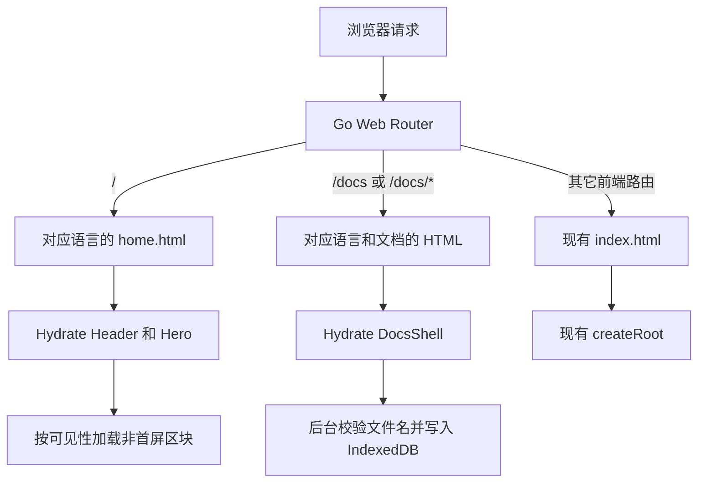

# 首页与文档页首屏性能优化方案

## 1. 结论

本项目继续采用以下边界：

```text
/             构建时 SSR/SSG
/docs         构建时 SSR/SSG
/docs/*       构建时 SSR/SSG
其它路由       保持现有 SPA
```

不迁移 Next.js，不增加生产 Node SSR 服务，不让 SSR 等待业务 API。构建阶段使用 React 生成 HTML，生产阶段仍由 Go 返回嵌入式静态产物。

但 SSR 不能单独解决当前的十多秒首屏。2026-08-02 的线上复测表明，当前主要问题是：

1. 空 HTML 必须等约 1.59 MB gzip 的同步 JavaScript 才能开始渲染；
2. 入口脚本之后还要经过 setup 检查、首页异步大块和首页 API；
3. 首页异步大块包含约 1.00 MB gzip 的全量 LobeHub 图标；
4. 七个语言包被静态打进入口，源文件合计约 977 KB gzip；
5. 缺失的 hash 静态文件被错误回退成 `200 text/html`；
6. Hero 动画和 Logo 分别约 717 KB、144 KB，且直到页面逻辑完成后才开始下载。

因此，最终方案不是“只加 SSR”，而是按收益与改动比执行四组改造：

```text
静态资源正确性
  -> 消除首屏 JS/API 瀑布
  -> 首页和文档页构建时 SSR/SSG
  -> 长缓存、发布兼容和真实用户监控
```

其中前两组改动很小，却决定 SSR 后能否同时获得较快的可见时间和可交互时间。

## 2. 线上复测基线

### 2.1 测试说明

测试时间：2026-08-02。

测试方式：

- `curl` 冷请求，检查 TTFB、压缩、体积、缓存头和错误路由；
- Microsoft Edge 无头浏览器，禁用缓存；
- 移动端视口 `390 x 844`；
- 4 倍 CPU 降速；
- 网络延迟 150 ms，下载 1.6 Mbps，上传 750 Kbps；
- 使用 Performance API 记录 FCP、LCP、CLS、长任务和请求时序。

这是可复现的实验室基线，不等同于真实用户 p75。上线后必须再用 RUM 验证。

线上 `/api/status` 报告的部署提交为 `a906d4d3020ccba5ffeb919eb67716b404ebbbce`，当前本地 HEAD 为 `49b109f7`，两者的构建 hash 不同。线上与本地产物中对应的首页图标块解压体积均约 5.31 MB，说明主要结论仍适用，但每次发布后都必须重新记录指标，不能直接沿用本次数字。

### 2.2 alltokenapi.com 指标

| 项目 | 结果 |
| --- | ---: |
| 根 HTML 原始体积 | 1,178 B |
| 根 HTML gzip 传输 | 556 B |
| 五次冷请求 TTFB 中位数 | 约 0.74 s |
| HTML 可见正文 | 0，只有空 `#root` |
| 首批同步 JS | 约 1.59 MB gzip |
| 移动端首屏全部脚本 | 约 2.69 MB 传输 / 11.04 MB 解压 |
| 移动端全部资源 | 约 2.97 MB 传输 / 11.71 MB 解压 |
| 移动端 FCP | 15.75 s |
| 移动端 LCP | 16.74 s |
| 移动端 CLS | 0.0037 |
| 移动端长任务 | 4 个，共 1.37 s，最长 610 ms |
| 桌面冷缓存 FCP | 2.53 s |
| 桌面冷缓存 LCP | 3.13 s |

CLS 已经合格，当前不需要为了布局稳定性重写页面。优化重点应放在“内容何时出现”和“为出现内容下载了多少代码”。

### 2.3 实际请求瀑布

移动端实验中，关键请求顺序如下：

```text
0.00 s  请求 HTML
0.55 s  开始下载入口 JS/CSS
8.80 s  最大入口 JS 下载完成
9.42 s  DOMContentLoaded，开始 /api/status
9.49 s  开始 /api/setup
9.66 s  setup 完成，开始首页路由异步块
15.15 s 首页异步大块完成
15.69 s 同时发起 status、notice、home_page_content
15.75 s FCP
16.74 s LCP
17.31 s Logo 下载完成
```

最大的两个脚本是：

| 资源 | gzip/传输 | 解压 | 作用 |
| --- | ---: | ---: | --- |
| `static/js/index.*.js` | 约 1.13 MB | 约 3.93 MB | 入口、语言包和共享代码 |
| 首页异步大块 | 约 1.00 MB | 约 5.31 MB | 主要包含全量 `@lobehub/icons` |

API 响应本身体积很小，并不是带宽主因；问题在于它们位于渲染阻塞链上，并且 `/api/status` 被重复请求三次。

### 2.4 静态资源和缓存问题

当前线上行为：

```http
/static/js/index.<hash>.js
Cache-Control: max-age=604800

/static/js/not-exist.<hash>.js
HTTP/1.1 200 OK
Content-Type: text/html
```

这带来两个问题：

- 带 hash 的不可变资源只缓存一周，浪费重复访问收益；
- 旧 HTML 引用已经不存在的 chunk 时，浏览器收到 HTML 而不是真实 404，最终表现为脚本解析错误、ChunkLoadError 或白屏。

这不是 SSR 问题，必须独立修复。

## 3. 与 TokenHub 的对比

同日检查 `https://tokenhub.com/zh`：

- HTML 约 252 KB，收到 HTML 时已有完整 Hero 和正文；
- HTML 使用 `no-store`，带 hash 静态资源长期缓存；
- 关键字体、Logo 和 CSS 使用 preload；
- JavaScript 分为多个异步 chunk，非首屏图片延迟加载；
- 同一移动端实验的 FCP/LCP 约为 9.50/9.94 秒。

TokenHub 也不是一个轻量页面：其 HTML、CSS、字体和主线程开销仍然较大。因此本项目只采用它的有效原则，不复制它的具体体积和依赖结构：

| 采用 | 不采用 |
| --- | --- |
| HTML 先包含可读 Header、Hero、CTA | 250 KB 级别的大 HTML |
| JavaScript 后接管交互 | 为首屏预加载所有字体和脚本 |
| 非首屏图片和模块延迟加载 | 大量首屏 chunk 并发竞争带宽 |
| hash 资源 immutable 缓存 | 请求时 Node SSR |
| JS 未执行时页面仍可读和可导航 | 把动态价格和登录态放进 SSR |

当前站在相同实验下比 TokenHub 的 LCP 慢约 6.8 秒，差值基本对应当前的入口 JS、setup、首页图标块和 API 瀑布。

## 4. 哪些问题来自上游，哪些来自当前定制

对比当前分支、`upstream/main` 和共同基线后，可以按以下方式归因。

### 4.1 上游原有问题

- `index.html` 只有空 `#root`，所有可见内容依赖 React；
- `router/web-router.go` 对缺失静态文件使用 SPA fallback；
- `routes/__root.tsx` 首次访问会等待 `/api/setup`；
- `features/home/index.tsx` 等待 `/api/home_page_content` 后才显示默认首页；
- `i18n/config.ts` 静态导入七个完整语言包；
- `lib/lobe-icon.tsx` 使用 `import * as LobeIcons`；
- `main.tsx`、`useSystemConfig` 和 `useStatus` 存在重复 status 请求来源；
- 上游默认首页同样静态导入所有首页区块，只是区块比当前定制页轻。

### 4.2 当前定制放大的问题

- 默认首页由原来的五个较轻区块扩展为九个营销和预览区块，并全部静态导入；
- 新增 726 KB Ribbon 动画、16 KB CC Switch Logo 和约 76 KB 的界面图；
- 公共 Logo 从上游约 9.6 KB 增至 144 KB；
- Provider Marquee、Featured Models、Pricing Preview 都进入 `getLobeIcon` 路径，使首页加载全量图标包；
- `useHomeCatalog()` 先等待 status，再决定是否请求 pricing，形成 status -> pricing 的串行依赖；
- 文档正文新增为约 104 KB 的 TSX 源文件，仍跟随 React chunk 发布；
- 首页组件数量和定制翻译增加了语言包体积，但“七个语言包全部首屏加载”是上游结构问题。

### 4.3 不应错误归因的部分

- API 响应只有几十字节到约 1 KB，不能把十多秒主要归因于后端查询；
- 浏览器实际协商到了 HTTP/2，当前不是因为只使用 HTTP/1.1；
- CLS 已经很低，无需通过大规模布局重写解决首屏慢；
- SSR 不会自动删除 JavaScript、动画、语言包或 API；它只让 HTML 可以更早显示。

## 5. 优化原则

1. 默认首页的 Header、Hero 和 CTA 不等待 JavaScript或 API。
2. 首页与文档的 SSR 只使用构建时稳定数据，不请求 pricing、status、notice 或用户接口。
3. 先删除瀑布和整包导入，再考虑微小的 React 重渲染优化。
4. SSR 首次客户端树必须与服务端 HTML 一致，登录态在 hydration 后更新。
5. 文档版本只比较文件名 hash，不在浏览器重新计算 hash，不依赖 ETag。
6. hash 资源永久不可变；HTML、manifest 和运行时 bootstrap 可重新验证。
7. 继续保留 Go 单体、TanStack Router、React Query 和现有 SPA 业务页面。

## 6. 目标架构



推荐实现方式仍是构建时 SSR/SSG：

```text
构建阶段：Bun/Node + React renderToString 生成 HTML
生产阶段：Go embed.FS 读取并返回 HTML
浏览器：SSR 根节点 hydrateRoot，SPA 空根节点 createRoot
```

当前 `main.tsx` 在根节点非空时直接不执行任何渲染。落地 SSR 时必须改成显式 `hydrateRoot`，不能只把 HTML 填入 `#root`。

## 7. 第一优先级：小改动直接消除十秒链路

这些改动应先于或与 SSR 同一批完成。

### 7.1 缺失静态资源返回真实 404

调整 `router/web-router.go`：

```text
/static/*、/assets/* 请求未命中 embed.FS -> 404
/api/*、/v1/* 未命中 -> 现有 RelayNotFound
其它应用路由未命中 -> SPA index.html
```

验收：

```text
/static/js/not-exist.123.js -> 404，且不是 text/html
/dashboard/not-a-real-child -> 仍返回 SPA HTML
```

这是低风险修复，也能让客户端正确识别版本失配并执行一次受控刷新。

### 7.2 setup 不再阻塞公共 SSR 路由

`constant.Setup` 在 Go 进程中已经可用。对 `/` 和 `/docs/*`：

- 未初始化时由 Go 直接重定向到 `/setup`；
- 已初始化时直接返回 SSR HTML；
- 客户端 `beforeLoad` 对已有服务端 setup 标记的路由不再请求 `/api/setup`；
- 其它 SPA 路由暂时保留现有检查逻辑，控制改动范围。

这比 SSR 后继续发 setup API 更直接，也不会削弱未初始化实例的保护。

### 7.3 `/api/status` 收敛为一个数据源

当前网络记录出现三次 `/api/status`：

- `main.tsx` 为标题和 favicon 请求一次；
- `useSystemConfig({ autoLoad: true })` 请求一次；
- `useHomeCatalog()` 内的 `useStatus()` 再请求一次。

调整为：

- `main.tsx` 只应用本地缓存，不主动发网络请求；
- 根组件统一使用 React Query 的 `['status']`；
- `useSystemConfig` 和 `useHomeCatalog` 读取同一 query/store；
- SSR bootstrap 提供 system name、Logo、公开模块开关时，首次渲染直接使用 bootstrap；
- 后台最多刷新一次 status。

不得把整份 status JSON重复注入多个位置。

### 7.4 默认首页不等待 `home_page_content`

Go 已经持有 `common.OptionMap["HomePageContent"]`。返回首页时只注入小型公开 bootstrap：

```ts
interface HomeBootstrap {
  locale: string
  systemName: string
  logo: string
  setup: boolean
  homeMode: 'default' | 'custom-html' | 'custom-markdown' | 'custom-url'
  homeRevision?: string
  pricingEnabled: boolean
  pricingRequireAuth: boolean
}
```

其中 `homeRevision` 是服务端内容版本，不包含内容本身。

行为：

- `default`：直接使用 SSR 默认首页，不请求 `/api/home_page_content`；
- `custom-*` 且本地 revision 命中：立即显示本地缓存，后台校验；
- `custom-*` 且无缓存：显示稳定的自定义内容容器，再异步下载，不先闪现默认首页；
- 管理员从自定义首页切回默认首页时，bootstrap 立即决定默认模式，不受旧缓存影响。

现有 DOMPurify、Markdown 处理和 iframe sandbox 保持不变。

### 7.5 语言包按语言加载

`i18n/config.ts` 不再静态导入七个 JSON。使用明确的 loader map：

```ts
const localeLoaders = {
  en: () => import('./locales/en.json'),
  zhCN: () => import('./locales/zh.json'),
  zhTW: () => import('./locales/zh-TW.json'),
  fr: () => import('./locales/fr.json'),
  ja: () => import('./locales/ja.json'),
  ru: () => import('./locales/ru.json'),
  vi: () => import('./locales/vi.json'),
}
```

只加载当前语言；需要 fallback 时再加载英文。当前七个语言文件合计约 3.50 MB 原始 / 977 KB gzip，按语言拆分可从入口移除大部分体积。

SSR 语言选择顺序：

```text
语言 cookie -> Accept-Language -> 系统默认语言
```

客户端语言选择继续保留 localStorage，同时同步一个不含敏感信息的语言 cookie，保证 SSR 与 hydration 首次语言一致。

### 7.6 首页不再加载全量 LobeHub 图标

不需要立刻重写全站动态图标系统，只切断首页的导入链即可：

- Provider Marquee 的四个固定图标使用直接 import 或本地静态图；
- Featured Models 和 Pricing Preview 首屏使用供应商静态映射或文字 fallback；
- 用户滚动到动态模型区域后，才允许加载更完整的图标能力；
- `getLobeIcon` 继续服务 Dashboard、Models、Channels 等既有页面。

这项小范围修改预计可避免首页下载约 998 KB gzip / 5.31 MB 解压的图标块，是当前收益最高的单项前端改动。

### 7.7 首页非首屏区块按可见性加载

当前 `DefaultHome` 静态导入所有九个区块。调整为：

```text
首屏立即提供：PublicHeader、LandingHero、Provider 文本
接近视口加载：AI Clients、Featured Models、Capabilities
空闲或接近视口加载：Console、Gateway、Pricing、FAQ、CTA、Footer 增强逻辑
```

不能只使用 `React.lazy` 后立即渲染，因为这仍会马上请求所有 chunk。需要一个共享的 `DeferUntilVisible` 边界，在距离视口约 600-1000 px 时才挂载 lazy component，并为每个区块预留稳定高度。

SSR 只输出 Header、Hero、CTA 所需的稳定首屏 HTML和轻量的后续区块占位。搜索引擎需要的介绍文本可以保留为静态 HTML，但复杂预览和价格组件不进入首屏 hydration 树。

### 7.8 Hero 使用静态首帧

当前 Ribbon 动画约 726 KB。调整为：

- 从动画生成 30-80 KB 的 AVIF/WebP 静态首帧；
- SSR 和 LCP 只使用静态首帧，设置明确宽高；
- 动画在 hydration 后、浏览器空闲且 Hero 仍可见时加载；
- `prefers-reduced-motion`、Save-Data、慢网和移动端默认不升级动画；
- 不 preload 完整动画。

Logo 提供与实际展示尺寸匹配的小图，不让 662 x 662、144 KB 的 PNG 作为导航 Logo 下载。favicon 与页面 Logo 分开产物。

## 8. 首页 SSR/SSG 设计

### 8.1 SSR 输出范围

首页 HTML 必须包含：

- 当前语言的 `<html lang>`；
- title、description、canonical 和 Open Graph；
- 主题初始化短脚本；
- PublicHeader 的 Logo、站点名和主要导航；
- LandingHero 的标题、说明、两个 CTA；
- Ribbon 静态首帧；
- Provider 可读文本；
- 下一屏的内容提示或稳定占位。

不包含：

- 用户信息、钱包、token 或 session；
- 实时 pricing/catalog；
- notice 和后台通知；
- 请求时读取数据库的动态页面内容；
- 完整动画和非首屏图片。

### 8.2 组件复用

以最小改动拆成：

```text
HomeSsrView
  纯 props，服务端和首次客户端共同渲染

HomeClientContainer
  登录态、status 刷新、自定义首页和动态 catalog

HomeDeferredSections
  接近视口后按块加载
```

LandingHero 和 PublicHeader 优先改造成“纯视图 + 客户端增强”，不另建一套完全独立的 HTML 模板。

SSR 和首次 hydration 一律按未登录状态输出稳定 CTA。hydration 完成后，如果本地认证状态有效，再通过普通 state 更新成 Dashboard CTA。不得在首次 render 中直接读取 localStorage 改变 SSR 树。

### 8.3 API 时序

默认首页目标时序：

```text
HTML + CSS + Hero 静态图 -> 首屏可见
hydration -> 最多一次 status 后台刷新
接近价格区块 -> 按模块权限请求 pricing
打开通知或浏览器空闲 -> 请求 notice
```

默认首页不请求 `home_page_content`，不请求 setup，也不因 pricing 失败隐藏 Hero。

`useHomeCatalog()` 不再等待 status 网络请求后才开始所有工作。它先读取 SSR/bootstrap 或本地缓存中的公开模块开关；只有价格区块接近视口且允许访问时才请求 pricing。

## 9. 文档页 SSR 与长期本地缓存

### 9.1 内容产物

保留 `DocsShell`、导航、面包屑、目录、上一篇/下一篇和 CodeBlock 交互。只把正文从 TSX 拆为内容文件：

```text
web/default/src/content/docs/{locale}/{page-id}.md
```

构建时生成：

```text
dist/ssr/docs/{locale}/{page-id}.html
dist/static/docs/manifest.json
dist/static/docs/{locale}/{page-id}.{hash}.json
```

payload 示例：

```json
{
  "pageId": "codex",
  "title": "Codex",
  "description": "...",
  "toc": [],
  "html": "<section>...</section>"
}
```

Markdown 在构建阶段转换并过滤。复杂交互不写入任意 HTML，复制代码等交互由 DocsShell hydration 后增强。

### 9.2 文件名 hash

```text
/static/docs/zh/codex.90ef12ab34cd.json
/static/docs/en/introduction.33cd55ef77ab.json
```

hash 输入包含：

- Markdown 正文；
- title、description、toc；
- 影响最终 HTML 的转换器版本。

使用 SHA-256 前 12 或 16 个十六进制字符。浏览器只比较文件名，不下载后重新计算内容 hash，不比较更新时间和 ETag。

### 9.3 manifest

```json
{
  "version": 1,
  "locales": {
    "zh": {
      "introduction": "introduction.12ab34cd56ef.json",
      "codex": "codex.90ef12ab34cd.json"
    }
  }
}
```

缓存规则：

```http
/static/docs/manifest.json
Cache-Control: no-cache, must-revalidate

/static/docs/{locale}/{page-id}.{hash}.json
Cache-Control: public, max-age=31536000, immutable
```

### 9.4 IndexedDB

正文长期存放在 IndexedDB，不使用 localStorage：

```ts
interface CachedDoc {
  key: `${locale}:${pageId}`
  fileName: string
  payload: DocsPayload
  savedAt: number
}
```

不设置时间过期。只有 manifest 或 SSR 标记中的文件名变化时才替换。

### 9.5 首次访问和 SPA 导航

直接访问文档：

```text
Go 返回包含完整正文的 SSR HTML
  -> 页面立即可读
  -> hydration 读取 SSR 标记的 fileName
  -> 将 SSR payload 写入 IndexedDB
  -> 空闲时重新验证 manifest
```

如果 IndexedDB 的 `fileName` 与 SSR 标记相同，不再次下载正文 JSON。

SPA 文档导航：

```text
读取 manifest 当前 fileName
  -> IndexedDB 命中同名文件：立即显示
  -> fileName 不同：后台请求新 hash 文件
  -> 成功：原子替换页面和缓存
  -> 失败：保留旧文档，显示轻量重试状态
```

这里的“文档后台异步加载”不意味着直接访问文档先显示空白：直接访问有 SSR 正文；只有 SPA 导航到未缓存文档时才显示稳定 skeleton。

## 10. Go 路由和构建产物

### 10.1 构建产物

```text
dist/index.html                              现有 SPA
dist/ssr/home/{locale}.html                 首页
dist/ssr/docs/{locale}/{page-id}.html       文档
dist/static/docs/manifest.json
dist/static/docs/{locale}/{page-id}.{hash}.json
```

建议新增：

```text
web/default/src/ssr/home-document.tsx
web/default/src/ssr/docs-document.tsx
web/default/src/ssr/render-context.tsx
web/default/src/features/docs/content-loader.ts
web/default/src/features/docs/docs-cache.ts
web/default/scripts/build-ssr-pages.mjs
web/default/scripts/build-doc-content.mjs
```

### 10.2 Go 返回逻辑

`ThemeAssets` 增加首页和文档预渲染索引，但保留现有 Default Build FS：

```go
type ThemeAssets struct {
    DefaultBuildFS   embed.FS
    DefaultIndexPage []byte
    HomeIndexPages   map[string][]byte
    DocsIndexPages   map[string][]byte
}
```

路由顺序：

1. API 和 Relay 保持现有处理；
2. `/static/*` 命中 embed.FS，否则真实 404；
3. 未 setup 的 `/` 和 `/docs/*` 重定向 `/setup`；
4. `/` 按语言返回 home HTML；
5. `/docs/*` 按语言和 page ID 返回 docs HTML；
6. 其它前端路由返回现有 SPA index；
7. 不存在的文档 page ID 返回文档 404，不伪装成首页。

Go 只替换经过 JSON 安全编码的小型公开 bootstrap 占位符，不把用户数据写入 HTML。

## 11. 缓存、压缩与发布兼容

### 11.1 缓存头

```http
/ 和 /docs/* HTML:
  Cache-Control: no-cache, must-revalidate

/static/docs/manifest.json:
  Cache-Control: no-cache, must-revalidate

/static/**/*.<hash>.*:
  Cache-Control: public, max-age=31536000, immutable

/logo.png、/favicon.ico 等非 hash 资源:
  Cache-Control: no-cache, must-revalidate
```

不要继续对所有非根路径统一设置 `max-age=604800`。缓存策略必须根据“HTML、manifest、hash 资源、非 hash 资源”分类。

### 11.2 发布期旧 chunk

真实 404 能让错误可诊断，但不能代替发布兼容。当前单二进制替换后，旧 hash 资源会立刻消失。

推荐发布包额外包含 `dist/static`，在服务器维护一个内容寻址的静态资源目录：

```text
/opt/new-api/web-static/
  当前发布 hash 文件
  上一发布 hash 文件
```

发布顺序：

```text
先合并上传新 static 文件
  -> 验证新 hash 文件可访问
  -> 再切换返回新 HTML 的 Go 二进制
  -> 至少保留上一版本或保留 7 天
```

hash 文件名不会冲突，可以增量合并。OpenResty 优先从该目录返回 `/static/`，未命中再返回真实 404，不回退 SPA。

客户端可为 ChunkLoadError 增加“每个 build version 最多一次”的受控刷新，但它只是兜底，不能通过无限 reload 掩盖缺失资源。

### 11.3 压缩和网络

当前资源已有 gzip。可在构建时额外生成 `.br` 和 `.gz`，在确认 OpenResty 模块支持后使用 `brotli_static`/`gzip_static`，减少 Go 动态压缩 CPU 和大脚本传输。

本次从当前工作站到源站的冷请求 TTFB 中位数约 0.74 秒，TokenHub 约 0.18 秒。应用优化完成后，如果主要用户仍跨境访问洛杉矶源站，静态资源 CDN、对象存储或更近的区域节点会成为进一步降低 p75 LCP 的主要手段。CDN 只缓存 `/static` 和公开图片；`/api`、`/v1`、HTML、鉴权和用户数据必须绕过缓存。

## 12. 实施顺序与收益
同条件完整方案目标为 FCP <=4s、LCP <=5s、首屏传输 <=500KB。本次只修改了方案文档，没有修改业务代码或部署线上；git diff --check 已通过，文档当前尚未跟踪。本次复测与方案修订约 35 分钟。


### P0：正确性和可观测性

| 改动 | 主要文件 | 收益 | 风险 |
| --- | --- | --- | --- |
| 缺失 `/static` 返回 404 | `router/web-router.go` | 消除伪 200 和白屏误诊 | 低 |
| 分类缓存头 | `middleware/cache.go` | hash 资源长期复用 | 低 |
| 构建输出 gzip 体积报告和预算 | `rsbuild.config.ts`、构建脚本 | 防止回归 | 低 |
| 记录 FCP/LCP/CLS/INP/build version | 前端性能采样 | 获得真实 p75 | 低至中 |

### P1：小改动高收益

| 改动 | 预期直接影响 |
| --- | --- |
| 公共路由 setup 改为 Go 判定 | 删除一段首屏网络屏障 |
| status 请求去重 | 3 次降为最多 1 次 |
| 默认首页不等 home content | 删除全屏 Loading 和最后一段 API 屏障 |
| 语言包动态加载 | 从入口移除约 0.75-0.89 MB gzip，具体取决于语言 |
| 首页绕开全量 Lobe icons | 避免约 1.00 MB gzip / 5.31 MB 解压块 |
| Hero 静态首帧和小 Logo | 首屏图片从约 861 KB 降到目标 100 KB 内 |
| 非首屏区块按可见性加载 | 避免首屏并发下载和执行全部营销区块 |

### P2：首页构建时 SSR/SSG

- 生成各语言 home HTML；
- Go 返回 SSR HTML 和 bootstrap；
- `main.tsx` 使用 `hydrateRoot`；
- 保证 JS 禁用时 Header、Hero 和 CTA 可读可用；
- 保持其它路由 createRoot SPA。

### P3：文档构建时 SSR/SSG 和 IndexedDB

- 正文迁移为内容文件；
- 生成 docs HTML、manifest 和 hash JSON；
- 实现文件名校验、IndexedDB 和失败回退；
- 保持 DocsShell 和 SPA 文档导航。

### P4：发布与链路优化

- 当前和上一版本静态资源并存；
- 构建时 Brotli/gzip；
- 结合 RUM 决定是否给 `/static` 接 CDN或迁移更近节点；
- 不在没有数据时先进行全站基础设施重构。

## 13. 性能预算

### 13.1 构建预算

| 项目 | 目标 |
| --- | ---: |
| 首页 SSR HTML gzip | <= 50 KB |
| 文档 SSR HTML gzip | <= 100 KB，超长正文单独评估 |
| 首屏关键 CSS gzip | <= 80 KB |
| 首屏 LCP 图片 | <= 80 KB |
| 首页渲染前必须下载的 JS | 0 B |
| 首页 hydration 必需 JS gzip | <= 450 KB |
| 单个初始 JS chunk gzip | <= 250 KB |
| 首页首屏同步 API | 0 |
| hydration 后 status 请求 | <= 1 |
| 默认首页 home content 请求 | 0 |
| 未到价格区块时 pricing 请求 | 0 |

预算应由构建脚本读取产物并失败退出，不能只写在文档中。

### 13.2 实验室目标

使用本次同一移动端配置和冷缓存，取至少五次中位数：

| 指标 | 当前 | 第一阶段目标 | 完整方案目标 |
| --- | ---: | ---: | ---: |
| FCP | 15.75 s | <= 8 s | <= 4 s |
| LCP | 16.74 s | <= 9 s | <= 5 s |
| CLS | 0.0037 | <= 0.1 | <= 0.1 |
| 最长长任务 | 610 ms | <= 300 ms | <= 200 ms |
| 首屏传输 | 2.97 MB | <= 1.2 MB | <= 500 KB |

第一阶段指 P0+P1，完整方案指 P0-P3。若源站网络抖动导致绝对时间不稳定，同时比较资源体积、请求顺序和至少五次中位数。

### 13.3 真实用户目标

上线后按国家/地区、网络类型、设备和 build version 分组：

- LCP p75 <= 2.5 s；
- INP p75 <= 200 ms；
- CLS p75 <= 0.1；
- 静态资源失败率和 ChunkLoadError 可按 build version 追踪；
- 首次访问与重复访问分别统计。

如果应用层预算已达标但跨境用户 LCP 仍高，才由 RUM 证据推动 CDN或节点调整。

## 14. 验收清单

### 路由和 SSR

- `/` 在 JavaScript 禁用时可见 Header、Hero、CTA；
- `/docs/*` 在 JavaScript 禁用时可见导航、标题和正文；
- `/dashboard`、`/pricing`、`/sign-in` 仍使用现有 SPA；
- 未 setup 实例访问首页和文档会进入 setup；
- SSR 与 hydration 没有 mismatch 警告；
- 已登录和未登录 CTA 在 hydration 后正确更新。

### 请求和资源

- 默认首页首屏不请求 setup、home content、pricing；
- status 最多一次且不阻止 SSR 内容显示；
- 首屏不加载全量 `@lobehub/icons`；
- 首屏不加载七个语言包；
- Ribbon 动画不会成为 LCP 请求；
- 非首屏区块未接近视口时不下载其脚本和图片；
- 缺失 hash 静态文件返回真实 404；
- 带 hash 资源返回一年 immutable。

### 文档缓存

- 第一次直接访问由 SSR 显示正文；
- 相同 fileName 命中 IndexedDB 时不下载正文；
- manifest fileName 更新后下载新正文并原子替换；
- 新正文失败时保留旧缓存；
- 不同语言使用独立缓存；
- 浏览器不计算正文 hash，不使用 ETag 判断版本。

### 发布

- 新静态资源先于新 HTML 可访问；
- 上一版本 HTML 引用的 chunk 仍可访问；
- 受控 ChunkLoadError 刷新最多执行一次；
- 发布后用同一脚本重新记录五次冷缓存和热缓存；
- 指标带 build version，可区分新旧版本。

## 15. 明确不做

- 不做全站 SSR；
- 不迁移 Next.js 或增加生产 Node 服务；
- 不让 SSR 串行等待 status、pricing、notice、home content；
- 不把登录态、钱包或 token 注入公开 HTML；
- 不使用 Service Worker 作为首轮优化，避免增加版本和缓存失效复杂度；
- 不为了分包而制造几十个首屏并发 chunk；
- 不 preload 全部字体、动画、语言包和非首屏脚本；
- 不用无限刷新掩盖发布期缺失 chunk。

## 16. 最终决策

保持现有 Go + React 架构，只为首页和文档页增加构建时 SSR/SSG。

最优实施路径是先用小改动删除当前明确测得的四个阻塞源：setup、重复 status、全量语言包、首页全量图标；同时修复静态资源 404 和缓存。随后 SSR 让 Header、Hero 和文档正文直接随 HTML 到达，文档正文通过文件名 hash 和 IndexedDB 长期缓存，非首屏区块按可见性加载。

这样既保留当前首页视觉、自定义首页能力、DocsShell、TanStack Router 和 Go 单体部署，又能把优化重点放在已测得的真实瓶颈上，而不是用一次大框架迁移替代性能治理。
