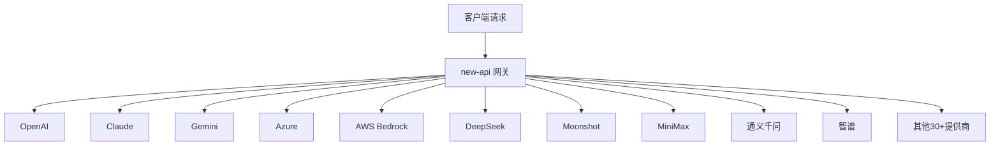

# 项目概述

## 什么是 new-api

new-api 是一个基于 Go 语言的下一代大模型网关和 AI 资产管理系统。它将 40+ 个上游 AI 提供商（OpenAI、Claude、Gemini、Azure、AWS Bedrock 等）整合在一个统一的 API 接口下，提供用户管理、计费、限流和管理后台等功能。

## 核心功能

### 1. 多提供商聚合


### 2. 多 API 格式支持
- **OpenAI 兼容格式** - `/v1/chat/completions`
- **OpenAI Responses 格式** - `/v1/responses`
- **Claude Messages 格式** - `/v1/messages`
- **Gemini 格式** - `/v1beta/models/...`
- **实时对话格式** - `/v1/realtime` (WebSocket)

### 3. 统一计费系统
支持多种计费模式：
- 按使用量计费（tokens）
- 按时间计费（音频/视频）
- 按图片数量计费
- 按分辨率/时长组合计费
- 任务预付费 + 完成结算

### 4. 智能路由策略
- **通道加权随机** - 按权重分配请求
- **自动重试** - 失败时自动切换通道
- **用户级模型限流** - 防止单用户占用过多资源
- **通道亲和性** - 会话级别的通道粘性

### 5. 异步任务系统
支持异步任务提供商：
- Midjourney - 图像生成
- Suno - 音乐生成
- Sora/Kling - 视频生成
- Jimeng - 即梦绘画

## 技术栈

| 层级 | 技术选型 |
|-------|----------|
| **后端框架** | Go 1.25.1, Gin Web Framework |
| **数据库** | SQLite, MySQL >= 5.7.8, PostgreSQL >= 9.6 |
| **缓存** | Redis (go-redis) + 内存缓存 |
| **ORM** | GORM v2 |
| **认证** | JWT, WebAuthn/Passkeys, OAuth (GitHub, Discord, OIDC) |
| **前端框架** | React 18, Vite |
| **UI 组件库** | Semi Design (@douyinfe/semi-ui) |
| **前端包管理器** | Bun |
| **国际化** | go-i18n (后端), i18next (前端) |

## 项目定位

### 目标用户
- 企业用户 - 需要 API 聚合和统一计费
- 开发者 - 需要简单接入多个 AI 模型
- 分发商 - 需要管理和计费终端用户

### 核心价值
1. **统一接入** - 一次接入 40+ AI 提供商
2. **成本可控** - 灵活的计费策略和限流
3. **高可用** - 自动重试和故障转移
4. **易管理** - 完整的用户、通道、日志管理后台

## 项目结构概览

```
new-api/
├── router/           # HTTP 路由层
├── controller/       # 请求处理层
├── service/          # 业务逻辑层
├── model/            # 数据模型和数据库访问
├── relay/            # AI API 转发核心
│   └── channel/     # 各提供商适配器
├── middleware/       # 中间件（认证、限流等）
├── setting/          # 配置管理
├── common/           # 通用工具
├── dto/              # 数据传输对象
├── constant/         # 常量定义
├── types/            # 类型定义
├── i18n/             # 后端国际化
├── oauth/            # OAuth 提供商实现
├── pkg/              # 内部包
└── web/              # React 前端
```

## 快速上手

### 1. 环境要求
- Go 1.25.1+
- Node.js 18+ (前端开发)
- Bun (前端包管理)
- SQLite/MySQL/PostgreSQL

### 2. 启动开发环境
```bash
# 后端
go run main.go

# 前端（在 web/ 目录）
cd web
bun install
bun run dev
```

### 3. 核心配置
```bash
# 数据库连接
SQL_DSN="user:password@tcp(localhost:3306)/newapi"

# Redis 连接（可选）
REDIS_CONN_STRING="redis://localhost:6379"

# 会话密钥（多机部署必填）
SESSION_SECRET="your-secret-key"

# 加密密钥（Redis 必填）
CRYPTO_SECRET="your-crypto-secret"
```

## 后续阅读

- [02-架构详解](./02-架构详解.md) - 深入了解系统架构
- [03-二次开发指南](./03-二次开发指南.md) - 学习如何扩展功能
