# 架构详解

## 整体架构

new-api 采用经典的分层架构：**Router → Controller → Service → Model**

```mermaid
graph TB
    subgraph "客户端层"
        Client[Web 客户端]
        API[API 客户端]
    end

    subgraph "路由层 (router/)"
        Router[Gin Router]
        API_Router[/v1/api]
        Relay_Router[/v1/relay]
        Dashboard_Router[/dashboard]
        Web_Router[前端路由]
    end

    subgraph "中间件层 (middleware/)"
        Auth[认证中间件]
        RateLimit[限流中间件]
        Distribute[分发中间件]
        CORS[CORS 中间件]
        Logger[日志中间件]
    end

    subgraph "控制器层 (controller/)"
        RelayCtrl[Relay 控制器]
        UserCtrl[User 控制器]
        ChannelCtrl[Channel 控制器]
        TokenCtrl[Token 控制器]
    end

    subgraph "业务逻辑层 (service/)"
        ChannelSelect[通道选择服务]
        Billing[计费服务]
        Convert[格式转换服务]
        BillingSession[计费会话服务]
        TokenCounter[Token 计数服务]
    end

    subgraph "数据层 (model/)"
        User[User 模型]
        Channel[Channel 模型]
        Token[Token 模型]
        Log[Log 模型]
        Task[Task 模型]
    end

    subgraph "转发层 (relay/)"
        Adaptor[适配器接口]
        OpenAI[OpenAI 适配器]
        Claude[Claude 适配器]
        Gemini[Gemini 适配器]
        TaskAdaptor[任务适配器]
    end

    subgraph "存储层"
        DB[(数据库)]
        Redis[(Redis 缓存)]
        Disk[磁盘缓存]
    end

    Client --> Router
    API --> Router

    Router --> CORS
    CORS --> Logger
    Logger --> Auth
    Auth --> RateLimit
    RateLimit --> Distribute

    Distribute --> RelayCtrl
    Distribute --> UserCtrl
    Distribute --> ChannelCtrl
    Distribute --> TokenCtrl

    RelayCtrl --> Convert
    RelayCtrl --> ChannelSelect

    ChannelSelect --> Channel
    Billing --> User
    Billing --> Token
    Billing --> Log

    Convert --> Adaptor
    Adaptor --> OpenAI
    Adaptor --> Claude
    Adaptor --> Gemini

    OpenAI --> DB
    Claude --> DB
    Gemini --> DB

    DB --> Redis
    DB --> Disk
```

## 请求处理流程

### 1. AI 请求转发流程

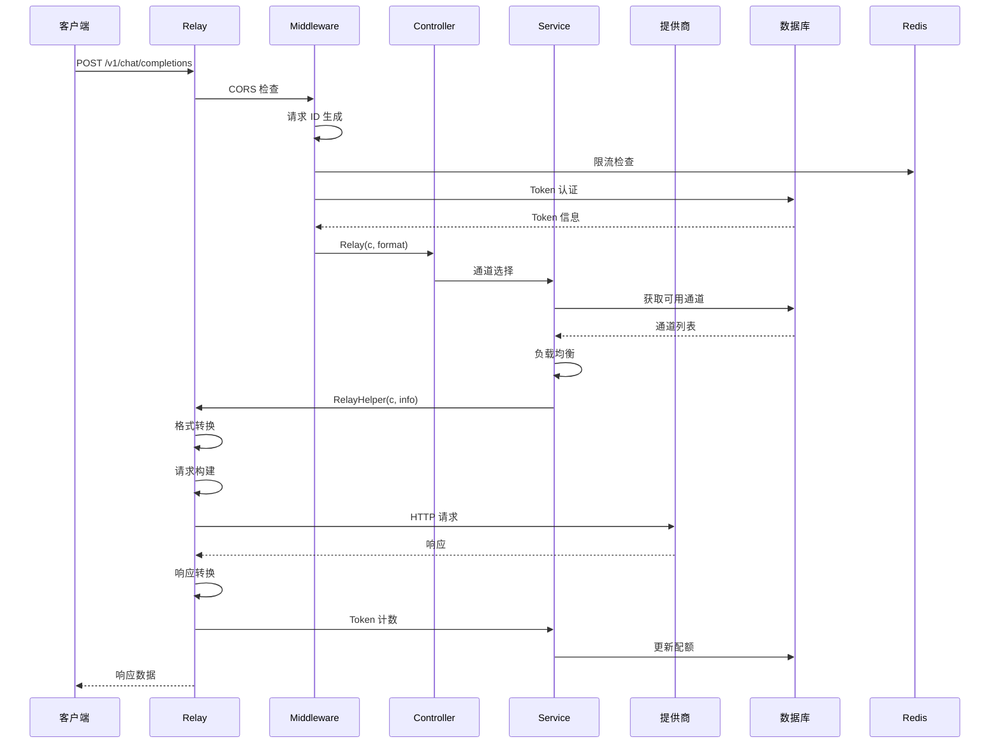

### 2. 通道选择策略

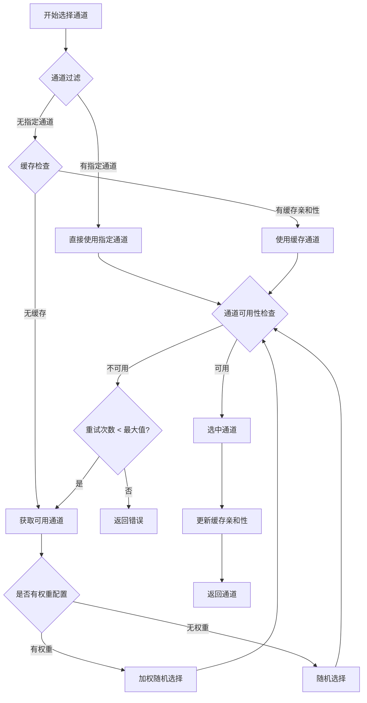

## 中间件架构

中间件按以下顺序执行：

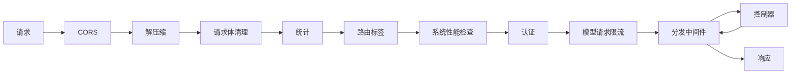

### 关键中间件说明

| 中间件 | 文件 | 功能 |
|---------|------|------|
| **CORS** | `cors.go` | 跨域资源共享配置 |
| **认证** | `auth.go` | Token 和用户认证 |
| **分发** | `distributor.go` | 通道选择和负载均衡 |
| **限流** | `rate-limit.go` | 全局请求限流 |
| **模型限流** | `model-rate-limit.go` | 用户级模型限流 |
| **性能检查** | `performance.go` | 系统性能保护 |
| **请求 ID** | `request-id.go` | 生成唯一请求 ID |
| **i18n** | `i18n.go` | 国际化上下文设置 |
| **日志** | `logger.go` | 请求/响应日志记录 |

## Relay 转发系统架构

### 适配器接口设计

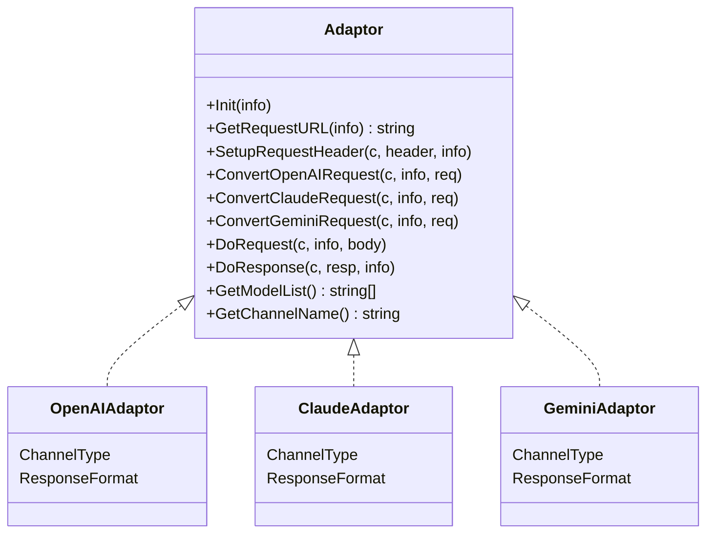

### Relay 模式与适配

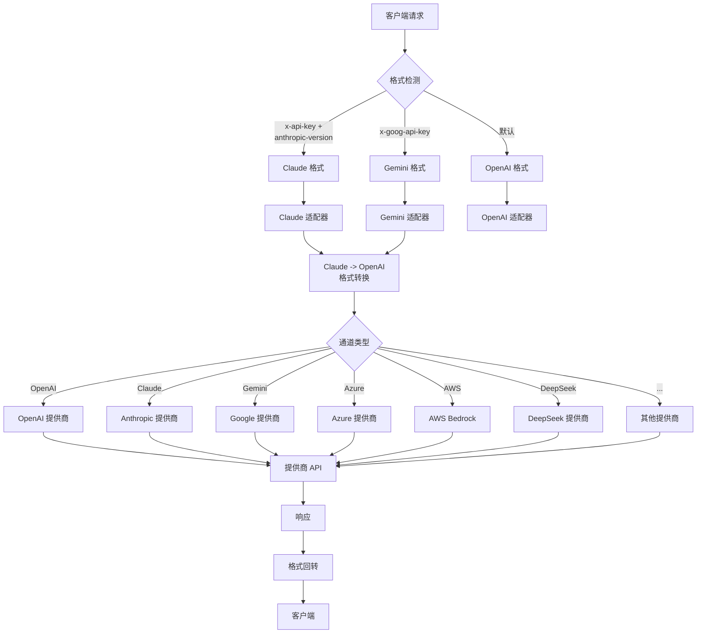

## 数据库架构

### 主要数据表

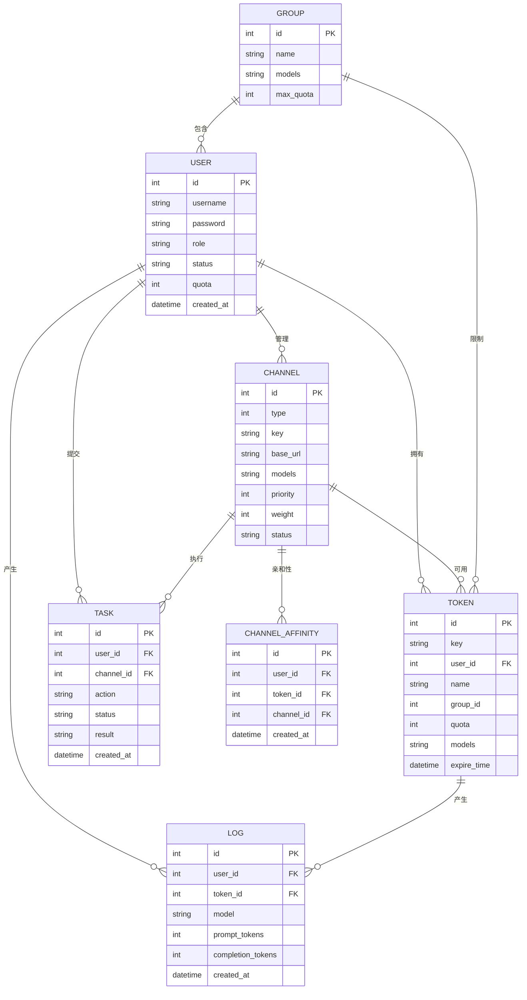

## 缓存架构

### 三级缓存设计

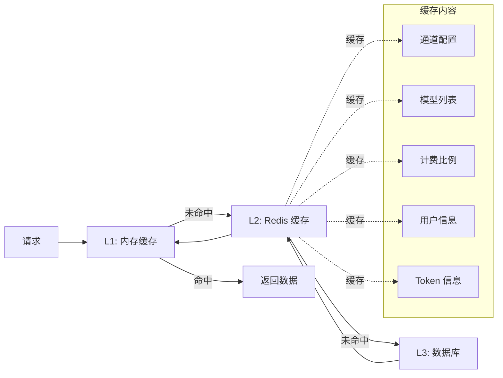

## 异步任务系统架构

### 任务生命周期

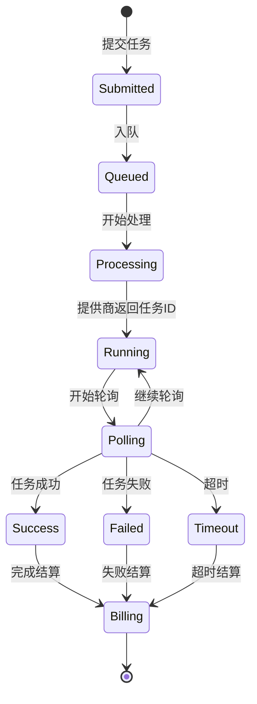

### 任务适配器接口

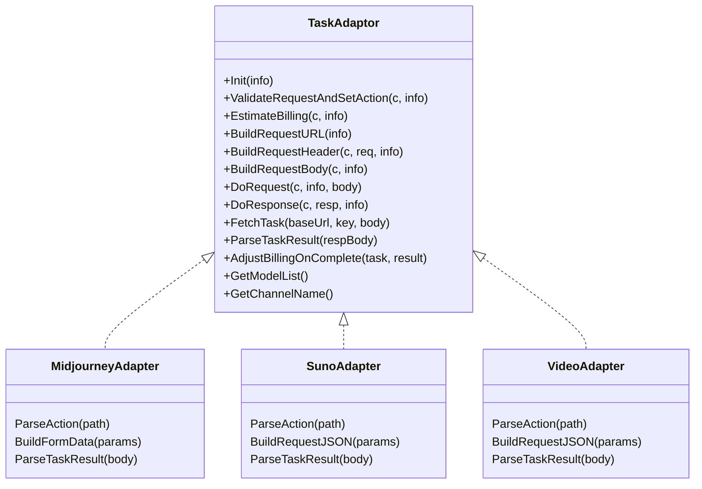

## 计费系统架构

### 计费流程

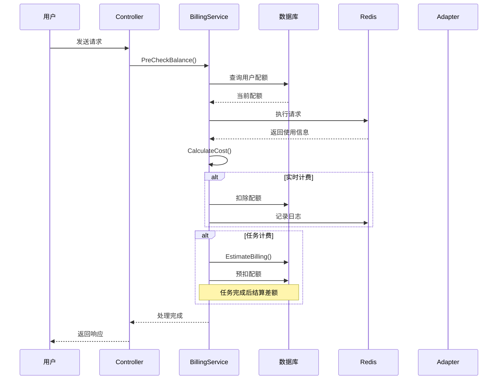

### 计费会话管理

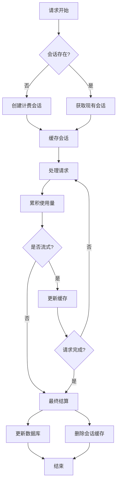

## WebSocket 实时通信

### OpenAI Realtime 处理流程

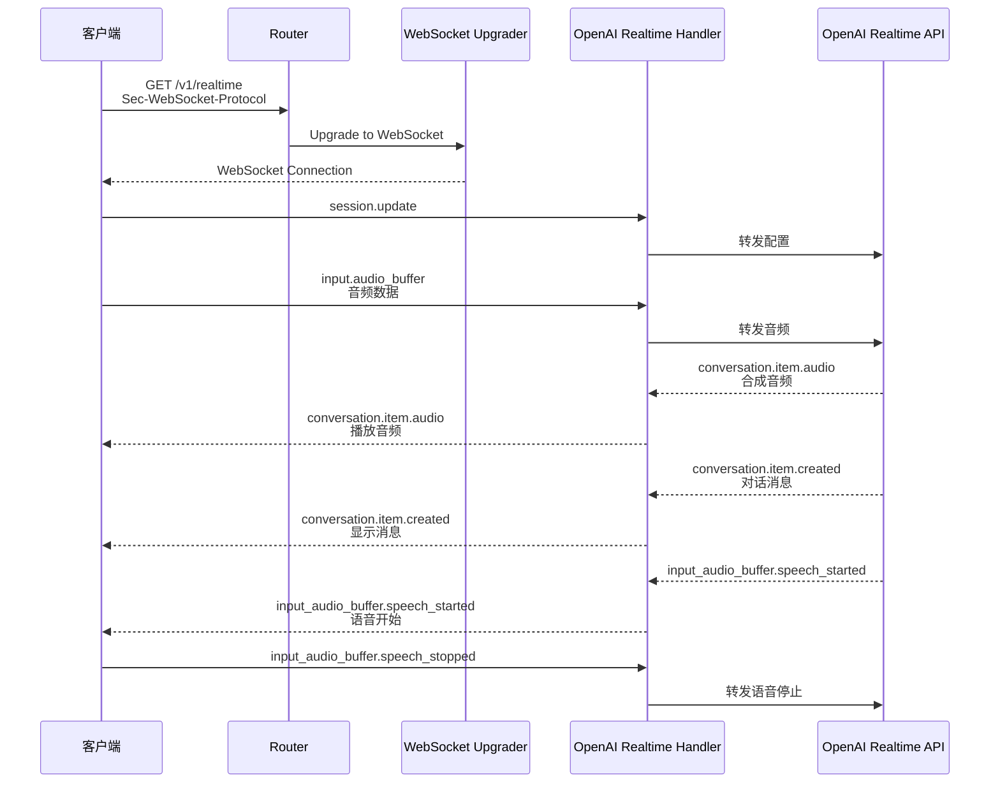

## 错误处理架构

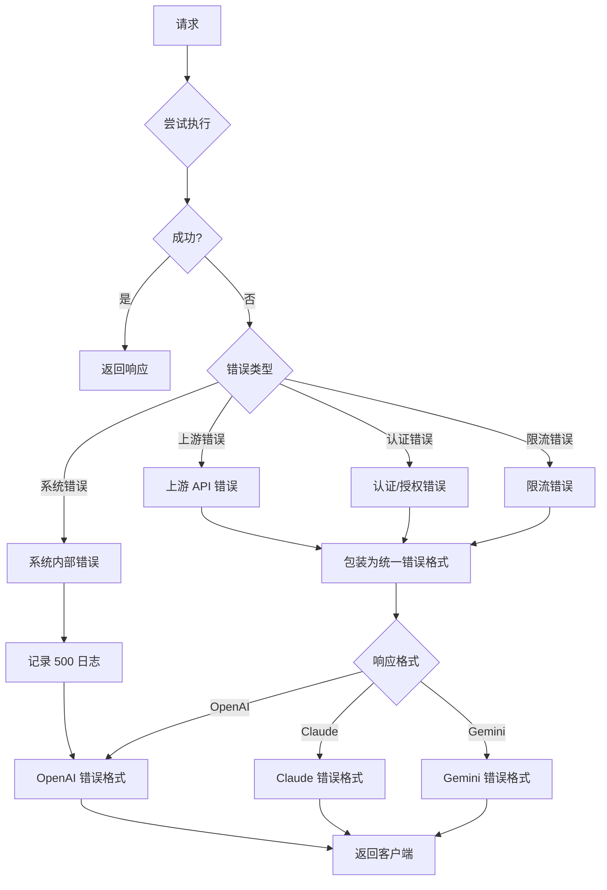
