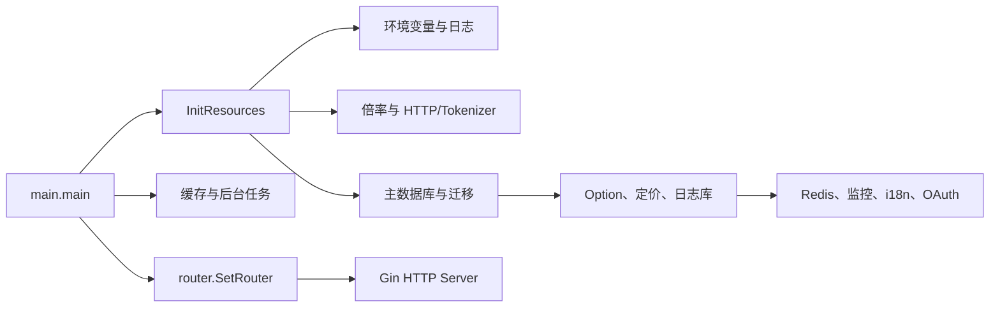
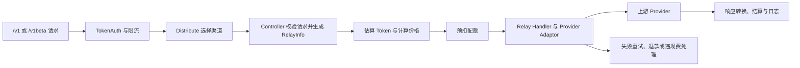

# 项目结构地图

## 说明

本文档由 Codex 根据当前代码自动维护，用于快速了解项目结构和功能入口。代码、测试和配置是事实来源；如本文档与代码冲突，以代码为准，并应刷新本文档。

- 最近初始化：2026-06-10
- 当前主干：`master`
- 应用定位：统一聚合多个 AI Provider 的 API 网关与 AI 资产管理系统，包含用户、渠道、令牌、计费、日志和管理后台。

## 技术与运行概览

| 范围 | 当前实现 | 主要依据 |
|---|---|---|
| 后端 | Go、Gin、GORM | `go.mod`、`main.go` |
| 默认前端 | React 19、TypeScript、Rsbuild、TanStack Router、Base UI、Tailwind CSS | `web/default/package.json`、`web/default/src/` |
| 经典前端 | React、Rsbuild、Semi UI，作为可切换主题保留 | `web/classic/package.json` |
| 数据库 | SQLite（默认）、MySQL、PostgreSQL；可配置独立日志库 | `model/main.go` |
| 缓存 | Redis、内存缓存、磁盘缓存 | `common/redis.go`、`model/channel_cache.go`、`common/disk_cache.go` |
| 认证 | Session/JWT、OAuth/OIDC、自定义 OAuth、Passkey、2FA | `middleware/auth.go`、`oauth/`、`service/passkey/` |
| 部署 | Docker、Docker Compose、systemd，另有 Electron 桌面封装 | `Dockerfile`、`docker-compose.yml`、`new-api.service`、`electron/` |

## 主要目录

| 目录/文件 | 作用 | 备注 |
|---|---|---|
| `main.go` | 进程入口、资源初始化、后台任务、Gin 启动 | 内嵌 `web/default/dist` 与 `web/classic/dist` |
| `router/` | HTTP 路由注册 | 分为管理 API、Relay、视频、旧版 Dashboard API 和 Web 静态资源 |
| `controller/` | 请求解析、响应与业务编排入口 | 复杂逻辑应继续下沉到 Service |
| `service/` | 业务逻辑 | 包含渠道选择、计费、配额、任务、订阅、认证辅助等 |
| `model/` | GORM 模型、数据库访问、迁移与缓存 | 必须保持 SQLite/MySQL/PostgreSQL 兼容 |
| `relay/` | AI 请求转换、转发、响应处理与 Provider 适配 | `relay/channel/` 存放 Provider 和异步任务适配器 |
| `middleware/` | 鉴权、限流、分发、日志、CORS、性能与请求体处理 | Relay 的渠道选择入口在 `distributor.go` |
| `setting/` | 系统、计费、模型、倍率、性能等配置 | 配置通常由 Option/环境变量驱动 |
| `common/` | JSON、环境变量、Redis、缓存、日志、配额等通用基础能力 | 业务 JSON 编解码应使用 `common/json.go` 封装 |
| `constant/`、`dto/`、`types/` | 常量、请求响应 DTO、跨模块类型 | Relay DTO 的可选标量需保留显式零值语义 |
| `oauth/`、`i18n/` | OAuth Provider 注册、后端国际化 | 自定义 OAuth Provider 从数据库加载 |
| `pkg/` | 相对独立的内部包 | 包含 billing expression、缓存、性能指标、io.net 客户端 |
| `web/default/` | 默认 React 管理后台 | 前端包管理器为 Bun |
| `web/classic/` | 经典主题前端 | 由后端主题文件系统按配置提供 |
| `electron/` | 桌面应用封装与打包配置 | 启动或捆绑后端可执行文件 |
| `docs/` | 项目文档、OpenAPI、安装说明和维护文档 | 本维护体系见 `docs/how-to-read.md` |

## 核心模块

| 模块 | 主要位置 | 说明 | 常见修改入口 |
|---|---|---|---|
| 启动与资源初始化 | `main.go`、`common/`、`model/main.go` | 加载环境变量、日志、倍率、数据库、配置、缓存、监控、i18n 和 OAuth | `InitResources()`、`model.InitDB()` |
| 管理 API | `router/api-router.go`、`controller/`、`service/`、`model/` | 用户、渠道、令牌、模型、日志、充值、订阅和系统设置 | 对应 Router、Controller、Service、Model |
| Relay 网关 | `router/relay-router.go`、`controller/relay.go`、`relay/` | 接收 OpenAI/Claude/Gemini 等格式，完成校验、选路、转换、转发和响应适配 | `controller.Relay()`、各 Handler |
| 渠道选择 | `middleware/distributor.go`、`service/channel_select.go`、`model/channel*.go` | 根据模型、分组、令牌限制、渠道亲和和重试策略选择上游 | `Distribute()`、`CacheGetRandomSatisfiedChannel()` |
| Provider 适配 | `relay/relay_adaptor.go`、`relay/channel/` | 按 API 类型选择同步请求或异步任务适配器 | `GetAdaptor()`、`GetTaskAdaptor()` |
| 计费与配额 | `service/billing*.go`、`service/quota.go`、`relay/common/billing.go`、`pkg/billingexpr/` | 预扣、结算、退款、阶梯/动态表达式计费 | 修改前先读 `pkg/billingexpr/expr.md` |
| 认证与安全 | `middleware/auth.go`、`controller/user.go`、`oauth/`、`service/passkey/` | 登录、OAuth/OIDC、Passkey、2FA、权限与安全验证 | 对应路由和认证 Service |
| 数据与缓存 | `model/`、`common/redis.go`、`pkg/cachex/` | 主数据库、日志数据库、Redis 和本地缓存 | `model/main.go`、具体模型文件 |
| 默认管理后台 | `web/default/src/routes/`、`web/default/src/features/`、`web/default/src/stores/` | 文件路由、功能模块、Zustand 状态和统一 API 客户端 | 对应 route 与 feature |
| 经典管理后台 | `web/classic/src/pages/`、`web/classic/src/components/`、`web/classic/src/hooks/` | 经典主题页面、Semi UI 组件和页面数据 Hook；运行时由 `theme.frontend` 选择 | 对应 page、table component 与 hook |

## 前端入口

TanStack Router 的 `_authenticated` 是无路径布局；下表使用用户实际访问路径。页面是否可见还会受登录状态、角色和系统模块配置影响。

| 功能/页面 | 路径 | 主要位置 | 相关后端入口 |
|---|---|---|---|
| 首页与公开信息 | `/`、`/about`、`/pricing`、`/rankings` | `routes/index.tsx`、`features/home/`、`features/about/`、`features/pricing/`、`features/rankings/` | `/api/status`、`/api/about`、`/api/pricing`、`/api/rankings` |
| 初始化与认证 | `/setup`、`/sign-in`、`/register`、`/oauth` 等 | `routes/setup/`、`routes/(auth)/`、`features/auth/` | `/api/setup`、`/api/user/*`、`/api/oauth/*` |
| Dashboard | `/dashboard` | `routes/_authenticated/dashboard/`、`features/dashboard/` | `/api/data/*`、`/api/log/*` |
| 渠道与模型 | `/channels`、`/models` | `features/channels/`、`features/models/` | `/api/channel/*`、`/api/models/*`、`/api/vendors/*` |
| API Key | `/keys` | `features/keys/` | `/api/token/*` |
| 经典令牌管理 | `/console/token` | `web/classic/src/components/table/tokens/`、`web/classic/src/hooks/tokens/` | `/api/token/*`；包含 CC Switch 导入入口 |
| 使用日志 | `/usage-logs` | `features/usage-logs/` | `/api/log/*` |
| 用户与兑换码 | `/users`、`/redemption-codes` | `features/users/`、`features/redemption-codes/` | `/api/user/*`、`/api/redemption/*` |
| 钱包与订阅 | `/wallet`、`/subscriptions` | `features/wallet/`、`features/subscriptions/` | `/api/user/topup/*`、`/api/subscription/*` |
| Playground 与聊天 | `/playground`、`/chat/:chatId` | `features/playground/`、`features/chat/` | `/pg/chat/completions`、Relay API |
| 系统设置 | `/system-settings/*` | `features/system-settings/` | `/api/option/*` 及各管理 API |
| 个人资料 | `/profile` | `features/profile/` | `/api/user/self`、Passkey、2FA、OAuth 绑定接口 |

## 后端入口

| 功能/API | Router/Controller | Service/Model | 备注 |
|---|---|---|---|
| 系统状态与初始化 | `router/api-router.go` -> `controller/setup.go`、`controller/misc.go` | `model/setup.go`、Option/Setting | `/api/setup`、`/api/status` |
| 用户与认证 | `/api/user`、`/api/oauth` -> 用户/OAuth/Passkey Controller | `service/passkey/`、`oauth/`、`model/user*.go` | 匿名、自助、管理员接口分组鉴权 |
| 渠道管理 | `/api/channel` -> `controller/channel*.go` | `service/channel*.go`、`model/channel*.go` | 管理员接口，敏感密钥操作有额外验证 |
| Token 管理 | `/api/token` -> `controller/token.go`、`controller/ccswitch_import.go` | `service/ccswitch_import.go`、`model/token*.go`、`model/ccswitch_import.go` | 用户鉴权；CC Switch 导入选项与链接生成使用令牌所有权校验 |
| 模型与 Provider 元数据 | `/api/models`、`/api/vendors` | `model/model*.go`、`model/vendor_meta.go` | 管理员鉴权 |
| 充值、订阅与计费 | `/api/user/topup`、`/api/subscription`、支付 webhook | Billing/Quota/Subscription Service 与 Model | 支付回调含匿名入口和签名校验逻辑 |
| 日志与统计 | `/api/log`、`/api/data`、`/api/perf-metrics` | Log、QuotaData、PerfMetric Model | 区分用户自助和管理员查询 |
| 系统配置 | `/api/option`、`/api/performance`、`/api/ratio_sync` | `setting/`、Option Model | 多数为 Root 权限 |
| OpenAI 兼容 Relay | `/v1/chat/completions`、`/v1/responses`、图片、音频、Embedding、Rerank | `controller.Relay()`、`relay/`、`service/billing*.go` | Token 鉴权、模型限流、渠道分发 |
| Claude/Gemini Relay | `/v1/messages`、`/v1beta/models/*` | Claude/Gemini Handler 与 Channel Adaptor | 请求与响应格式分别适配 |
| 异步媒体任务 | `/mj`、`/suno`、`/v1/videos`、`/kling/v1`、`/jimeng` | Task Controller/Service、`relay/channel/task/` | 创建、轮询与内容代理分开处理 |

## 关键数据流与调用链

### 服务启动



### 管理 API

```text
浏览器/客户端 -> Router -> 鉴权/限流 Middleware -> Controller -> Service -> Model -> 数据库/缓存
```

### Relay 请求



### 默认前端

```text
TanStack Route -> features/<feature> -> hooks/lib -> src/lib/api.ts -> /api 或 Relay 路径
```

### CC Switch 令牌导入

```text
默认前端 /keys 或经典前端 /console/token
  -> GET /api/token/:id/ccswitch/import-options
  -> 用户选择目标与模型
  -> POST /api/token/:id/ccswitch/import-link
  -> Service 校验令牌归属、目标和模型
  -> 记录用户偏好与导入审计
  -> 返回 ccswitch://v1/import 协议链接
```

## 常见修改应该看哪里

| 修改目标 | 优先查看 | 注意事项 |
|---|---|---|
| 新增管理 API | `router/api-router.go`、对应 Controller/Service/Model | 保持 Router -> Controller -> Service -> Model 分层 |
| 新增 Provider/Channel | `constant/channel.go`、`relay/relay_adaptor.go`、`relay/channel/<provider>/` | 同时确认模型映射、错误处理、计费和 `StreamOptions` 支持 |
| 修改 Relay DTO | `dto/`、`relay/common/`、对应 Adaptor | 可选标量使用 pointer + `omitempty`，保留显式 `0`/`false` |
| 修改计费 | `pkg/billingexpr/expr.md`、`service/billing*.go`、`relay/helper/price.go` | 先理解预扣、结算、额度换算和日志展示 |
| 修改数据库 | `model/main.go`、具体 Model | 同时兼容 SQLite、MySQL、PostgreSQL |
| 修改认证 | `router/api-router.go`、`middleware/auth.go`、`oauth/`、`service/passkey/` | 覆盖匿名、用户、管理员、Root 权限边界 |
| 新增默认前端页面 | `web/default/src/routes/`、`features/`、导航配置 | 使用 Bun；用户文案需同步 i18n |
| 修改系统配置 | `setting/`、`model/option.go`、系统设置前端 | 确认默认值、旧配置迁移和前端状态缓存 |
| 修改 JSON 处理 | `common/json.go` | 业务代码不要直接使用 `encoding/json` 做 marshal/unmarshal |

## 验证入口

- Go 小范围修改：`go test ./path/to/affected/package`
- Go 共享逻辑：`go test ./...`
- 默认前端：在 `web/default/` 运行 `bun run typecheck`、`bun run lint`、`bun run build:check`
- 用户可见前端修改：在本地页面或应用内浏览器验证主要路径

## 待确认

- 本次初始化聚焦主要模块和入口，没有穷举每个 Provider、支付渠道、系统设置子项和页面内部组件；后续应随真实代码变更增量补充。
