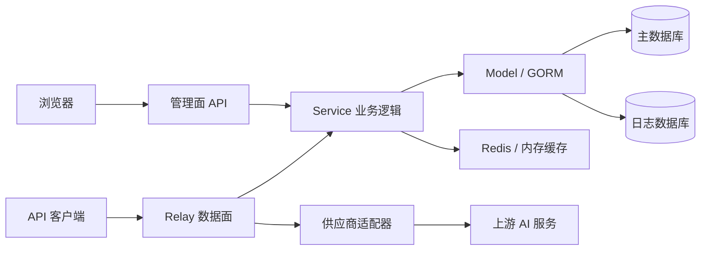

# 系统架构

## 系统边界

New API 是一个同时承载管理面和模型请求数据面的 Go 服务。生产构建会把默认与经典前端静态资源嵌入同一二进制；配置 `FRONTEND_BASE_URL` 时，非主节点可把 Web 请求重定向到独立前端。



## 启动流程

`main.go` 的启动顺序决定了运行时依赖：

1. `common.InitEnv()` 加载环境变量，初始化日志、倍率配置、HTTP 客户端和 tokenizer。
2. `model.InitDB()` 连接 SQLite、MySQL 或 PostgreSQL 并执行迁移，随后检查首次安装状态。
3. 从 `options` 表加载系统配置，并加载模型定价。
4. 初始化独立或复用的日志数据库、Redis、性能指标、系统监控和后端 i18n。
5. 从数据库加载自定义 OAuth 提供商。
6. 初始化渠道缓存与配置热同步，并启动用量聚合、渠道检查、凭证刷新、订阅重置和任务轮询等后台任务。
7. 创建 Gin Engine，挂载请求 ID、恢复、日志、i18n 和 Session 中间件，再注册管理面、Relay、视频与 Web 路由。

数据库和其他必需资源初始化失败时，服务不会进入监听阶段；i18n 和自定义 OAuth 加载失败会记录错误但不阻止启动。

## 分层与目录

主干调用方向是：

```text
router -> controller -> service -> model
                         |
                         +-> relay/channel -> upstream provider
```

| 目录 | 责任 |
| --- | --- |
| `router/` | 路径、HTTP 方法、中间件与控制器绑定 |
| `controller/` | HTTP 参数处理、响应和用例编排 |
| `service/` | 渠道选择、计费、任务、通知、文件等跨控制器业务逻辑 |
| `model/` | GORM 模型、查询、迁移、缓存同步和原子额度操作 |
| `relay/` | 请求格式识别、转换、上游调用、流式响应和供应商适配 |
| `middleware/` | 鉴权、限流、分发、请求体复用、审计与可观测性 |
| `setting/` | 按领域组织的运行时配置及校验 |
| `common/` | 环境、JSON、Redis、加密、请求体和通用基础设施 |
| `dto/`、`types/`、`constant/` | 边界 DTO、共享类型和稳定常量 |

这是主要结构，不是强制禁止跨层调用的规则。修改前应搜索真实调用者，而不是只按目录名推断影响面。

## 路由平面

`router.SetRouter` 组合五类入口：

- 管理面 `/api/*`：Session 用户、管理员和根用户操作。
- Relay 数据面：模型列表、同步生成、Realtime 和供应商兼容 API。
- 视频与任务入口：提交、查询和内容代理。
- Dashboard 兼容接口：使用 Token 鉴权查询订阅和用量。
- Web 静态资源：按主题提供默认或经典前端，并为前端路由回退 `index.html`。

权限由路由组中间件声明。用户、管理员和根用户角色值递增，`UserAuth`、`AdminAuth`、`RootAuth` 分别校验最低角色；模型调用使用 `TokenAuth` 或只读变体。

## 数据与缓存

- 主数据库保存用户、令牌、渠道、能力、模型、配置、订阅、订单、任务等业务数据。
- `LOG_SQL_DSN` 可为日志指定独立数据库；未配置时日志与主库共用连接目标。
- SQLite、MySQL 和 PostgreSQL 必须同时受支持，数据库差异集中在 `model/main.go` 等兼容分支中。
- Redis 用于分布式缓存和限流；启用 Redis 时同时启用进程内缓存。
- 渠道能力缓存以 `group + model + channel_id` 为核心索引，配置和渠道缓存通过后台同步刷新。
- 请求体由公共存储层保存并复位，以支持中间件读取、Relay 转换和失败重试。

## 后台任务

启动后可能运行以下任务，是否启用取决于节点角色和配置：

- 渠道缓存与 Option 配置同步。
- 配额数据聚合、渠道自动测试与余额更新。
- Codex 凭证自动刷新。
- 订阅日/周/月/自定义周期额度重置。
- 上游模型变更检测。
- Midjourney 和通用异步任务状态更新。
- 批量数据库更新、性能采样、系统监控、pprof 和 Pyroscope。

新增后台任务时，应明确主节点限制、执行周期、幂等性、关闭方式和多实例行为。

## 必须保持的约束

- JSON 编解码调用使用 `common/json.go` 的封装。
- 所有数据逻辑兼容 SQLite、MySQL 和 PostgreSQL。
- 上游可选标量使用指针配合 `omitempty`，保留显式 `0` 和 `false`。
- 新渠道需确认 `StreamOptions` 支持情况。
- 计费修改遵循 [billing-and-data.md](billing-and-data.md) 和 [Billing Expression System](../../pkg/billingexpr/expr.md)。
