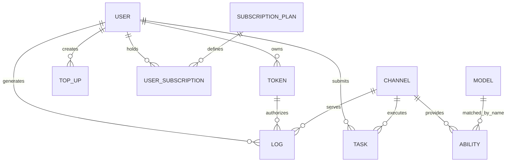
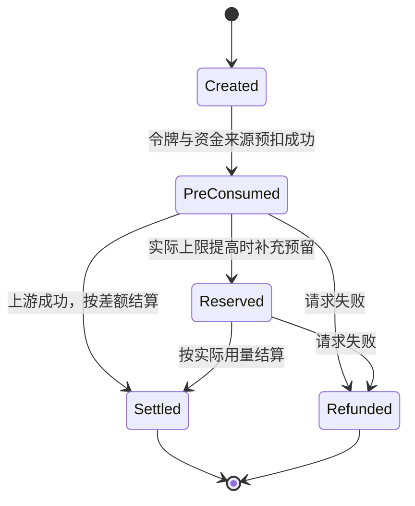

# 数据与计费设计

## 核心数据关系

下图表示业务上的逻辑关联，不表示数据库一定声明了外键约束。主要实体及职责：

| 实体 | 关键含义 | 文件 |
| --- | --- | --- |
| `User` | 身份、角色、状态、分组、钱包额度、已用额度和用户设置 | `model/user.go` |
| `Token` | 模型调用凭证及有效期、额度、模型、分组、IP、指定渠道限制 | `model/token.go` |
| `Channel` | 上游类型、密钥、模型、分组、优先级、权重、映射和覆盖配置 | `model/channel.go` |
| `Ability` | `group + model + channel_id` 的可用关系 | `model/ability.go` |
| `Model`、`Vendor` | 展示和管理模型/供应商元数据 | `model/model_meta.go`、`model/vendor_meta.go` |
| `SubscriptionPlan`、`UserSubscription` | 订阅规则、周期、额度、用户持有状态和已用额度 | `model/subscription.go` |
| `Task`、`Midjourney` | 异步生成请求、上游任务 ID、状态、属性和计费上下文 | `model/task.go`、`model/midjourney.go` |
| `Log`、`QuotaData` | 单次消费日志和聚合用量 | `model/log.go`、`model/usedata.go` |
| `Option` | 数据库存储的运行时系统配置 | `model/option.go` |

## 数据库边界

主业务库和日志库均通过 GORM 访问。`SQL_DSN` 决定主库，`LOG_SQL_DSN` 可指定独立日志库；缺省使用 SQLite。所有数据变更必须兼容 SQLite、MySQL >= 5.7.8 和 PostgreSQL >= 9.6。

额度是整数内部单位。界面显示和真实货币之间的换算由系统配置控制，不要在新功能中自行引入另一套单位。

## 价格计算模式

当前价格计算包含以下来源：

- 模型倍率与补全倍率。
- 按次固定模型价格。
- 缓存、图像、音频及任务参数等附加倍率。
- 基于表达式的动态/阶梯计费。
- 用户分组倍率。

预扣入口是 `relay/helper/price.go`，实际结算按请求类型进入 `service/text_quota.go`、`service/quota.go`、任务计费服务或动态计费结算。

动态计费表达式的变量、版本、token 归一化和换算公式以 [Billing Expression System](../../pkg/billingexpr/expr.md) 为唯一详细说明。本文件只说明它在总链路中的位置。

## 统一计费会话

`service.BillingSession` 封装一次请求的预扣、补充预留、结算和退款。它同时处理资金来源与 API 令牌额度，避免各 Relay 处理器自行拼装扣费步骤。

关键约束：

- 预扣先处理令牌额度，再处理资金来源；资金来源失败时回滚令牌额度。
- 结算以 `actualQuota - preConsumedQuota` 为差额，正数补扣，负数退还。
- `Settle` 和 `Refund` 有状态保护，避免同一会话重复处理。
- 钱包退款是非幂等加法，不能盲目重试；订阅退款依赖请求 ID 和事务保护，可有限重试。
- 免费模型跳过预扣；高额度钱包用户可按信任阈值跳过预扣，但订阅不使用该旁路。
- 异步任务可强制预扣，完成轮询后再根据真实任务参数调整。

## 资金来源与回退

资金来源实现 `service.FundingSource`：

- `WalletFunding` 操作 `User.Quota`。
- `SubscriptionFunding` 操作用户订阅额度及预扣记录。

用户计费偏好支持：

| 偏好 | 行为 |
| --- | --- |
| `subscription_first` | 默认先尝试订阅，不可用时回退钱包 |
| `wallet_first` | 先尝试钱包，额度不足时回退订阅 |
| `subscription_only` | 只使用订阅 |
| `wallet_only` | 只使用钱包 |

新增资金来源会扩大结算和退款的一致性风险；除非业务明确要求，不应绕过 `BillingSession` 或新增平行扣费链路。

## 修改计费时的验证重点

- 预扣不足时不调用上游。
- 上游成功后只结算一次，实际额高低于预扣时都正确。
- 请求失败、转换失败和重试耗尽时能退款。
- 钱包、订阅、令牌额度和日志记录保持一致。
- 普通、流式、Realtime、音频/图像和异步任务的 usage 语义正确。
- 动态表达式对 OpenAI 与 Claude usage 的 token 归一化正确。
- 数据库更新在三种受支持数据库上行为一致。
