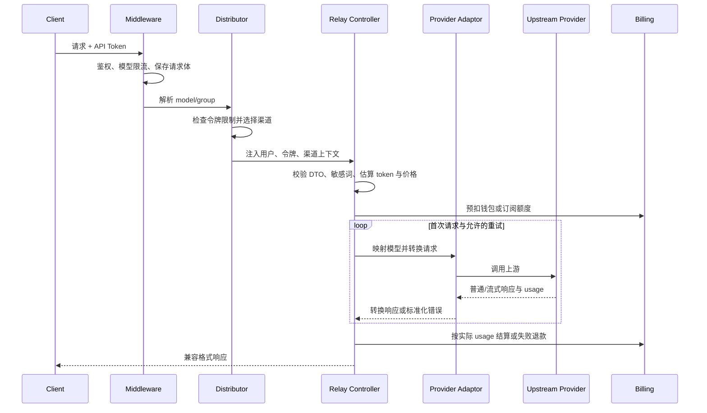

# Relay 请求链路

本文描述同步模型请求的公共链路。Midjourney、Suno 和视频等异步任务复用鉴权、渠道分发和计费思想，但由 `TaskAdaptor` 负责提交、查询和完成态结算。

## 支持的请求格式

`types/relay_format.go` 定义公共格式，包括 OpenAI、Claude、Gemini、Responses、Responses Compact、音频、图像、Realtime、Rerank、Embedding 和任务格式。具体路径由 `router/relay-router.go` 与 `router/video-router.go` 注册。

## 同步请求时序

## 1. 路由与中间件

典型 `/v1` 请求依次经过：

1. CORS、请求解压、请求体清理和统计中间件。
2. `SystemPerformanceCheck` 拒绝系统过载时的新请求。
3. `TokenAuth` 校验 API 令牌，加载用户、分组、额度、模型/IP/渠道限制等上下文。
4. `ModelRequestRateLimit` 执行用户/模型级限流。
5. `Distribute` 解析模型和可选分组，选择初始渠道并填充渠道上下文。

不同路由的中间件组合有差异，应以路由文件中的实际顺序为准。

## 2. 渠道选择

`middleware.Distribute` 与 `service/channel_select.go` 共同完成选择：

- 指定渠道令牌直接加载目标渠道，并验证启用状态。
- 普通请求先检查令牌允许的模型集合。
- 渠道亲和命中时，优先复用仍支持当前分组和模型的渠道。
- 未命中亲和时，从能力缓存中筛选支持 `group + model` 的启用渠道。
- 选择先比较优先级，再按权重随机；`auto` 分组可在用户允许的多个分组间选择。
- 重试会排除已使用渠道；启用跨组重试时，可在当前自动分组耗尽后切换分组。

`model.Ability` 是渠道、分组和模型之间的可用关系。渠道模型、分组或状态变化时，必须同步维护能力数据和缓存。

## 3. 请求解析与预扣

`controller.Relay` 执行公共准备工作：

1. `helper.GetAndValidateRequest` 根据 Relay 格式解析并校验 DTO。
2. `relaycommon.GenRelayInfo` 把请求、用户、令牌和渠道上下文汇总为 `RelayInfo`。
3. 按配置执行敏感词检查并估算输入 token。
4. `helper.ModelPriceHelper` 计算价格和预扣额度，同时冻结动态计费所需快照。
5. 非免费模型通过 `service.PreConsumeBilling` 创建统一 `BillingSession`，从钱包或订阅预扣，并同步扣减令牌额度。

请求在任何后续步骤失败时，延迟清理逻辑会调用计费会话退款；符合配置的违规错误可改为收取违规费用。

## 4. 适配器职责

同步适配器实现 `relay/channel.Adaptor`。公共处理器负责调用顺序，供应商适配器负责差异：

- 初始化渠道和 Relay 信息。
- 构造 URL 与请求头。
- 转换 OpenAI、Claude、Gemini、Responses、Rerank、Embedding、Audio 或 Image 请求。
- 发送上游请求。
- 把普通或流式响应转换为客户端格式，并返回统一 usage。

OpenAI 兼容渠道可以复用 OpenAI 适配器。只有协议或认证确实不同的供应商才需要独立实现。

请求转换前可应用模型映射、系统提示词、禁用字段、参数覆盖和请求头覆盖。全局或渠道开启透传时，会跳过普通请求体转换并转发保存的原始请求体。

## 5. 响应、重试与渠道状态

公共处理器把上游非成功状态转换为 `NewAPIError`，再应用状态码映射。重试由 `controller.shouldRetry` 控制：

- 渠道类错误可触发重试。
- 标记为跳过重试的错误、指定渠道请求和已耗尽次数的请求不重试。
- 业务配置可按错误码或 HTTP 状态码决定是否重试。
- 渠道亲和失败策略可以阻止继续切换渠道。

失败会记录渠道错误；符合自动禁用条件且渠道允许自动禁用时，后台逻辑会更新渠道或多 Key 状态。请求体在每次重试前复位，确保所有适配器读取相同输入。

## 6. 结算与日志

适配器从响应中生成统一 usage。文本、音频、图像、Realtime 和任务请求分别进入对应结算函数，最终由 `BillingSession.Settle` 按“实际额度 - 预扣额度”的差值补扣或退还。

结算完成后记录用户、令牌、渠道、模型、分组、token 明细、计费模式、命中档位和请求耗时。流式请求还会记录结束原因、结束错误、已接收响应数和处理过程中收集的错误，供管理员在使用日志详情中诊断客户端断开、超时或上游读取失败。动态表达式的详细语义见 [Billing Expression System](../../pkg/billingexpr/expr.md)。

## 新增渠道检查表

新增渠道前，先阅读 [development-guide.md](development-guide.md)，至少确认：

- 渠道类型、API 类型与适配器注册齐全。
- 支持的请求格式、模型列表、认证、Base URL 和错误响应已实现。
- 流式与非流式响应均能产生正确 usage。
- 客户端显式传入的 `0` 或 `false` 不会在 DTO 转发时丢失。
- 已确认 `StreamOptions` 是否受支持。
- 失败重试不会重复消费不可复用的请求体或重复结算。
