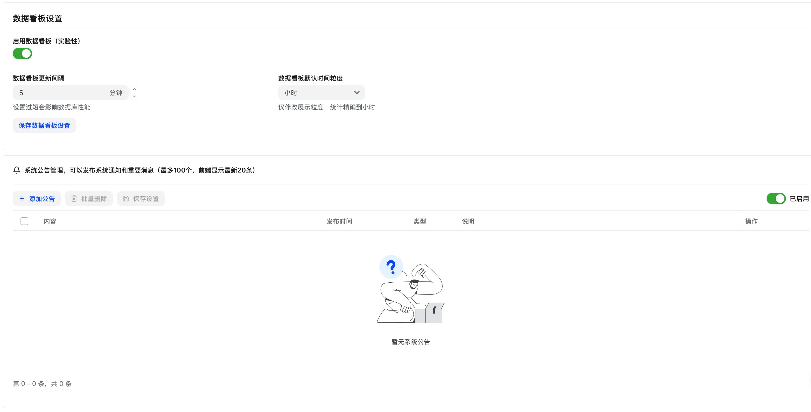
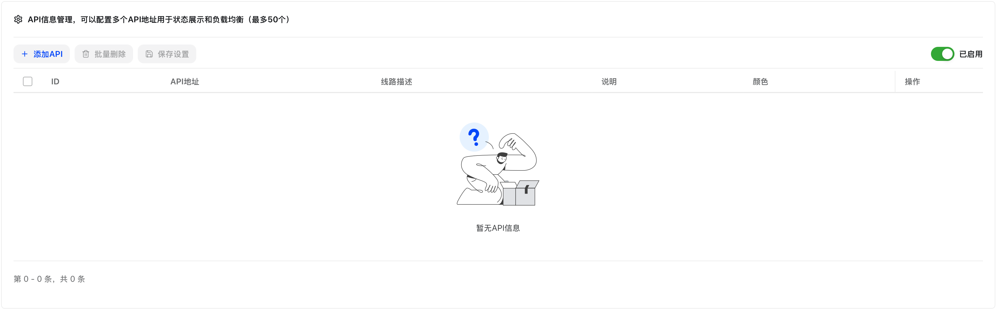
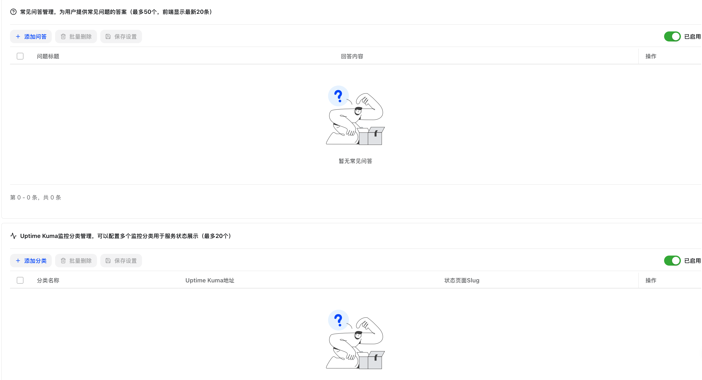

# 数据看板

> 来源：https://raw.githubusercontent.com/QuantumNous/new-api-docs-v1/main/content/docs/zh/guide/console/settings/dashboard-settings.mdx
> 抓取时间：2026-05-23T07:43:21.476Z
> 源文件：content/docs/zh/guide/console/settings/dashboard-settings.mdx

## 页面大纲

- 本页未识别到标题层级。

## 原文内容

---
title: 数据看板
---
这里可以设置启用数据看板，系统公告，API信息管理，常见问答和Uptime Kuma监控。

