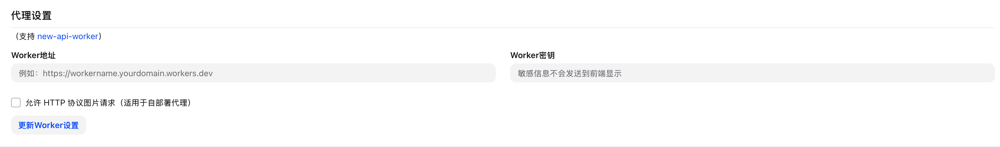
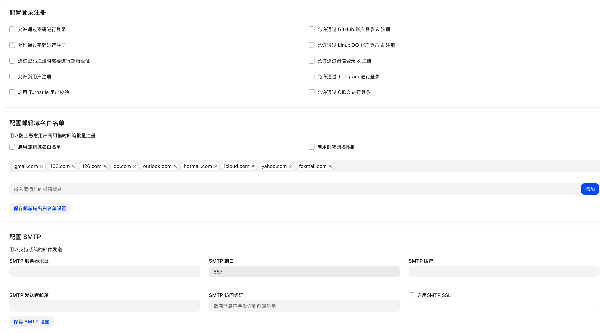
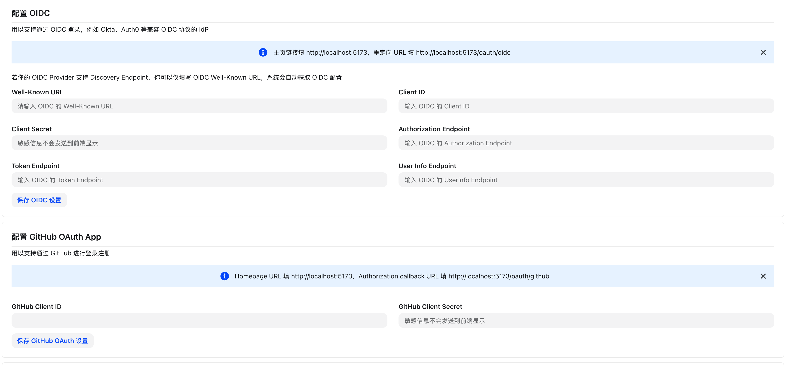
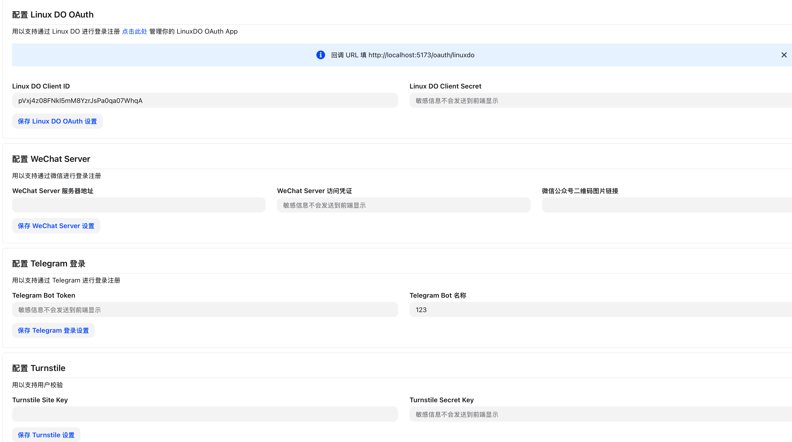

# 系统设置

> 来源：https://raw.githubusercontent.com/QuantumNous/new-api-docs-v1/main/content/docs/zh/guide/console/settings/system-settings.mdx
> 抓取时间：2026-05-23T07:43:21.476Z
> 源文件：content/docs/zh/guide/console/settings/system-settings.mdx

## 页面大纲

- 本页未识别到标题层级。

## 原文内容

---
title: 系统设置
---
这里可以配置 NewAPI worker，邮件服务器和登录注册相关设置

当启用OIDC配置后，请一定要勾选"允许新用户注册"，否则会导致OIDC登录的新用户无法正常创建用户，并同时勾选"允许通过OIDC进行登录"。其他配置根据需要勾选。

