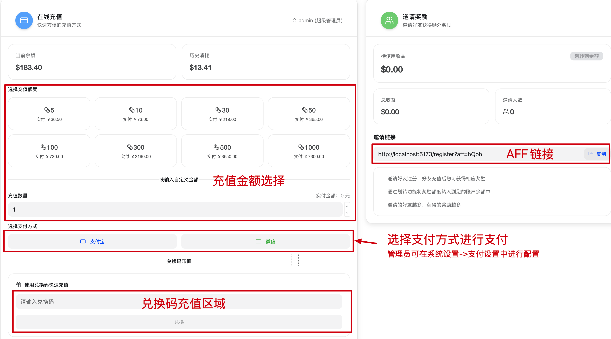

# 钱包

> 来源：https://raw.githubusercontent.com/QuantumNous/new-api-docs-v1/main/content/docs/zh/guide/console/wallet.mdx
> 抓取时间：2026-05-23T07:43:21.476Z
> 源文件：content/docs/zh/guide/console/wallet.mdx

## 页面大纲

- 本页未识别到标题层级。

## 原文内容

---
title: 钱包
---
import { Callout } from 'fumadocs-ui/components/callout';

在这里可以进行内部余额管理、授权兑换和合规邀请记录。支付方式由管理员在系统设置->支付设置中配置。

<Callout type="warn">
  充值、兑换码和邀请链接适用于合法授权场景。使用时应符合授权范围、上游服务条款、平台规则和所在地法律法规要求。
</Callout>

