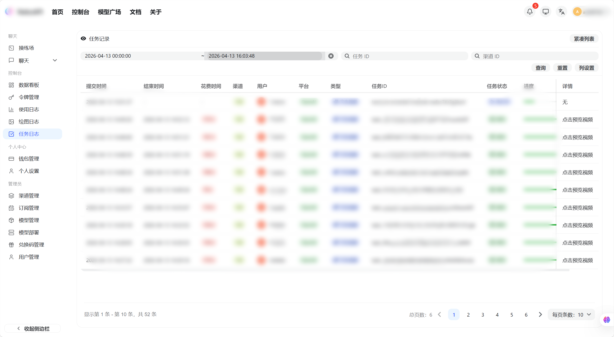

# 任务管理

> 来源：https://raw.githubusercontent.com/QuantumNous/new-api-docs-v1/main/content/docs/zh/guide/feature-guide/user/task.mdx
> 抓取时间：2026-05-23T07:43:21.476Z
> 源文件：content/docs/zh/guide/feature-guide/user/task.mdx

## 页面大纲

- 本页未识别到标题层级。

## 原文内容

---
title: 任务管理
description: 管理 Midjourney 绘图、Suno 音乐生成等异步任务
---
管理 Midjourney 绘图、Suno 音乐生成等异步任务的状态与结果。左侧导航点击「任务」，或直接访问 `/console/task`。

任务列表展示所有已提交的异步生成任务，包含任务 ID、类型、状态、提交时间和完成时间。

任务状态说明：

| 状态 | 说明 |
| --- | --- |
| `PENDING` | 任务已提交，等待处理 |
| `IN_PROGRESS` | 任务正在生成中 |
| `SUCCESS` | 任务已完成，可查看结果 |
| `FAILURE` | 任务生成失败，已自动退还配额 |
