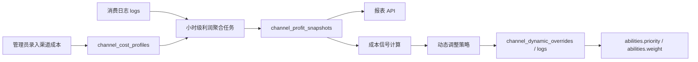

# aiapi114 渠道成本录入、盈利报表与成本驱动调度设计

日期：2026-05-24  
范围：渠道成本录入、基于成本的收支及盈利报表、根据渠道成本调整分组中的优先级和权重  
状态：已按推荐方案固化，等待实现计划确认

## 1. 目标

本设计为 aiapi114 增加一条从“成本录入”到“利润报表”再到“成本驱动调度”的闭环：

- 管理员可以按 **渠道 + 模型 + 分组** 录入成本。
- 系统按消费日志定时计算收入、成本、利润和利润率。
- 系统基于利润率对 `abilities.priority` 和 `abilities.weight` 做动态调整。
- 所有自动调整必须保留基准值、应用值和审计日志，不能覆盖管理员手工配置。

## 2. 当前项目依据

已确认当前项目中存在以下相关能力：

- `model.Channel`：渠道包含 `Priority`、`Weight`、`Group`、`Models`、`UsedQuota` 等字段。
- `model.Ability`：按 `group + model + channel_id` 保存模型能力，包含 `Enabled`、`Priority`、`Weight`。
- `model.Log`：消费日志包含 `channel_id`、`group`、`model_name`、`quota`、`prompt_tokens`、`completion_tokens`、`created_at`。
- `model.TopUp`：充值记录可用于现金流分析，但不适合作为消费收入确认的唯一依据。
- `model.ChannelDynamicOverride`：已有动态调整覆盖层，可保存基准值、应用值和状态。
- `service.channel_dynamic_adjustment_runner`：已有定时扫描并写回 `abilities` 的动态调度框架。

因此首期不新建一套调度系统，而是在现有动态调整链路中增加成本信号。

## 3. 总体方案

采用四层架构：

1. **成本档案层**：管理员录入渠道成本，支持渠道、模型、分组和生效时间。
2. **利润快照层**：定时从 `logs` 聚合收入、成本和利润。
3. **报表查询层**：提供总览、渠道、模型、分组和异常报表。
4. **成本调度层**：把利润率转换为动态调度信号，调整 `abilities.priority` 和 `abilities.weight`。

数据流：



## 4. 成本录入设计

### 4.1 成本匹配粒度

首期采用推荐口径：**渠道 + 模型 + 分组**。

匹配优先级从高到低：

1. `channel_id + group + model`
2. `channel_id + model`
3. `channel_id + group`
4. `channel_id`
5. 未匹配，进入 `unmatched_cost`

这样既能支持精细成本，也允许管理员先录入渠道默认成本。

### 4.2 数据表：`channel_cost_profiles`

字段建议：

| 字段 | 类型 | 说明 |
| --- | --- | --- |
| `id` | bigint | 主键 |
| `channel_id` | int | 渠道 ID，必填 |
| `group` | varchar(64) | 分组，空字符串表示不区分分组 |
| `model` | varchar(255) | 模型，空字符串表示渠道默认成本 |
| `cost_mode` | varchar(32) | `token`、`quota_ratio`、`fixed`、`hybrid` |
| `currency` | varchar(16) | 原始币种，首期支持 `USD`、`CNY` |
| `input_unit_price` | decimal | 输入成本，按百万 token 或项目约定单位 |
| `output_unit_price` | decimal | 输出成本，按百万 token 或项目约定单位 |
| `cache_read_unit_price` | decimal | 缓存读取成本 |
| `cache_write_unit_price` | decimal | 缓存写入成本 |
| `quota_cost_ratio` | decimal | 按收入基数折算成本时使用 |
| `fixed_cost` | decimal | 固定成本 |
| `effective_from` | bigint | 生效开始时间 |
| `effective_to` | bigint | 生效结束时间，0 表示长期有效 |
| `enabled` | bool | 是否启用 |
| `remark` | varchar(255) | 管理员备注 |
| `created_at` | bigint | 创建时间 |
| `updated_at` | bigint | 更新时间 |

索引：

- `idx_cost_profile_lookup(channel_id, group, model, enabled, effective_from, effective_to)`
- `idx_cost_profile_channel(channel_id)`
- `idx_cost_profile_model(model)`

约束：

- 同一 `channel_id + group + model` 在同一时间段不能存在两个启用配置。
- 价格字段不能为负数。
- `effective_to = 0` 或 `effective_to > effective_from`。

### 4.3 成本模式

`token`：

- 使用 `logs.prompt_tokens` 和 `logs.completion_tokens` 计算成本。
- 适合大多数按 token 成本的上游。

`quota_ratio`：

- 使用 `logs.quota / common.QuotaPerUnit` 得到收入基数，再乘 `quota_cost_ratio`。
- 适合只知道整体折扣或中转成本比例的渠道。

`fixed`：

- 仅使用固定成本。
- 适合订阅型或包月型上游，但首期只建议作为补充。

`hybrid`：

- token 成本 + 固定成本。
- 后续用于更复杂的成本结构。

## 5. 收入与利润计算

### 5.1 收入口径

消费收入以 `logs.quota` 为准：

```text
revenue_usd = logs.quota / common.QuotaPerUnit
```

如果需要展示用户分组折扣前的基准收入，可额外计算：

```text
base_revenue_usd = revenue_usd / effective_group_ratio
```

`effective_group_ratio` 从现有 `GroupGroupRatio` 和 `GroupRatio` 中解析，优先级与当前计费逻辑保持一致。

### 5.2 成本口径

`token` 模式：

```text
cost_usd =
  prompt_tokens / 1_000_000 * input_unit_price_usd
  + completion_tokens / 1_000_000 * output_unit_price_usd
  + cache_read_tokens / 1_000_000 * cache_read_unit_price_usd
  + cache_write_tokens / 1_000_000 * cache_write_unit_price_usd
```

首期如果日志没有稳定记录 cache token，可先按 0 处理，并在报表中标注“缓存成本未纳入”。

`quota_ratio` 模式：

```text
cost_usd = revenue_usd * quota_cost_ratio
```

`fixed` 模式：

```text
cost_usd = fixed_cost_usd
```

### 5.3 利润指标

```text
profit_usd = revenue_usd - cost_usd
margin_pct = profit_usd / revenue_usd * 100
```

当 `revenue_usd = 0` 时，`margin_pct` 为空，不能写成 0，避免误导。

## 6. 利润快照设计

新增表：`channel_profit_snapshots`

| 字段 | 类型 | 说明 |
| --- | --- | --- |
| `id` | bigint | 主键 |
| `bucket_start` | bigint | 统计窗口开始 |
| `bucket_end` | bigint | 统计窗口结束 |
| `channel_id` | int | 渠道 ID |
| `group` | varchar(64) | 请求分组 |
| `model` | varchar(255) | 模型 |
| `request_count` | bigint | 请求数 |
| `prompt_tokens` | bigint | 输入 token |
| `completion_tokens` | bigint | 输出 token |
| `quota` | bigint | 消费额度 |
| `revenue_usd` | decimal | 收入 |
| `cost_usd` | decimal | 成本 |
| `profit_usd` | decimal | 利润 |
| `margin_pct` | decimal | 利润率 |
| `cost_profile_id` | bigint | 命中的成本档案 |
| `cost_match_level` | varchar(32) | `exact`、`channel_model`、`channel_group`、`channel_default`、`unmatched` |
| `calculated_at` | bigint | 计算时间 |

唯一索引：

- `idx_profit_snapshot_bucket(bucket_start, channel_id, group, model)`

查询索引：

- `idx_profit_snapshot_channel(bucket_start, channel_id)`
- `idx_profit_snapshot_model(bucket_start, model)`
- `idx_profit_snapshot_group(bucket_start, group)`

## 7. 定时报表任务

新增任务：`StartChannelProfitReportTask`

调度建议：

- 每小时第 5 分钟计算上一完整小时。
- 每天凌晨计算昨日聚合报表。
- 支持手动重算指定时间范围。

任务要求：

- 使用幂等 upsert，重复执行不会重复计入。
- 每次只处理完整时间桶，避免正在写入的日志造成波动。
- 失败时记录错误日志，不影响主请求链路。
- 时间窗口扫描必须使用 `created_at` 索引。

报表 API：

- `GET /api/channel-profit/summary`
- `GET /api/channel-profit/channels`
- `GET /api/channel-profit/models`
- `GET /api/channel-profit/groups`
- `GET /api/channel-profit/unmatched-costs`
- `POST /api/channel-profit/recalculate`

## 8. 成本驱动动态调度

### 8.1 成本信号

新增服务层结构：

```go
type ChannelCostSignal struct {
    ChannelID      int
    Group          string
    Model          string
    RevenueUSD     decimal.Decimal
    CostUSD        decimal.Decimal
    ProfitUSD      decimal.Decimal
    MarginPct      *decimal.Decimal
    RequestCount   int64
    WindowMinutes  int
    State          string
    Reason         string
}
```

状态：

| 状态 | 条件 | 动作 |
| --- | --- | --- |
| `profitable` | 利润率达到目标 | 保持基准 |
| `low_margin` | 利润率低于目标但未亏损 | 降低权重 |
| `negative_margin` | 利润小于 0 | 降低优先级并大幅降权 |
| `unknown_cost` | 没有匹配成本 | 不升权，只记录告警 |
| `insufficient_sample` | 样本量不足 | 不调整 |

### 8.2 调度策略

默认阈值建议：

- 最小样本：最近 60 分钟不少于 20 次请求。
- 目标利润率：20%。
- 低利润率阈值：0% 到 20%。
- 负利润率：低于 0%。

动作：

```text
profitable:
  priority = base_priority
  weight = base_weight

low_margin:
  priority = base_priority
  weight = max(1, base_weight * 0.5)

negative_margin:
  priority = base_priority - 1
  weight = max(1, base_weight * 0.2)

unknown_cost:
  不调整

insufficient_sample:
  不调整
```

保护规则：

- 不禁用最后一个可用渠道。
- 不自动提升未配置成本的渠道。
- 不覆盖手动禁用渠道。
- 成本策略和健康策略同时存在时，取更保守的结果。
- 管理员手动修改渠道基准值后，下一轮必须重新捕获新的基准值。

### 8.3 与现有动态调整融合

现有 `ChannelDynamicOverride.Source` 已可区分来源。新增 `source = "cost"`。

成本调整写入：

- `channel_dynamic_overrides`
- `channel_dynamic_adjustment_logs`

写回目标仍是：

- `abilities.enabled`
- `abilities.priority`
- `abilities.weight`

首期成本策略只调整 `priority` 和 `weight`，不自动禁用 `ability`。禁用仍由健康检查策略负责。

## 9. 管理端页面

建议增加两个入口：

1. 渠道详情页：成本配置 Tab。
2. 运营设置页：利润报表和成本策略设置。

成本配置表单：

- 渠道名称只读展示。
- 分组选择。
- 模型选择。
- 成本模式。
- 输入/输出单价。
- 成本比例。
- 生效时间。
- 启用状态。
- 备注。

报表页面：

- 总收入、总成本、总利润、利润率。
- 渠道利润排行。
- 亏损渠道列表。
- 未配置成本列表。
- 分组利润对比。
- 模型利润对比。

## 10. 错误处理与审计

错误处理：

- 成本配置缺失时不阻断消费。
- 报表计算失败只记录错误，不影响请求链路。
- 成本配置冲突时拒绝保存，并指出冲突时间段。
- 汇率缺失时拒绝保存非 USD 成本配置。

审计：

- 成本配置创建、修改、禁用写管理日志。
- 每次成本驱动调度写 `channel_dynamic_adjustment_logs`。
- 报表重算写操作人、时间范围和结果。

## 11. 测试计划

单元测试：

- 成本匹配优先级。
- 不同成本模式计算。
- 利润率边界。
- 成本信号状态判定。
- 动态调度动作生成。

集成测试：

- 从 `logs` 聚合到 `channel_profit_snapshots`。
- 成本配置变更后重算指定窗口。
- 成本信号写入 `channel_dynamic_overrides`。
- dry-run 模式只记录不写回 `abilities`。

回归测试：

- 现有渠道选择逻辑不变。
- 现有健康动态调整逻辑不被成本策略覆盖。
- 未配置成本的渠道不会被错误提升。

## 12. 非首期范围

首期不做以下内容：

- 自动抓取上游账单。
- 自动对账支付渠道到账。
- 多币种实时汇率抓取。
- 财务级应收应付科目。
- 基于利润自动调整用户售价。

这些能力应在成本录入和利润快照稳定后再设计。

## 13. 实施顺序

1. 新增成本档案模型、迁移和 CRUD API。
2. 新增利润快照模型和小时级聚合任务。
3. 新增报表查询 API。
4. 新增成本信号计算服务。
5. 将成本信号接入现有动态调整框架，先 dry-run。
6. 增加管理端成本录入和报表页面。
7. 验证 dry-run 结果后允许开启真实写回。

## 14. 验收标准

- 管理员能按渠道、模型、分组录入成本。
- 系统能按小时生成收入、成本、利润和利润率快照。
- 报表能展示渠道、模型、分组维度利润。
- 未配置成本的消费会进入异常列表。
- 负毛利渠道不会被自动升权。
- 成本驱动策略能降低低利润渠道的权重。
- 所有自动调整都有审计记录。
- dry-run 模式不会修改 `abilities`。
