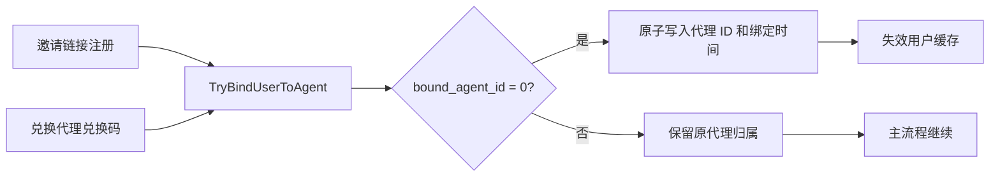

# 代理客户绑定与调用日志设计

## 目标

在现有代理 MVP 的基础上迁移旧仓的客户经营能力：

1. 通过代理邀请链接注册的用户绑定到该代理；
2. 未绑定代理的用户兑换代理兑换码后绑定到兑换码所属代理；
3. 已绑定代理的用户再次兑换其他代理的兑换码时保持原归属；
4. 代理可以只读查看所属客户资料和调用日志；
5. 后端兼容 SQLite、MySQL、PostgreSQL，默认前端补齐客户管理和客户日志，Classic 前端不新增页面。

## 现状与约束

当前仓库使用 `AgentAccount` 表示代理身份，`User.InviterId` 表示邀请关系，`Redemption.AgentUserId` 表示代理兑换码来源；但用户没有客户归属字段，注册和兑换流程也没有调用绑定逻辑。当前日志已经保存 `Log.UserId`，且日志库可能独立于主库。

旧仓使用 `User.BoundAgentId` 和 `User.BoundAt`，通过 `UPDATE ... WHERE bound_agent_id = 0` 保证首绑不变；客户列表和日志路由均以当前登录代理为范围。新实现保留该业务语义，但使用当前仓的 `AgentAccount` 作为代理身份来源，并按用户 ID 查询日志而不是按用户名查询。

本设计不包含佣金结算、优惠邀请码管理、运营看板、代理资料编辑、客户解绑/转移和到期提醒。

## 方案选择

### 方案 A：在 users 表增加归属字段（采用）

新增 `bound_agent_id` 和 `bound_at` 两个字段，统一通过一个服务完成原子首绑。该方案与旧仓兼容，改动面最小，并且无需维护关系表与 users 的双重事实来源。

### 方案 B：新增 agent_customers 关系表

可以保存来源和历史，但会引入重复事实来源、跨库查询和迁移复杂度。本期不采用，未来如需解绑审计可另加事件表。

### 方案 C：只复用 inviter_id

无法覆盖代理兑换码绑定，也无法表达客户归属与邀请关系的差异，不采用。

## 数据模型

在 `model.User` 增加：

```go
BoundAgentId int   `json:"bound_agent_id" gorm:"type:int;default:0;index;column:bound_agent_id"`
BoundAt      int64 `json:"bound_at" gorm:"type:bigint;default:0;index;column:bound_at"`
```

`BoundAgentId == 0` 表示未绑定，`BoundAt == 0` 表示无绑定时间。所有迁移使用 GORM/AutoMigrate 兼容三种数据库，不添加数据库专属 SQL。

代理查询身份继续使用 `AgentAccount`：账户存在即可作为绑定目标，`active` 允许读写，`disabled` 允许读取历史客户和日志但不能执行进货、退款等写操作。代理账户只应禁用，不应物理删除。

客户列表使用独立脱敏 DTO，仅返回：用户 ID、用户名、显示名、状态、注册时间、最后登录时间、额度、已用额度、剩余额度、绑定时间、当前/最近订阅套餐名称和结束时间。订阅结束时间从 `UserSubscription.EndTime` 派生，不给 `User` 增加重复的 `ExpireAt`。不返回密码、AccessToken、邮箱、备注、令牌密钥、IP 或管理员字段。

## 绑定流程



服务接口：

```go
func TryBindUserToAgent(userID int, agentID int) (bool, error)
```

服务先确认目标代理存在 `AgentAccount`，再执行：

```sql
UPDATE users
SET bound_agent_id = ?, bound_at = ?
WHERE id = ? AND bound_agent_id = 0
```

绑定冲突返回未绑定但不报业务错误；数据库错误记录并返回。注册和兑换的主流程不因绑定失败而失败，绑定异常通过系统日志记录。

普通注册在用户创建成功后绑定；OAuth 注册在用户创建事务提交后绑定；兑换码在兑换事务提交后使用兑换结果中的 `AgentUserId` 绑定。配额兑换分支必须在事务内保留代理 ID，不能在事务外按兑换码再次猜测归属。

## API 设计

所有接口挂在现有 `/api/agent` 路由组下，继续使用 `UserAuth` 和服务层的代理账户校验，不接受客户端传入的 `agent_user_id`。

### 推广信息

`GET /api/agent/promotion`

返回 `aff_code`、注册推广链接、绑定客户总数和本月新增绑定数。不在本期返回佣金信息。

### 客户列表

`GET /api/agent/customers`

参数：`keyword`、`sort_by`、`sort_order`、`p`、`page_size`。排序字段限定为 `status`、`remaining_quota`、`subscription_end_time`、`bound_at`。查询条件始终包含当前用户的 `bound_agent_id`。

### 客户日志

`GET /api/agent/logs`

参数兼容旧仓：`type`、`username`、`user_id`、`token_name`、`model_name`、`group`、`start_timestamp`、`end_timestamp`、`p`、`page_size`。

`GET /api/agent/logs/stat`

返回 `quota`、`rpm`、`tpm`。RPM/TPM 继续统计最近 60 秒的消费日志。

日志查询先在主库取得绑定客户 ID，再在日志库按 `logs.user_id` 过滤。客户数量大时按小批次查询并在服务层合并，避免 SQLite 参数数量限制。用户名仅作为已绑定客户的展示/筛选条件，不能作为权限边界。返回前复用现有日志格式化和请求方脱敏逻辑，去除 `admin_info`、`audit_info` 和 `stream_status`。

## 历史数据回填

新增幂等、批处理的迁移任务，不阻塞服务启动：

1. 保留已有非零 `bound_agent_id`；
2. 将 `InviterId` 指向有效 `AgentAccount` 的用户作为邀请绑定候选；
3. 将已使用且 `AgentUserId > 0` 的兑换码作为兑换绑定候选；
4. 邀请候选时间使用用户创建时间，兑换候选时间使用兑换时间，按时间和稳定的 ID 顺序决定首绑；
5. 旧仓已有 `is_agent`、`bound_agent_id`、`bound_at` 或旧兑换码代理字段时，先做字段映射和数据审计；
6. 无法解析代理身份的记录输出异常报告，不覆盖已有绑定。

## 默认前端设计

扩展现有 `/agent` 工作台的 URL Tab：

```text
overview / orders / codes / ledger / customers / customer-logs
```

客户管理新增脱敏客户表、关键词搜索、排序和分页；客户日志复用现有 `features/usage-logs` 的筛选、表格和移动端布局，通过新增 `agent` 数据作用域调用代理日志 API。所有新增文案进入六种 i18n locale 文件。Classic 前端保持不变。

## 安全与错误处理

- 查询范围由服务端当前登录用户决定，不能由请求参数扩大；
- 代理禁用不影响历史客户只读权限；
- 无效代理兑换码仍可正常兑换，但不建立绑定，并记录异常；
- 绑定使用数据库原子条件，保证邀请和兑换并发时只有一个归属；
- 排序字段、分页大小、时间范围和日志类型全部校验；
- 客户日志不泄漏管理员信息、令牌密钥和上游真实地址。

## 验收标准

1. 邀请链接注册和 OAuth 注册均可绑定代理；
2. 未绑定用户兑换代理码后绑定，已绑定用户归属不改变；
3. 并发邀请/兑换只有一个代理绑定成功；
4. 代理只能查看自己的客户和客户日志；
5. 客户列表和日志不暴露敏感字段；
6. 禁用代理仍能读取历史客户和日志；
7. 历史回填可重复执行且不会覆盖已有归属；
8. SQLite、MySQL、PostgreSQL 均可迁移和查询；
9. 默认前端客户管理、客户日志和六种语言构建通过。
