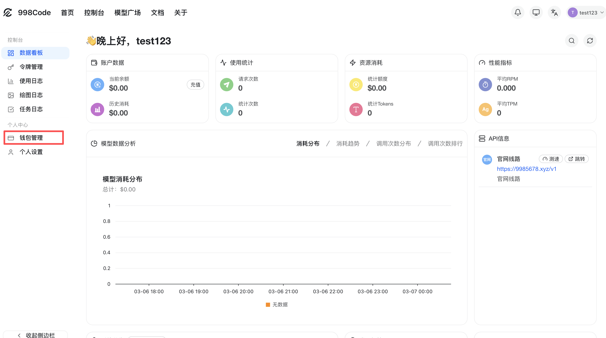
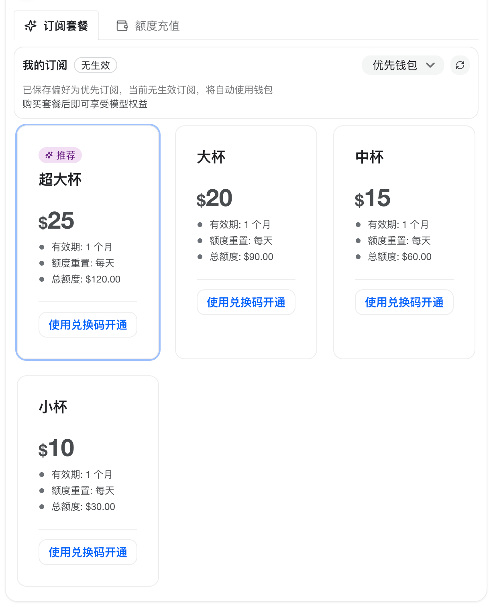

# 额度充值

通过兑换码为账号充值余额或额度。

## 兑换码的使用

1. **进入首页**
首先进入首页，点击「钱包管理」。

2. **进入充值页面**
在钱包页面找到兑换码或充值入口。

3. **完成兑换**
如果是余额兑换码，点击「额度充值」即可完成兑换。

## 页面示意

  
⚠️

  

    
<strong>注意：</strong>兑换码类型不同，对应入口也可能不同；如果是余额兑换码，请优先使用「额度充值」入口。

  

