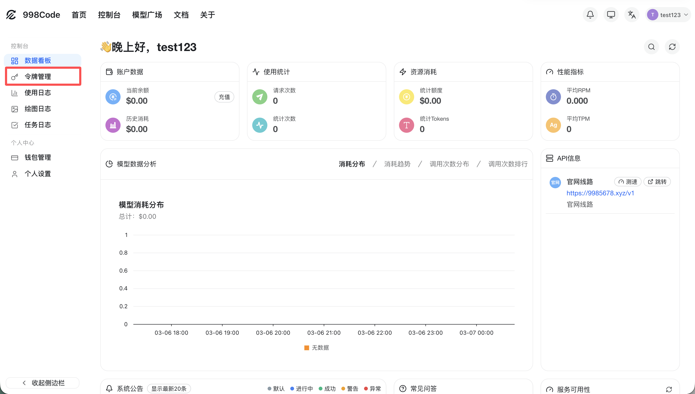
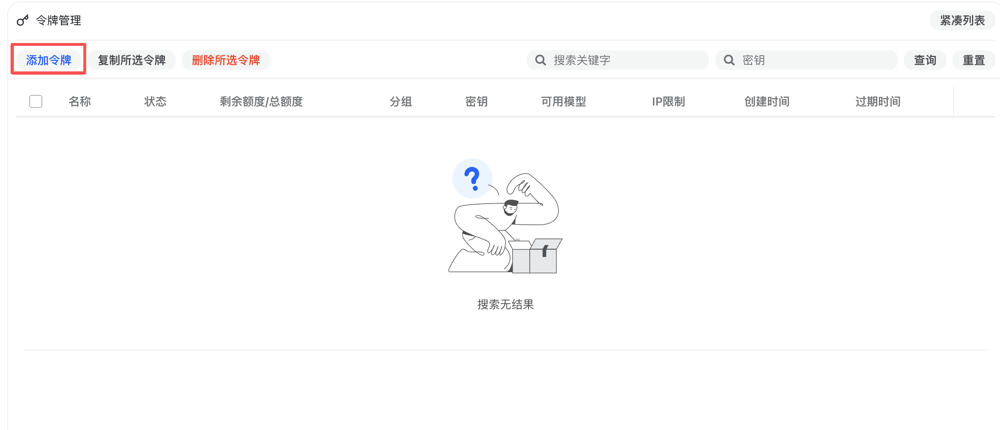
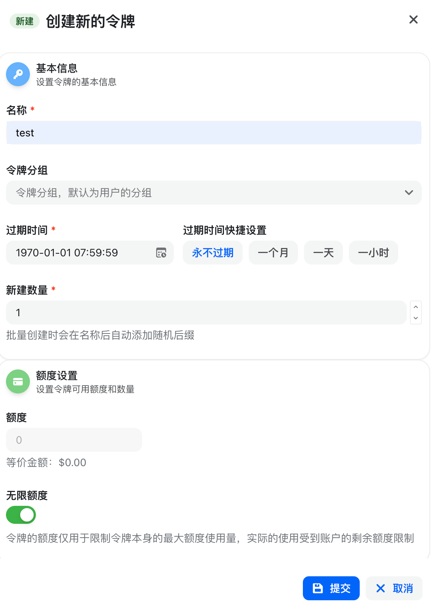

# 获取令牌

创建 API Key 用于接口调用。

1. **进入令牌管理**
进入首页后，点击「令牌管理」。

2. **点击添加令牌**
在令牌页面点击「添加令牌」。

3. **填写名称并创建**
输入名称后点击创建即可生成新的 API Key。

## 页面示意

  
🔴

  

    
<strong>安全提醒：</strong>请妥善保管你的 API Key，不要泄露给他人或提交到公开仓库。

  

