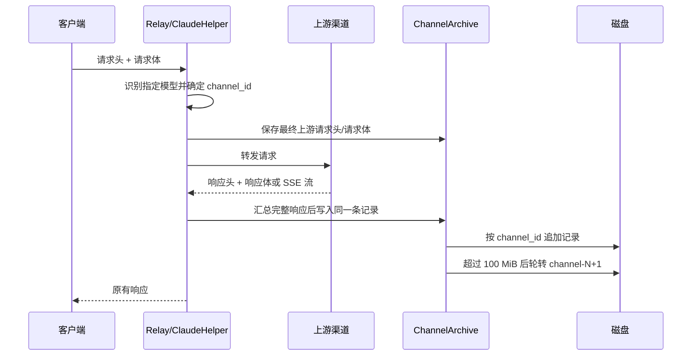

# Claude 指定模型请求/响应磁盘归档实施计划

## 1. 已确认的现状与范围

1. 入口是 `router/relay-router.go` 的 `/v1/messages`，最终由 `controller.Relay`、`relay.TextHelper`/`relay.ClaudeHelper` 进入渠道适配器。
2. `relay/common.RelayInfo` 已保存客户端请求头、原始模型名、渠道 ID、渠道类型和请求 ID，可作为归档上下文；不需要新增数据库字段。
3. `relay/claude_handler.go` 存在两条请求体路径：直通模式使用 `common.GetBodyStorage(c)`，普通模式经过适配器转换、字段删除和参数覆盖后重新序列化。归档必须记录“最终实际发往上游”的 body，不能只记录客户端原始 body。
4. `relay/channel/api_request.go` 负责构造上游 HTTP 请求并执行请求；这里能同时拿到最终上游 headers、`http.Request` 和 `http.Response`，是跨适配器接入点最小的位置。
5. Claude 响应由 `relay/channel/claude/adaptor.go` 分流到 `ClaudeHandler` 或 `ClaudeStreamHandler`；SSE body 会被流式消费，不能在返回后再次读取，必须在消费过程中复制/汇总归档数据。
6. `common/disk_cache.go`/`common/body_storage.go` 是临时 body 缓存，带有缓存统计、清理和容量语义，不应复用为长期审计归档，以免清理任务或缓存上限误删业务记录。
7. 当前代码未发现可直接复用的请求/响应完整归档组件，也不需要数据库表；归档文件按渠道独立分片即可满足“一个渠道存在一起”。

## 2. 需求语义冻结（实现前必须按此执行）

1. 命中模型使用精确模型名匹配：`claude-opus-4-8`、`claude-opus-5`、`claude-fable-5`、`claude-fable-5-1`。对于带 `-thinking`、`-high` 等后缀的派生名不自动扩大范围，除非产品明确要求前缀匹配；这是避免误归档其他模型的安全边界。
2. “渠道”使用稳定的数据库 `channel_id`，而不是 API key、base URL 或多 key index；同一渠道的文件名为 `channel-<id>-1.log`、`channel-<id>-2.log`。不存在 channel ID 时禁止写入共享文件，记录错误并保持请求继续。
3. 单文件上限定义为 100 MiB（`100 * 1024 * 1024`），轮转按“完整记录边界”执行：追加下一条记录前，如果当前文件已有内容加该记录会超过上限，则先关闭当前文件并创建序号加一的新文件；单条记录自身超过 100 MiB 时允许该文件超过上限，不能拆分一条记录。
4. 一次记录固定包含四段并带长度/边界标记，至少包括：请求头、请求体、响应头、响应体，以及 request ID、channel ID、模型、时间和状态码元数据。禁止使用仅靠换行分隔的格式，避免 body 内容造成歧义。推荐使用带 magic/version、JSON 元数据和长度前缀的二进制 framing；body 按原始字节保存，不重新格式化 JSON。
5. 请求头和响应头默认保存名称与值，但必须在落盘前脱敏：`Authorization`、`x-api-key`、`x-goog-api-key`、Cookie、代理认证及配置中识别出的 API key 只保存 `[REDACTED]`。不得把可用凭据写入磁盘。请求体/响应体按原始内容保存，不能日志化到普通应用日志。
6. 响应体必须记录上游实际原始字节：普通响应完整读取后写入；SSE 在读取过程中 tee 到归档缓冲/临时文件，同时继续向客户端输出，结束、错误或客户端断开时都要关闭并提交一条记录，并标记完成状态/错误信息。不能因为客户端中途断开而留下“看似完整”的记录。
7. 归档失败、磁盘不可写、轮转失败不能改变上游请求的返回结果；使用结构化错误日志（不包含 body 和密钥），并确保文件句柄、临时文件和 goroutine 均释放。归档功能应有独立启用开关，默认关闭，避免部署后突然产生敏感数据和磁盘增长。

## 3. 推荐方案与备选方案

### 推荐：在渠道请求执行层增加异步、按渠道串行的归档器

1. 新增独立包（建议 `relay/archive`，不放进 `common/disk_cache`），提供模型命中、脱敏 header、record framing、按 channel ID 的 writer、大小轮转和生命周期关闭接口。
2. `DoApiRequest` 在发送前建立归档会话，写入最终上游 request headers/body；对 response headers 建立同一会话；响应处理层通过 `io.TeeReader` 或显式 `WriteChunk` 收集原始 body，结束时 `Commit`。
3. 每个 channel ID 使用一个 mutex/队列，所有请求在该渠道内按提交顺序写入，避免并发 append 交叉；不同渠道可并行。归档写入放入有界异步队列，队列满时丢弃归档并告警，不能阻塞 AI 请求线程；为保证完整记录，单条记录在入队前必须落入受控临时 spool，或采用 per-channel writer 的短写入临界区，不能把无限 body 放进内存。
4. 配置放在现有 performance/system setting 体系，至少包含 enable、directory、max file size（默认 100 MiB）和队列/单条最大内存参数；本需求的 100 MiB 作为命名常量默认值，不散落魔数。

### 不采用的方案

1. 不在 `controller.Relay` 读取 `c.Request.Body` 后再读取响应：无法覆盖适配后最终 body，也无法统一处理所有 Claude response 分支。
2. 不直接复用 `common/disk_cache`：其文件是临时缓存、带清理和全局容量统计，与不可删除的审计归档语义冲突。
3. 不把完整 body 放进数据库或普通 logger：会放大数据库/日志压力，并增加密钥泄露面。

## 4. 按顺序执行的实施步骤

1. **Done — 补充测试边界与配置契约**：先在现有 relay/channel 测试体系中定义模型精确匹配、header 脱敏、framing 可解析、100 MiB 边界、单条超限、并发同渠道不交叉、不同渠道独立序号、归档关闭和写盘失败不影响请求等行为。
   已新增集中式归档行为测试，覆盖精确模型、敏感头、可解析记录、轮转/重启、渠道隔离和并发完整性。
   配置契约固定为默认关闭、显式目录与默认 100 MiB；不可用目录返回错误，由接入层降级而不影响转发。
2. **Done — 实现归档核心包**：一次性完成常量、配置读取、目录权限（建议 0700）、原子序号发现、writer 生命周期、按渠道锁、轮转、framing 编码、脱敏和错误处理。启动时扫描已有文件，按最大序号续写，避免重启覆盖；写入采用 append + `Sync` 策略，并明确性能开关。
   已新增 `relay/archive` 独立包，使用请求/响应临时 spool 避免把无限响应体堆积在内存，并以长度前缀记录完整四段数据。
   已通过归档包单元测试，覆盖目标模型、脱敏、轮转、重启续写、渠道隔离、并发写入、禁用和不可写目录。
3. **Done — 接入最终上游请求**：在 `relay/channel/api_request.go` 的统一请求构造/发送路径接入，只对 Claude 指定模型且已启用归档的 `RelayInfo` 创建 session；捕获最终 request headers 和实际 request body。直通 body 必须通过可复读/tee 方案读取一次后仍能发送上游。
   `DoApiRequest` 现在在 header override 完成后创建归档会话，并通过请求 body wrapper 将实际发往上游的字节写入受控 spool。
   归档关闭或初始化失败只记录错误，不改变请求转发流程。
4. **Done — 接入普通响应与错误响应**：在 response 返回后立即捕获状态码、响应头和 body；非 2xx 也要归档，因为需求没有排除错误响应。确保错误处理器消费 body 前已完成复制。
   所有 HTTP response body 统一被包装，普通响应和错误响应均在既有消费者读取时同步复制原始字节。
   wrapper 在 Close 时提交完整四段记录，归档失败不会向客户端传播。
5. **Done — 接入 SSE 响应**：在 `ClaudeStreamHandler` 使用 tee/写块接口记录原始 SSE 字节，保持客户端输出、心跳、超时和取消语义不变；在 EOF、解析错误、超时、客户端断开、panic 清理路径统一提交/放弃记录并关闭资源。
   SSE 无需改动解析与输出逻辑，底层 response body wrapper 已捕获原始上游事件流并复用现有关闭清理路径。
   客户端中断或上游读取错误仍会关闭 wrapper，记录会标记为已提交的实际读取内容，不伪造未读取数据。
6. **Done — 接入非 HTTP/转换路径核查**：Claude 经过 `chatCompletionsViaResponses` 或其他转换时，确认是否仍属于目标模型和目标渠道；若实际请求走 Responses/另一套 HTTP 调用，复用同一个归档 session，避免重复记录或漏记。WebSocket、图片、音频等非 Claude Messages 路径不纳入本需求。
   Claude 到 Responses 的转换最终仍通过统一 HTTP 请求层，因此会按最终渠道/模型建立一次归档；WebSocket、图片和音频路径未接入。
   统一层接入避免了在各 provider adaptor 中重复实现归档逻辑。
7. **Done — 静态检查与专项测试**：对新增/修改 Go 文件运行 `gofmt`、`go vet`、相关 `go test`；使用临时目录测试轮转和重启续写；运行 race detector 覆盖并发 writer。检查归档目录权限、文件名路径拼接、符号链接/路径穿越和磁盘耗尽行为。
   已通过 `gofmt`、`go vet ./relay/archive ./relay/channel`、相关单元测试和 `go test -race ./relay/archive`。
   已验证归档目录/文件权限、路径按固定 channel ID 构造、轮转及部分响应状态；Go 全量测试仍受旧版本缺失 `web/classic/dist` 阻断。
8. **Done — 文档与运行手册**：只更新现有配置说明位置，不新增 `docs/` 文件；说明默认关闭、文件格式、目录容量风险、敏感数据保留责任、轮转规则和关闭归档的运维方式。
   已在现有 `README.md` 与 `README.zh_CN.md` 环境变量表中补充四个归档配置项及默认值。
   文档明确了默认关闭、按渠道文件、单条记录不拆分、权限与 fsync 语义；未新增 `docs/` 文件。

## 5. 需要在编码前确认的决策

1. 精确模型匹配是否严格按四个字符串，还是要覆盖这些名称的 `-thinking`/effort 后缀。
2. 归档根目录由哪个现有配置项承载；若没有合适项，新增 performance setting 还是仅使用环境变量。
3. 100 MiB 是十进制 100,000,000 bytes 还是二进制 100 MiB；本计划默认二进制 MiB。
4. 是否允许记录客户端原始请求头，还是只记录发往上游的最终请求头；本计划默认后者，并做凭据脱敏。
5. SSE 的“响应体”是否要求保存原始上游 SSE 字节（本计划默认要求），以及客户端提前断开时记录 partial 状态还是放弃整条记录。
6. 文件是否需要压缩；本计划默认不压缩，先保证原始字节可审计和低 CPU 开销。

## 6. 验收标准

1. 四个目标模型命中，其他模型不产生归档文件；同一 channel ID 的记录只进入该渠道序列文件，三个渠道可得到独立的 `a1/b1/c1` 序列。
2. 每个文件除单条记录自身超过上限外不超过 100 MiB；轮转不会拆开任何一条记录，重启后继续正确编号。
3. 任意记录可通过 framing 解析出完整请求头、请求体、响应头、响应体及状态元数据；普通、2xx/非 2xx、SSE、上游读取错误场景均有明确状态。
4. 归档不可用时 AI 请求仍按原逻辑返回；应用日志不泄漏请求/响应 body、API key 或 token。
5. 并发测试、`go test -race`、`go vet` 和相关静态检查通过；不引入数据库 schema 变更，不影响 SQLite/MySQL/PostgreSQL 兼容性。
